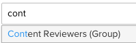

# Groepen toevoegen aan een proefdruk

>[!IMPORTANT]
>
>Dit artikel verwijst naar functionaliteit in het standalone product [!DNL Workfront Proof]. Voor informatie over proefdrukken binnen [!DNL Adobe Workfront], zie [Proofing](../../../review-and-approve-work/proofing/proofing.md).

Voeg een groep toe aan een proefdruk om de inhoud automatisch naar alle groepsleden te verzenden.

Voor informatie over hoe te om een groep tot stand te brengen, zie [Proofinggroepen maken met [!DNL Workfront Proof]](../../../workfront-proof/wp-mnguserscontacts/groups/create-proofing-groups.md).

1. Maak een proefdruk op een van de volgende manieren:

   * Een standaardproefdruk maken.

      Zie voor meer informatie [Proefdrukken genereren in [!DNL Workfront Proof]](../../../workfront-proof/wp-work-proofsfiles/create-proofs-and-files/generate-proofs.md).

   * Maak een nieuwe proefdrukversie.

      Zie voor meer informatie.
   * Een kopie van een proefdruk maken. Zie voor meer informatie <a href="../../../workfront-proof/wp-work-proofsfiles/create-proofs-and-files/copy-proofs.md" class="MCXref xref">Proefbestanden kopiëren in [!DNL Workfront Proof]</a>.

1. In de **[!UICONTROL Workflow]** in, typt u de naam van de groep in het dialoogvenster **[!UICONTROL Type contact name or email address to add a recipient]** veld. 
1. Selecteer de groepsnaam.
De leden van de groep worden nu weergegeven. 
1. (Optioneel) Wijzig de **Proefdrukrol** of **E-mailwaarschuwingen** met de vervolgkeuzemenu&#39;s.
Zie voor meer informatie <a href="../../../workfront-proof/wp-work-proofsfiles/share-proofs-and-files/manage-proof-roles.md" class="MCXref xref">Proefrollen beheren in [!DNL Workfront Proof]</a> en <a href="../../../workfront-proof/wp-emailsntfctns/email-alerts/config-email-notification-settings-wp.md" class="MCXref xref">Instellingen voor e-mailmeldingen configureren in [!DNL Workfront Proof]</a>.
1. (Optioneel) Verwijder een groepslid van de proefdruk door de muisaanwijzer boven de gegevens van de gebruiker te houden en op de knop **[!UICONTROL X]**.
U kunt ook alle leden van de proefdruk verwijderen door op **[!UICONTROL Delete all]**.
1. Doorgaan met maken van de proefdruk zoals beschreven in <a href="../../../workfront-proof/wp-work-proofsfiles/create-proofs-and-files/generate-proofs.md" class="MCXref xref">Proefdrukken genereren in [!DNL Workfront Proof]</a>  of <a href="../../../workfront-proof/wp-work-proofsfiles/create-proofs-and-files/copy-proofs.md" class="MCXref xref">Proefbestanden kopiëren in [!DNL Workfront Proof]</a>. 
