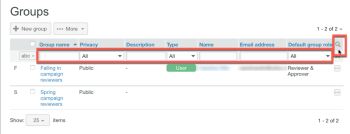

# Groepen beheren met [!DNL Workfront Proof]

>[!IMPORTANT]
>
>Dit artikel verwijst naar functionaliteit in het zelfstandige product [!DNL Workfront Proof] . Voor informatie bij het proef binnen [!DNL Adobe Workfront], zie [ het Bewijzen ](../../../review-and-approve-work/proofing/proofing.md).

Als [!DNL Workfront Proof] beheerder, kunt u uw openbare en privé Groepen op de pagina van Groepen beheren.

## De pagina Groepen openen

1. Klik op **[!UICONTROL Groups]** in de linkernavigatiebalk.
Op de pagina [!UICONTROL Groups] kunt u:

   * Bekijk al uw openbare en privé Groepen.
   * Maak een nieuwe groep. Voor meer informatie, zie [ het ProofingGroepen creëren gebruikend  [!DNL Workfront Proof]](../../../workfront-proof/wp-mnguserscontacts/groups/create-proofing-groups.md).
   * Groepen exporteren naar CSV-bestand.
   * Filter en sorteer Groepen.
   * Nadat u een of meer groepen hebt geselecteerd, zijn de volgende aanvullende opties beschikbaar:

      * Voeg personen toe aan de geselecteerde groepen.

        

      * Maak de geselecteerde Groepen privé of openbaar, zoals die in [ worden beschreven Privé maken Groepen  [!DNL Workfront Proof]](../../../workfront-proof/wp-mnguserscontacts/groups/make-groups-private.md)
      * De privé Groepen zijn zichtbaar slechts aan hun scheppers.
      * Verwijder de geselecteerde groepen.

        
   * U kunt acties uitvoeren op Groepen ook op elke Groep afzonderlijk van hun eigen **[!UICONTROL More]** (drie punten) menu:

     

      * Groepdetails weergeven.

        U kunt de details van de Groep ook bekijken door op de naam van de Groep te klikken.
      * Voeg mensen toe.
      * Een groep openbaar/privé maken.
      * Een groep verwijderen.

## Groepen sorteren

U kunt groepen sorteren op groepsnaam, privacystatus en beschrijving.

1. Klik op de kolomkop waarop u wilt sorteren.
of
Selecteer een sorteeroptie in het menu Sorteren.
   
Het driehoekje op een kolomkop geeft de sorteervolgorde aan. Naar boven gericht, wijst het op stijgende orde; naar beneden wijst op dalende orde.

## Groepen filteren

1. Klik op het pictogram **[!UICONTROL Filter]** helemaal rechts van de kolomkoppen om de filteropties onder de kolomkoppen weer te geven.
   

1. Selecteer [!UICONTROL filtering options] in de vervolgkeuzemenu&#39;s en typ in de filtervakken die onder elke kolomkop worden weergegeven. Klik vervolgens nogmaals op het pictogram **[!UICONTROL Filter]** om de opties toe te passen.
of\
   Selecteer de eerste letter in de naam van de groep.
   

## Groepdetails weergeven en bewerken

1. Klik op de knop **[!UICONTROL More]** helemaal rechts van de naam Groep en klik vervolgens op **[!UICONTROL View group details]** in de vervolgkeuzelijst.
Op de pagina die wordt weergegeven, kunt u alle personen weergeven die zich momenteel in de groep bevinden, samen met hun standaardrollen en e-mailwaarschuwingen voor de groep.

1. Voer een van de volgende handelingen uit om de groepdetails te bewerken:

   * Bewerk de naam en beschrijving van de groep door erop te klikken en te typen. Als u ergens buiten het veld klikt, worden de wijzigingen opgeslagen.
   * Klik op **[!UICONTROL Privacy]** om de privacyinstelling voor groepen in het keuzemenu te wijzigen.
   * Klik op **[!UICONTROL Add to group]** om nieuwe personen aan de groep toe te voegen.

     

   * Klik op **[!UICONTROL Delete group]** in de rechterbovenhoek om de groep te verwijderen.\

     

   * Klik checkbox aan het begin van de rij van een lid van de Groep en gebruik om het even welke opties die net boven de lijst verschijnen.
   * Klik op het pictogram **[!UICONTROL More]** aan het einde van de rij van een groepslid en gebruik een van de opties in het keuzemenu.

     

## Contactpersonen toevoegen aan groepen

1. Klik op **[!UICONTROL Contacts]** in het navigatievenster aan de linkerkant om naar de **[!UICONTROL Contacts]** -pagina te gaan.

1. Schakel de selectievakjes in naast de naam of namen van de contactpersonen die u aan een groep wilt toevoegen.
1. Klik op **[!UICONTROL Add to group]** .
   
Het dialoogvenster **[!UICONTROL Add to group]** wordt weergegeven.

1. In de sectie **[!UICONTROL People]** :

   1. Gebruik de drop-down menu&#39;s om het 3} alarm van de Rol van een lid **te veranderen** of **E-mail**. Voor meer informatie, zie [ de Rollen van het Bewijs binnen beheren  [!DNL Workfront Proof]](../../../workfront-proof/wp-work-proofsfiles/share-proofs-and-files/manage-proof-roles.md) en [ vormen e-mailberichtmontages in  [!DNL Workfront Proof]](../../../workfront-proof/wp-emailsntfctns/email-alerts/config-email-notification-settings-wp.md).

   1. Gebruik het veld **[!UICONTROL Enter a contact name]** of **[!UICONTROL email address]** om extra contactpersonen aan de groep toe te voegen.

1. Selecteer in de sectie **[!UICONTROL Groups]** de groep waaraan u de contactpersoon of contactpersonen wilt toevoegen.
1. Klik op **[!UICONTROL Add to group]**.
