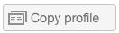
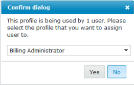

# Aangepaste profielen maken en beheren met [!DNL Workfront Proof]

>[!IMPORTANT]
>
>Dit artikel verwijst naar functionaliteit in het zelfstandige product [!DNL Workfront Proof] . Voor informatie bij het proef binnen [!DNL Adobe Workfront], zie [ het Bewijzen ](../../../review-and-approve-work/proofing/proofing.md).

Factureringsbeheerders en -beheerders kunnen aangepaste profielen maken en beheren om op te geven wat gebruikers kunnen doen in de account van uw organisatie en in de accountinstellingen.

Deze functie is alleen beschikbaar voor Premium-accounts.

## Modulemachtigingen {#module-permissions}

Met de modulemachtigingen kunt u bepalen welke toegang gebruikers moeten hebben over hun eigen items en over items die eigendom zijn van andere gebruikers in de account.

In het gedeelte Basistoegang wordt bepaald of gebruikers hun eigen items in de account kunnen lezen, maken, bewerken en verwijderen.

De sectie [!UICONTROL Data administration] bepaalt de rechten die gebruikers hebben op items die eigendom zijn van andere gebruikers in de account.

In beide secties kunt u rechten verlenen voor de volgende items in de account:

* Proefdrukken
Voor meer informatie, zie [ Proefdrukken in  [!DNL Workfront Proof]](../../../workfront-proof/wp-work-proofsfiles/create-proofs-and-files/generate-proofs.md) produceren.

* Bestanden
Voor meer informatie, zie [ Dossiers en de Inhoud van het Web aan  [!DNL Workfront Proof]](../../../workfront-proof/wp-work-proofsfiles/create-proofs-and-files/upload-files-web-content.md) uploaden.

* Openbare mappen
Voor meer informatie, zie [ Begrijp de Toestemmingen van de Omslag in  [!DNL Workfront Proof]](../../../workfront-proof/wp-work-proofsfiles/organize-your-work/folder-permissions.md).

* Persoonlijke mappen
Voor meer informatie, zie [ Begrijp de Toestemmingen van de Omslag in  [!DNL Workfront Proof]](../../../workfront-proof/wp-work-proofsfiles/organize-your-work/folder-permissions.md).

* Contactpersonen
Voor meer informatie, zie [ Contacten ](https://support.workfront.com/hc/en-us/sections/115000920808-Contacts).

* Groepen
Voor meer informatie, zie [ Groepen ](https://support.workfront.com/hc/en-us/sections/115000920828-Groups).

* Tags
Voor meer informatie, zie [ Tags creëren en beheren in  [!DNL Workfront Proof]](../../../workfront-proof/wp-work-proofsfiles/organize-your-work/create-and-manage-tags.md).

* Aangepaste weergaven
Voor meer informatie, zie [ creëren en leiden de Mening van de Douane in  [!DNL Workfront Proof]](../../../workfront-proof/wp-work-proofsfiles/manage-your-work/create-and-manage-custom-views.md).

## Administratieve machtigingen {#administrative-permissions}

In deze sectie kunt u administratieve toestemmingen aan uw gebruikers verlenen. Sommige toestemmingen verbinden en, wanneer geselecteerd, automatisch toelaten andere toestemmingen nodig om de taak uit te voeren. Als de gebruiker bijvoorbeeld machtigingsprofielen kan beheren, kunnen gebruikers in de account automatisch worden beheerd.

U kunt de volgende machtigingen verlenen:

* Accountinstellingen beheren
Voor informatie, zie [ montages van de Rekening ](https://support.workfront.com/hc/en-us/sections/115000912147-Account-settings).

* Gebruikers beheren
Voor informatie, zie [ Gebruikers ](https://support.workfront.com/hc/en-us/sections/115000911887-Users).

* Besluiten beheren
Voor informatie, zie [ een besluit over een bewijs in de het proef kijker ](../../../review-and-approve-work/proofing/reviewing-proofs-within-workfront/make-a-decision-on-a-proof/make-decisions-on-proof.md) nemen.

* Partners beheren
Voor informatie, zie [ Partners ](https://support.workfront.com/hc/en-us/sections/115000912107-Partner-accounts).

* Toepassingen beheren
Voor informatie, zie [ Integraties ](https://support.workfront.com/hc/en-us/categories/115000588707-Integrations).

* Aangepaste velden beheren
Voor informatie, zie [ douanegebieden in  [!DNL Workfront Proof]](../../../workfront-proof/wp-acct-admin/account-settings/create-and-manage-custom-fields.md) creëren en beheren.

* Dropzone beheren
Voor informatie, zie [ Dropzone ](../../../workfront-proof/wp-work-proofsfiles/create-proofs-and-files/dropzone.md).

* Geavanceerde workflow beheren
Voor informatie, zie [ Geautomatiseerd overzicht van het Werkschema ](../../../review-and-approve-work/proofing/proofing-overview/automated-workflow.md).

* SSO beheren
Voor informatie, zie [ Enige Sign-On in  [!DNL Workfront Proof]](../../../workfront-proof/wp-acct-admin/managing-security/single-sign-on-overview.md).

* Accountgeschiedenis weergeven
Voor informatie, zie [ Begrijpend het  [!DNL Workfront Proof]  Trail van de Controle van de Activiteit ](../../../workfront-proof/wp-work-proofsfiles/basic-features/activity-audit-trail.md).

* Accountback-ups weergeven
Voor informatie, zie [ file Uw  [!DNL Workfront Proof]  Gegevens ](../../../workfront-proof/wp-work-proofsfiles/organize-your-work/back-up-data.md).

* Facturen beheren
Voor informatie, zie [ uw het factureren ](https://support.workfront.com/hc/en-us/sections/115000912187-Managing-your-billing) beheren.

* Satellietrekeningen maken
Voor informatie, zie [ een satellietrekening in  [!DNL Workfront Proof]](../../../workfront-proof/wp-acct-admin/satellite-accounts/configure-sat-acct-in-wp.md) vormen.

* Lege prullenbak
Voor informatie, zie [ herstellen en de Prullenbak in  [!DNL Workfront Proof]](../../../workfront-proof/wp-work-proofsfiles/manage-your-work/restore-and-empty-trash.md) leegmaken.

* Machtigingsprofielen beheren
Voor informatie, zie [ Profielen van de Toestemmingen van de Bewijs in  [!DNL Workfront Proof]](../../../workfront-proof/wp-acct-admin/account-settings/proof-perm-profiles-in-wp.md).

* Analyses weergeven

## Een nieuw aangepast profiel maken

1. Navigeer naar **[!UICONTROL Account Settings]** en klik vervolgens op de tab **[!UICONTROL Profiles]** .

1. Klik op **[!UICONTROL Create New Profile]**.

1. In de sectie **[!UICONTROL Profile Details]** :

   1. Geef in het veld **[!UICONTROL Name]** een naam voor het aangepaste profiel op.
   1. Selecteer **[!UICONTROL Enable profile]** . 

1. In de sectie **[!UICONTROL Module permissions]** :

   1. Selecteer toestemmingen voor **Basistoegang**.
   1. **Beleid van Gegevens**. Voor meer informatie, zie ](#module-permissions) Toestemmingen van de Module 0}[

1. Selecteer in de sectie **[!UICONTROL Administrative permissions]** machtigingen voor beheerfuncties.

   Voor meer informatie, zie [ Administratieve Toestemmingen ](#administrative-permissions).

1. Klik op **[!UICONTROL Create]** .
Het nieuwe profiel is nu beschikbaar op het tabblad **[!UICONTROL Users]** .

1. (Optioneel) Wijs het nieuwe profiel toe aan nieuwe en bestaande gebruikersaccounts.
Voor meer informatie, zie [ Profielen van de Toestemmingen van de Bewijs in  [!DNL Workfront Proof]](../../../workfront-proof/wp-acct-admin/account-settings/proof-perm-profiles-in-wp.md).

## Een profiel in- en uitschakelen {#enabling-and-disabling-a-profile}

1. Navigeer naar **[!UICONTROL Account Settings]** en klik vervolgens op de tab **[!UICONTROL Profiles]** .

1. Selecteer het profiel dat u wilt in- of uitschakelen.
of
Als u meerdere profielen tegelijk wilt in- of uitschakelen, selecteert u de profielen handmatig of selecteert u **[!UICONTROL Name]** om alle aangepaste profielen te selecteren.
   

1. Klik op het vervolgkeuzemenu **[!UICONTROL More]** en klik vervolgens op een van de volgende opties, afhankelijk van de vraag of u het profiel wilt in- of uitschakelen:

   * **laat profielen toe:** het profiel wordt actief en zichtbaar in de [!DNL Workfront Proof] menu&#39;s.
   * **maak profielen onbruikbaar:** een bevestigingsvakje verschijnt. Selecteer **[!UICONTROL Yes]** om te bevestigen. Het profiel wordt inactief en wordt verwijderd uit de menu&#39;s van [!DNL Workfront Proof] .

     >[!NOTE]
     >
     >Een uitgeschakeld profiel kan niet meer worden toegewezen aan gebruikers in de account. Als gebruikers met dat profiel in de account aanwezig zijn, selecteert u een ander profiel voor hen voordat het profiel wordt uitgeschakeld.

     

## Een profiel kopiëren

Maak kopieën van een bestaand profiel om meerdere profielen in te stellen met vergelijkbare machtigingen.

1. Navigeer naar **[!UICONTROL Account Settings]** en klik vervolgens op de tab **[!UICONTROL Profiles]** .

1. Klik op de naam van het profiel en klik op de knop **[!UICONTROL Copy profile]** .

   

   Het gekopieerde profiel wordt nu weergegeven in de lijst met profielen. De naam van het oorspronkelijke profiel wordt voorafgegaan door het woord &quot;Kopiëren&quot;.

   

1. (Facultatief) om het gekopieerde profiel toe te laten, zie [ Toelatend en onbruikbaar makend een Profiel ](#enabling-and-disabling-a-profile).
1. (Facultatief) om uit te geven aan het gekopieerde profiel, zie [ het Uitgeven van een Profiel ](#editing-a-profile).

## Een profiel bewerken {#editing-a-profile}

Als u een profiel bewerkt, worden updates toegepast op alle gebruikers aan wie dit profiel momenteel is toegewezen.

1. Navigeer naar **[!UICONTROL Account settings]** en klik vervolgens op de tab **[!UICONTROL Profiles]** .

1. Klik op de profielnaam die u wilt bewerken.
1. Breng de gewenste wijzigingen aan in de naam of machtigingen voor het profiel. Deze wijzigingen worden automatisch opgeslagen en bijgewerkt.
Voor meer informatie over toestemmingen, zie {de Toestemmingen van de Module 1} en [ Administratieve Toestemmingen ](#administrative-permissions).

>[!NOTE]
>
>De standaardprofielen [!DNL Workfront Proof] zijn zichtbaar in de lijst met profielen, maar kunnen niet worden gewijzigd.

## Een profiel verwijderen

1. Navigeer naar **[!UICONTROL Account settings]** en klik vervolgens op de tab **[!UICONTROL Profiles]** .

1. Selecteer het profiel of de profielen die u wilt verwijderen.
1. Klik op het pictogram **[!UICONTROL Trash]** boven aan de pagina.

   

1. Klik op **[!UICONTROL Yes]** in het vak **[!UICONTROL Confirm dialog]** dat wordt weergegeven.

1. Als het profiel aan een gebruiker is toegewezen, gebruikt u het vervolgkeuzemenu in het dialoogvenster om een ander profiel te selecteren dat u aan deze gebruiker wilt toewijzen. Klik op **[!UICONTROL Yes]** om te bevestigen.

   

>[!NOTE]
>
>Het is niet mogelijk standaardprofielen van de account te verwijderen. Het is mogelijk standaardprofielen uit te schakelen als u deze niet wilt gebruiken in uw account.

Voor meer informatie bij het onbruikbaar maken van profielen, zie [ Toelatend en onbruikbaar makend een Profiel ](#enabling-and-disabling-a-profile).
