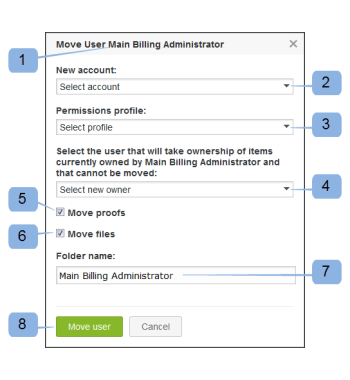

# Gebruikers tussen accounts verplaatsen met [!DNL Workfront Proof]

>[!IMPORTANT]
>
>Dit artikel verwijst naar functionaliteit in het zelfstandige product [!DNL Workfront Proof] . Voor informatie bij het proef binnen [!DNL Adobe Workfront], zie [ het Bewijzen ](../../../review-and-approve-work/proofing/proofing.md).

Als u een [!DNL Workfront] Proefbeheerder bent en u een of meer satellietrekeningen hebt verbonden met uw belangrijkste rekening, kunt u de gebruikers tussen al deze rekeningen bewegen.

## Gebruikers verplaatsen tussen verbonden accounts

1. Klik op **[!UICONTROL Settings]** > **[!UICONTROL Account settings]** .

1. Open de tab **[!UICONTROL Users]** .
1. Klik op het pictogram **[!UICONTROL Move user]** (1). 

1. Bevestig in het gebruikersvak Verplaatsen dat wordt weergegeven de gebruiker die u wilt verplaatsen (1).
1. Selecteer een doelaccount in de lijst met verbonden accounts (2).
1. Wijs de profieltoestemming (3) toe die deze gebruiker op de nieuwe rekening zou moeten hebben.
1. Selecteer een gebruiker (4) die de items die niet worden verplaatst, de eigenaar moet geven.
Dit omvat de punten die u om op de oude rekening en de punten zult besluiten te verlaten die niet kunnen worden bewogen (zie [ Punten die niet ](https://support.workfront.com/knowledge/articles/115004087708/en-us?brand_id=662728&amp;return_to=%2Fhc%2Fen-us%2Farticles%2F115004087708#Items-that-can&#39;t-be-moved) hieronder kunnen worden bewogen).

1. Schakel de selectievakjes in als u de proefdrukken (5) en bestanden (6) samen met de gebruiker wilt verplaatsen.
1. Maak een naam voor de map (7) waarin alle verplaatste items op de nieuwe account worden geplaatst.
1. Klik op **[!UICONTROL Move user]** (8) om het proces te starten.
   

Als u de gebruiker zonder proefdrukken en bestanden verplaatst, wordt deze actie direct uitgevoerd. Als u ervoor kiest om de gebruiker samen met zijn proefdrukken en dossiers te bewegen, zal het profiel van de gebruiker onmiddellijk worden opnieuw toegewezen, maar de proefdrukken en de dossiers zullen geleidelijk verschijnen op de bestemmingsrekening aangezien deze verrichting tijd vereist om de gegevens over te brengen.

Afhankelijk van het aantal bestanden en proefdrukken kan het verplaatsen van bestanden een paar minuten tot een paar uur duren.

>[!NOTE]
>
>Neem contact op met ons ondersteuningsteam als u vermoedt dat het proces langer duurt dan u had verwacht of als de verplaatste proefdrukken en/of bestanden niet op de nieuwe account worden weergegeven.

## Items die niet kunnen worden verplaatst

### Mappen die zijn gemaakt of eigendom zijn van de verplaatste gebruiker

Vanwege de aard van verschillende machtigingen die op mappen en de inhoud ervan zijn toegepast (deze kunnen bijvoorbeeld worden gedeeld met andere gebruikers en accounts), kunnen we geen mapstructuren met de gebruiker verplaatsen.

Als een map het eigendom is van de verplaatste gebruiker, wordt de eigendom overgedragen naar de geselecteerde gebruiker (4) in het pop-upvenster &quot;Gebruiker verplaatsen&quot;.

>[!NOTE]
>
>Als een map is gemaakt door de verplaatste gebruiker, blijft deze de maker. Alleen de eigendom wordt overgedragen. De map blijft zichtbaar voor de verplaatste gebruiker in de zijbalk van zijn nieuwe account. De verplaatste gebruiker heeft nog steeds &quot;Alleen-lezen&quot; toegang tot de items in deze mappen.

Als u niet wilt dat de verplaatste gebruiker dergelijke toestemmingen bewaart of de verplaatste gebruiker hun oude omslagen op oude &amp; rekening niet wil zien, zou de oplossing hier zijn om de omslagen als volgt te schrappen:

1. Maak een nieuwe map op het oude account.
1. Verplaats alle items van de mappen van de verplaatste gebruiker naar de nieuw gemaakte map.
1. Verwijder alle mappen die de verplaatste gebruiker nog heeft.

### Versiesets met verschillende eigenaars

Als een proef een paar versies heeft en elk van hen wordt bezeten door een verschillende gebruiker zal de versies die door de bewogen gebruiker worden bezeten niet bewegen. De eigendom van dergelijke versies wordt naar keuze (4) in het gebruikersvak Verplaatsen overgedragen aan een andere gebruiker. (Zie voor meer informatie .)

>[!NOTE]
>
>Een verplaatste gebruiker moet eigenaar zijn van alle proefversies in de set om de proefdruk te kunnen verplaatsen.

### Groepen

Groepen moeten opnieuw worden gemaakt door de verplaatste gebruiker op hun nieuwe account. Voor meer informatie, zie [ het ProofingGroepen creëren gebruikend  [!DNL Workfront Proof]](../../../workfront-proof/wp-mnguserscontacts/groups/create-proofing-groups.md).

### Aangepaste weergaven

De persoonlijke meningen van de Douane zullen door de verplaatste gebruiker op hun nieuw rekening moeten worden opnieuw gecreeerd. Voor meer informatie, zie [ creëren en leiden de Mening van de Douane in  [!DNL Workfront Proof]  Bewijs ](../../../workfront-proof/wp-work-proofsfiles/manage-your-work/create-and-manage-custom-views.md).

### Aangepaste velden

Aangepaste velden kunnen niet worden verplaatst en gegevens uit aangepaste velden gaan verloren. Zorg er dus voor dat u de rapporten over de vereiste items genereert voordat u gaat verplaatsen.

### Geautomatiseerde werkstroomsjablonen

De geautomatiseerde Malplaatjes van het Werkschema moeten op de nieuwe rekening worden ontspannen, maar de stadia zullen op de bewogen proefdrukken worden behouden die met de malplaatjes worden gecreeerd.

### Handelingen voor opmerkingen

Handelingen voor opmerkingen blijven op de proefdrukken staan, maar het is niet mogelijk om deze te filteren. De oplossing zou zijn om passende Acties op de nieuwe rekening tot stand te brengen en de commentaren met de nieuwe acties te hervlaggen indien nodig.
