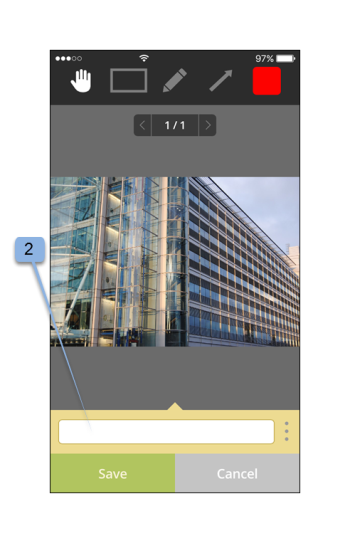

# Workfront Proof mobiele app

>[!IMPORTANT]
>
>Dit artikel verwijst naar functionaliteit in het zelfstandige product [!DNL Workfront Proof] . Voor informatie bij het proef binnen [!DNL Adobe Workfront], zie [&#x200B; het Bewijzen &#x200B;](../../../review-and-approve-work/proofing/proofing.md).

Download de app [!DNL Workfront Proof] van de Apple App Store of Google Store om waar u ook bent productief te zijn. De app [!DNL Workfront Proof] heeft de volgende functies in de iPhone en iPod Touch:

* Statische en audiovisuele proefdrukken weergeven, reviseren en goedkeuren
* Opmerkingen weergeven, toevoegen en beantwoorden
* Proefbestanden beheren via het dashboard en de weergaven

U hoeft geen gebruiker van [!DNL Workfront Proof] te zijn (u hebt dus uw eigen aanmeldingsgegevens) om een proefdruk te reviseren en goed te keuren via de iOS-app. Als u de app downloadt naar uw iOS-apparaat en toegang hebt tot uw persoonlijke URL via uw iOS-e-mailtoepassing, kunt u de app onderweg controleren en goedkeuren.

## Apparaatvereisten

Vereist iOS 7.0 of hoger. Android 4.0 en hoger. Compatibel met iPhone, iPad en iPod touch.

## De app downloaden en installeren

>[!IMPORTANT]
>
>De mobiele Workfront Proof-app wordt niet meer ondersteund en is ongewijzigd beschikbaar.  Eventuele problemen in de app worden niet opgelost.

Voor iOS-apparaten moet u de vorige [!DNL Workfront Proof] -toepassing voor iOS-apparaten verwijderen voordat u de nieuwe toepassing installeert.

De app [!DNL Workfront Proof] detecteert automatisch welk type apparaat u gebruikt. Als u app op uw tablet zou willen gebruiken, zie [[!DNL Workfront Proof]  mobiele app voor tablets &#x200B;](../../../workfront-proof/wp-mobile/wp-mobile-apps/wp-mobile-app-tablet.md).

>[!NOTE]
>
>Het is niet mogelijk om SWF- of audiobestanden, zoals MP3, te controleren op iOS-apparaten vanwege de softwarebeperkingen van mobiele apparaten. Als u een proefdruk wilt bekijken die is gemaakt op basis van een SWF-bestand of een audiobestand op een mobiel apparaat, dient u deze om te zetten in een ondersteunde indeling voordat u het bestand uploadt naar [!DNL Workfront Proof] .

## Aan de slag met de app

U hoeft geen [!DNL Workfront Proof] -gebruiker te zijn om de app te gaan gebruiken. Installeer de toepassing gewoon op uw apparaat en klik op een koppeling **[!UICONTROL Go To Proof]** in uw e-mailmelding. De app start automatisch en laadt de proefdruk.

Als u een [!DNL Workfront Proof] -gebruiker bent, kunt u zich aanmelden bij de app voordat u proefdrukken opent. Met de app kunt u door alle proefdrukken bladeren die met u worden gedeeld en kunt u gemakkelijk tussen de proefdrukken schakelen.

1. Open de app.
1. Voer uw e-mail en wachtwoord in en tik op **[!UICONTROL Login]** .

   of

   Gebruik Single Sign-On als dit is geconfigureerd voor uw [!DNL Workfront Proof] -account.

   U kunt de optie **[!UICONTROL Forgot password]** gebruiken als u uw wachtwoord niet onthoudt.

## Het dashboard

Nadat u zich hebt aangemeld bij uw [!DNL Workfront Proof] -account, wordt het dashboard weergegeven. Hier hebt u eenvoudig toegang tot uw proefdrukken. U kunt een van de beschikbare weergaven, Mijn proefdrukken en Alle proefdrukken openen. U kunt ook op de naam van een van uw recente proefdrukken tikken om rechtstreeks naar de proefdrukviewer te gaan.

Standaard wordt in het dashboard de weergave Totaal aantal proefdrukken geopend. In deze weergave worden alle proefdrukken getoond die u als eigenaar hebt of die met u zijn gedeeld. U kunt de weergave wijzigen door op de balk boven aan de pagina te tikken en een vervolgkeuzemenu te openen met de opties [!UICONTROL On time] , [!UICONTROL At risk] , [!UICONTROL Late] en [!UICONTROL Recent] . Als u een proefdruk wilt openen vanuit een willekeurige weergave, bladert u omlaag naar de gewenste proefdruk en tikt u op de gewenste naam om naar de proefdrukviewer te gaan.

| **op de Mening van de Tijd** | Hiermee geeft u alle actieve proefdrukken in uw account weer die u kunt bekijken en die geen deadline hebben of die langer dan 24 uur duren tot de deadline. |
|---|---|
| **bij de Mening van het Risico** | Hiermee geeft u alle proefdrukken weer waarvoor de deadline minder dan 24 uur is. |
| **Late Mening** | Vermeldt alle proefdrukken waarbij niet alle handelingen zijn uitgevoerd waarvoor de deadline al is overschreden. |
| **Recente mening** | Omvat de proefdrukken die onlangs door u zijn betreden en die u hebt, toestemmingen om volgens uw profieltoestemmingen hebben te zien en die met u werden gedeeld. In deze weergave worden alleen de proefdrukken weergegeven die u zelf hebt geopend (via de [!DNL Workfront Proof] Viewer of via de pagina Proefgegevens). |
| **E-mailverbinding** | Als u een proefdruk van uw e-mail wilt openen, opent u gewoon het e-mailbericht in uw e-mailprogramma, klikt u op de koppeling naar de knop [!UICONTROL Go to proof] in het e-mailbericht (1) en gaat u naar de proefdruk in de app van [!DNL Workfront Proof] . |

{style="table-layout:auto"}

## Een statische proefdruk in de app controleren

Wanneer u een proefdruk opent in de mobiele app, kunt u het volgende doen:

* Lees en antwoord op opmerkingen van andere revisoren (1 - het cijfer dat zichtbaar is in het pictogram geeft het aantal opmerkingen aan dat nog op de proefdruk staat. Als er geen opmerkingen op de proefdruk staan, wordt de knop 0 weergegeven en wordt het grijs weergegeven).
* Opmerkingen en markeringen toevoegen (2).
* De zichtbaarheid van de knop Opmerking en Besluit is afhankelijk van uw proefdrukrol.
* Beslissen (3).
* Ga naar het menu (4).
* Schaal de proefdruk door het scherm te knijpen.
  

## Opmerkingen en antwoorden toevoegen

1. Tik op de knop **[!UICONTROL Add comment]** (1) wanneer u een proefdruk hebt geopend.

   

1. Typ uw opmerking (2).

   

1. Klik op **[!UICONTROL Save]**.

## Opmerkingen lezen en beantwoorden

1. Open de proefdruk en tik vervolgens op het bijschriftpictogram in de rechterbovenhoek om de lijst met opmerkingen (1) weer te geven en kies de opmerking die u wilt controleren.
1. Tik op het punt om de bijbehorende opmerking te openen (2).

   

1. Voer een van de volgende handelingen uit:

   * Tik op de knop **[!UICONTROL Reply]** (3) om te reageren op een opmerking.
   * Tik op het pictogram [!UICONTROL callout] om terug te keren naar de proefdrukafbeelding.
   * Tik op de opmerking zelf om de volledige opmerking en de antwoorden daarop weer te geven.

     

   * Een handeling toepassen op een opmerking:

      1. Open een opmerking.
      1. Tik op **[!UICONTROL Reply]** .
      1. Open het menu [!UICONTROL actions] rechts van het tekstveld (1).
      1. Tik op **[!UICONTROL Add action]** (2).

         

         Voor meer informatie over acties, zie [&#x200B; acties van het Gebruik op proefdrukcommentaren &#x200B;](../../../review-and-approve-work/proofing/reviewing-proofs-within-workfront/comment-on-a-proof/use-actions-on-comments-in-viewer.md).

## Markeringen toevoegen

U kunt een markering toevoegen (zoals een vak dat een gebied op de proefdruk markeert) en een opmerking typen die bij de markering is gevoegd. U kunt ook een opmerking maken zonder een markering toe te voegen. En u kunt meerdere markeringen toevoegen aan één opmerking.

1. Voor een bewijs u hebt geopend, Tik **toevoegt commentaar** (1).

   

1. Kies tussen [!UICONTROL pan mode] (2), [!UICONTROL rectangle tool] (3), [!UICONTROL freehand drawing] (4) of [!UICONTROL arrow] (5).

   U kunt ook de lijnkleur van de markering (6) wijzigen.

1. Als u een markering op de proefdruk wilt tekenen, raakt u het scherm aan en verplaatst u uw vinger over de proefdruk.

   U hoeft geen tekst toe te voegen om uw markering op te slaan (7).

1. Tik op **[!UICONTROL Cancel]** (8) als u de markering wilt verwijderen.

   

   Als u een gebied op de proefdruk markeert, wordt het opmerkingenveld automatisch geopend. U kunt gemaakte opmaakcodes verwijderen door te tikken op het kruis naast de opmaakvorm (9).

   

## Besluiten nemen over een bewijs

1. Open de proefdruk in de Proefweergave en tik op de knop [!UICONTROL Decision] (1).

   

1. Tik op de beslissing die u wilt indienen (2).
1. Tik op **[!UICONTROL Save]** om uw beslissing te verzenden.

   

   >[!NOTE]
   >
   >* Als er een pop-upbericht over een beslissing wordt weergegeven op de account waarin het bewijs is gemaakt, wordt dit ook weergegeven in de iOS-app wanneer een beslissing wordt genomen op een bewijs.
   >* Als u beslissingsredenen instelt, worden deze op het [!UICONTROL Submit your decision] -scherm weergegeven en kunt u ze kiezen.

   Als u al een beslissing hebt ingediend en u wilt deze wijzigen of verwijderen, kunt u dat gemakkelijk doen. Nadat u een beslissing hebt verzonden, verschijnt er een nieuwe optie, **[!UICONTROL Remove my decision]** (6), op het [!UICONTROL Submit your decision] -scherm.

   

## Een audio- of videoproefdruk in de app controleren

Het reviseren van een audioproefdruk in de iOS-app is net zo eenvoudig als het reviseren van een statisch bestand:

1. Tik op de knop [!UICONTROL play/pause] om de video af te spelen of te pauzeren (1).
1. Tik op de [!UICONTROL navigation] balk (2) om door de video te navigeren.
1. Als u een opmerking wilt achterlaten, tikt u op de knop **[!UICONTROL Comment]** (3) en volgt u de hierboven beschreven instructies.

   Eventuele opmerkingen of markeringen op de proefdruk worden gemarkeerd met punten op de navigatiebalk (4).

1. Als u de opmerkingen op de proefdruk wilt bekijken, tikt u op de knop **[!UICONTROL Comments]** (5) en volgt u de bovenstaande instructies.
1. Tik op de knop **[!UICONTROL Decision]** (6) en volg de bovenstaande instructies om een beslissing te nemen.

   
