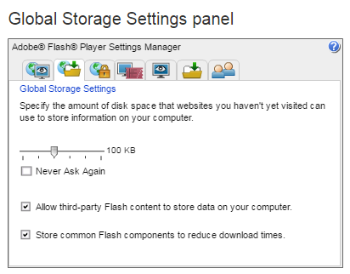

# Problemen met het bekijken van proefdrukken - [!DNL Flash] Gedeelde objecten beschreven

>[!IMPORTANT]
>
>Dit artikel verwijst naar functionaliteit in het standalone product [!DNL Workfront Proof]. Voor informatie over proefdrukken binnen [!DNL Adobe Workfront], zie [Proofing](../../../review-and-approve-work/proofing/proofing.md).

>[!NOTE]
>
>De informatie in dit artikel verwijst naar functies die momenteel zijn verouderd en die worden verwijderd uit [!DNL Workfront] in 2018. We raden u aan de nieuwe webproefdrukviewer te gebruiken (zoals beschreven in [Proefdrukken bekijken in de webproefweergave](https://support.workfront.com/hc/en-us/sections/115000275214-Reviewing-Proofs-in-the-Web-Proofing-Viewer)) of de Desktop Proofing Viewer (zoals beschreven in [Proofs controleren in de Desktop Proofing Viewer](https://support.workfront.com/hc/en-us/sections/360000686434-Reviewing-Proofs-in-the-Desktop-Proofing-Viewer)).

## [!DNL Flash] Gedeelde objecten

Een lokaal gezamenlijk object, ook wel &quot;[!DNL Flash] cookie&quot; is een gegevensbestand dat op uw computer kan worden gemaakt door de sites die u bezoekt. Gezamenlijke objecten worden meestal gebruikt om uw webervaring te verbeteren. A [!DNL Flash] cookie is een bericht dat wordt gebruikt in [!DNL Adobe Flash] dat van een server van het Web naar browser van het Web wordt verzonden en dan als gegevensdossier in browser wordt opgeslagen.

Aangezien [!DNL Workfront Proof] De viewer is gebaseerd op [!DNL Flash]Het zou de moeite waard zijn te controleren of opslag is toegestaan [!DNL Flash] op uw computer.

## [!DNL Flash] Gedeelde objecten - bekende problemen

Als de [!DNL Flash] opslag is ingesteld op 0 kB of heeft een andere instelling die blokken [!DNL Flash] toepassingen om de gegevens lokaal op te slaan, kan dit leiden tot bepaalde bekende problemen in de [!DNL Workfront Proof] Viewer:

* De pop-up Aan de slag-tour wordt steeds weergegeven, maar de optie om deze niet opnieuw weer te geven is gekozen
* [!DNL Workfront Proof] De prestaties van de viewer worden trager doordat er steeds meer opmerkingen aan de proefdrukken worden toegevoegd
* Proefdrukken worden niet geladen en u krijgt het &#39;grijze scherm&#39; in plaats van een echte afbeelding

## Toestaan [!DNL Flash] Gedeelde objecten

Zorg ervoor dat het opslaan [!DNL Flash] De gedeelde Voorwerpen worden toegestaan op de computer en dat de opslaggrens niet 0 is.

Controleren of de gedeelde objecten zijn toegestaan:

1. Klik met de rechtermuisknop in het dialoogvenster [!DNL Workfront Proof] Viewer.
1. Selecteren **[!UICONTROL Global Settings]** in het contextmenu.
1. Ga naar de **[!UICONTROL Storage]** tab.
1. Controleer of **[!UICONTROL Allow sites to save information on this computer]** is geselecteerd (1).
1. 

## Toename [!DNL Flash] opslag

Standaard [!DNL Flash] toepassingen kunnen maximaal 100 kB aan gegevens opslaan op het station van de gebruiker, maar deze gegevens kunnen eenvoudig door de gebruikers worden aangepast. De oplossing voor de vele [!DNL Flash] de interne [!DNL Flash] opslag. Dit kan rechtstreeks vanuit de [!DNL Workfront Proof] Viewer:

1. Open een proefdruk.
1. Open het menu met de rechtermuisknop op de proefdruk.
1. Klikken **[!UICONTROL Settings]** om de [!DNL Flash] pop-up instellingen.
1. Ga naar de **[!UICONTROL Local]** opslagtabblad.
1. Verhoog de opslagcapaciteit tot bijvoorbeeld 100 kB (1).
1. Sluit de instellingen en open de proefdruk opnieuw.

