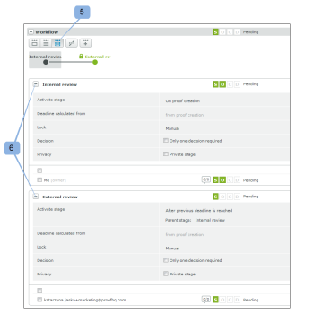

# Een proefdruk beheren die is geconfigureerd met een automatische workflow in [!DNL Workfront Proof]

>[!IMPORTANT]
>
>Dit artikel verwijst naar functionaliteit in het zelfstandige product [!DNL Workfront Proof] . Voor informatie bij het proef binnen [!DNL Adobe Workfront], zie [ het Bewijzen ](../../../review-and-approve-work/proofing/proofing.md).

U kunt de voortgang van de automatische workflowproefdrukken gemakkelijk bijhouden in de sectie Workflow van de pagina [!UICONTROL Proof details] . U kunt het werk bekijken dat in elk werkgebied is uitgevoerd en de fasen in uw proefdruk wijzigen, toevoegen, starten en vergrendelen.

## Een geautomatiseerde workflow weergeven

U kunt uw geautomatiseerde workflow op drie manieren bekijken:

* [Een werkgebied in detail weergeven](#view-a-stage-in-detail)
* [Alle fasen weergeven](#view-all-stages)
* [Alle fasen in detail weergeven](#view-all-stages-in-detail)

### Een werkgebied in detail weergeven {#view-a-stage-in-detail}

1. Klik op de knop boven aan de sectie (1).

   U kunt tussen stadia schakelen gebruikend het diagram. Het werkgebied dat u bekijkt, wordt grijs (2) gemarkeerd.

1. Als u een ander werkgebied wilt weergeven, selecteert u dit in het diagram.

### Alle fasen weergeven {#view-all-stages}

Om alle stadia in een Geautomatiseerde Werkschema te bekijken:

1. Klik op de knop boven aan de pagina (3).

   Alle fasen van de geautomatiseerde workflow worden vermeld in de sectie, maar de details worden verborgen.

1. Klik op het plusteken naast de naam van elk werkgebied (4) om de details van een werkgebied weer te geven.

### Alle fasen in detail weergeven {#view-all-stages-in-detail}

Om alle stadia van uw Geautomatiseerde Werkschema in detail te bekijken:

1. Klik op de knop boven aan de pagina (5).

   Dit zal u alle stadia van uw Geautomatiseerde Werkschema met de details van elk uitgevouwen stadium tonen.

   U kunt de details van elk werkgebied verbergen door op het minteken (6) te klikken.

## Gebruik het Geautomatiseerde diagram van het Werkschema

Het diagram van uw Geautomatiseerde [!UICONTROL Workflow] wordt getoond bij de bovenkant van de sectie van het Werkschema.

Het diagram verbergen

1. Klik op **[!UICONTROL Hide]** (1).

De fasen in het diagram zijn als volgt gemarkeerd:

 - een actief stadium

 - een inactief stadium\
  - een privéfase

  - een vergrendeld stadium

De lijnen tussen de stadia geven de afhankelijkheden tussen de fasen aan. De lijnen die leiden tot inactieve stadia worden gestippeld tot het werkgebied wordt geactiveerd.

Als u de cursor boven een werkgebied in het diagram houdt, ziet u de voortgang van het werkgebied. Als het werkgebied niet actief is en u beschikt over bewerkingsrechten voor het werkgebied, kunt u het werkgebied starten vanuit het pop-upvenster met de knop [!UICONTROL Start stage] . Op dezelfde manier wordt de optie voor het vergrendelen van een actief werkgebied weergegeven.

Ga voor meer informatie over de voortgangsbalk naar  [ Mening de Voortgang en de Status van een Bewijs in  [!DNL Workfront]  Bewijs ](../../../workfront-proof/wp-work-proofsfiles/manage-your-work/view-progress-and-status-of-proof.md).

## Een nieuw werkgebied toevoegen

U kunt vanaf de pagina [!UICONTROL Proof details] een nieuw werkgebied toevoegen aan uw geautomatiseerde workflow.

1. Klik op **[!UICONTROL New stage]** (1).

In het **Nieuwe stadium** vakje dat verschijnt, kunt u de de details en montages van het werkgebied bevolken.

## Werkgebiedinstellingen beheren

Op de pagina kunt u de instellingen voor elk werkgebied wijzigen (als u bewerkingsrechten hebt):

* De deadline voor het werkgebied wijzigen, toevoegen of verwijderen (1)
* Het werkgebied vergrendelen (2) - deze optie wordt weergegeven als het werkgebied actief is; voor inactieve fasen ziet u de optie om het werkgebied te starten
* De instellingen wijzigen door ze online te bewerken (3)
* Slechts één vereiste beslissing in het werkgebied in- of uitschakelen (4)
* De privacy van het werkgebied wijzigen (5)

U kunt de controleurs ook van het ene stadium naar het andere verplaatsen door ze van het ene stadium naar het andere te slepen. De beschikbare stadia worden blauw gemarkeerd met de dropgebieden voor elk stadium duidelijk gemarkeerd.

## Werkgebiedopties

Het [!UICONTROL Actions] menu (1) voor elk werkgebied heeft de volgende opties:

* Bericht alle (2) - u kunt een herinnering e-mail naar alle recensenten op het stadium verzenden
* Delen (3) - u kunt nieuwe revisoren toevoegen aan het werkgebied
* Werkgebied 4 verwijderen - als de eigenaar van het bewijs zich in dat werkgebied bevindt, wordt u gevraagd een nieuw werkgebied voor de eigenaar te kiezen
