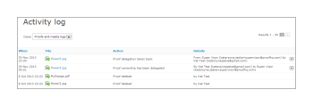

# Het [!DNL Workfront Proof] Activity Audit Trail

>[!IMPORTANT]
>
>Dit artikel verwijst naar functionaliteit in het zelfstandige product [!DNL Workfront Proof] . Voor informatie bij het proef binnen [!DNL Adobe Workfront], zie [&#x200B; het Bewijzen &#x200B;](../../../review-and-approve-work/proofing/proofing.md).

De pagina [!UICONTROL Activity Audit Trail] bevat een volledige lijst met alle activiteiten die in uw account hebben plaatsgevonden.

De pagina [!UICONTROL Activity] openen:

1. Klik in de linkerzijbalk op **[!UICONTROL Activity]** .\
   \
   De pagina [!UICONTROL Activity Audit Trail] wordt weergegeven.\
   

1. Selecteer in het vervolgkeuzemenu Weergave de weergave die u wilt weergeven.\
   U kunt uit de volgende weergaven kiezen:

   * **[!UICONTROL Proofs and media logs]**: geeft alle activiteit weer op proefdrukken en bestanden in uw account.
   * **[!UICONTROL Folders logs]:** Hiermee geeft u alle activiteiten weer in mappen in uw account.
   * **[!UICONTROL Profile log]:** toont alle veranderingen die in uw persoonlijk profiel zijn aangebracht.
   * **[!UICONTROL Account log]:** Hiermee geeft u alle wijzigingen in de accountinstellingen weer. Deze weergave is alleen beschikbaar voor gebruikers met beheerdersrechten.
   * **[!UICONTROL Authentication log]:** toont alle login activiteit op de rekening, die zowel succesvolle als mislukte pogingen toont.
   * **[!UICONTROL Billing log]:** toont de factureringsgeschiedenis op uw rekening. Deze weergave is alleen beschikbaar voor gebruikers met de rechten voor factureringsbeheerders.
   * **[!UICONTROL Email log]:** geeft alle e-mails weer die van uw account zijn verzonden.
