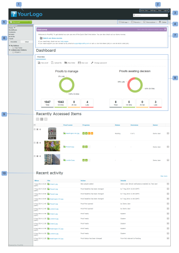
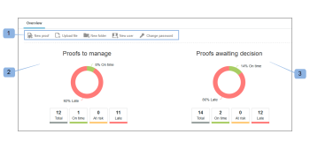

# Het dashboard in [!DNL Workfront Proof]

>[!IMPORTANT]
>
>Dit artikel verwijst naar functionaliteit in het zelfstandige product [!DNL Workfront Proof] . Voor informatie bij het proef binnen [!DNL Adobe Workfront], zie [ het Bewijzen ](../../../review-and-approve-work/proofing/proofing.md).

Het dashboard is de eerste pagina die u ziet wanneer u zich aanmeldt bij uw [!DNL Workfront Proof] -account. Hierin wordt een overzicht gegeven van de activiteit in uw [!DNL Workfront Proof] -account en snelle koppelingen naar andere secties en functies in [!DNL Workfront Proof] .

Het dashboard bevat het volgende:

* Organisatie-logo (1)
* Navigatie boven (2)
* Zoeken (3)

* Menu Koptekst (4)
* Nieuw menu (5)
* Zijbalk (6)
* Welkomstsectie (7)
* Overzicht (8)
* Onlangs geopende items (9)
* Recente activiteit (10)

>[!NOTE]
>
>De menu&#39;s en koppelingen die u op het dashboard kunt weergeven en gebruiken, zijn afhankelijk van uw gebruikersprofiel en uw machtigingen.

U kunt uw account markeren om het logo, de kleuren, aangepaste koppelingen en meer van uw eigen organisatie weer te geven. Voor meer informatie, zie [ Merk de  [!DNL Workfront Proof]  plaats ](../../../workfront-proof/wp-acct-admin/branding/brand-wp-site.md).&quot;

Als u uw account niet brandt, worden het logo en de standaardkleuren van [!DNL Workfront Proof] weergegeven.

## Menu Koptekst

### De gebruikersnaam

De gebruikersnaam (2) die u hebt gekozen, wordt hier weergegeven. Het kan in Persoonlijke montages worden veranderd.

### Instellingen

Hier (3) hebt u toegang tot uw:

* Persoonlijke instellingen
* Accountinstellingen
* Facturering

>[!NOTE]
>
>De zichtbaarheid van de bovenstaande menu&#39;s is afhankelijk van uw profiel. Zie Gebruikersprofielen en machtigingen voor meer informatie.

### Help

Hier (4) hebt u toegang tot:

* Help-artikelen
* Demo-films

>[!NOTE]
>
>Met onze Uitgezochte en Premium plannen kunt u de opties van de Hulp vormen om uw gebruikers aan uw eigen inhoud te richten. Raadpleeg onze geavanceerde opties voor branding voor meer informatie.

### Afmelden

Klik hier om u af te melden bij uw account.

## Het nieuwe menu

U opent als volgt het menu Nieuw:

1. Klik op de vervolgkeuzepijl (7).

   Het menu **[!UICONTROL New]** heeft de volgende opties:

   * Nieuwe proefdruk (8)
   * Bestand uploaden (9)
   * Nieuwe map (10)
   * Nieuwe gast (11)
   * Nieuwe gebruiker (12)
   * Nieuwe groep (13)

## Het menu Dashboard

Het menu Dashboard bevat de volgende menu&#39;s:

* Codes bewerken
* Verplaatsen naar
* Meer handelingen
* Verwijderen

## Codes bewerken

Met het menu [!UICONTROL Edit tags] (1) kunt u:

* Een tag toepassen op een item of items
* Nieuwe tags maken
* Tags beheren (2)

 uit

## Verplaatsen naar

Met deze functie kunt u proefdrukken en bestanden naar een van uw mappen verplaatsen. Dit doet u als volgt:

1. Selecteer het vakje voor het (de) relevante item(s).
1. Klik op **[!UICONTROL Move to]** (3) en kies de relevante map (4).
1. Klik op **[!UICONTROL Save]** (5).

   

### Meer handelingen

In het menu [!UICONTROL More actions] (6) kunt u de volgende handelingen uitvoeren:

* Vergrendelen (alleen proefdrukken)
* Activeren
* Archief (alleen proefdrukken)
* Unarchive (alleen proefdrukken)
* Eigenaar wijzigen

### Verwijderen

Items verwijderen:

1. Selecteer het selectievakje links van de items en klik op **[!UICONTROL Delete]** (7).

1. Controleer in het bevestigingsscherm dat wordt weergegeven de details en bevestig door op **[!UICONTROL Yes]** (8) te klikken.

### De zijbalk

De zijbalk bevat koppelingen naar de volgende pagina&#39;s:

* Dashboard (1)
* Weergaven (2)
* Workflows (3) (alleen Premiumplannen)
* Dropzone (4) (Select- en Premium-plannen)
* Contactpersonen (5)
* Groepen (6)
* Activiteit (7)
* Prullenbak (8)
* Mijn mappen (9) (u kunt elke afzonderlijke map ook openen vanuit de zijbalk)
* Mappen voor andere organisaties (10) (waar u items kunt zoeken die andere organisaties met u hebben gedeeld)
* Tags (11)

De Sidebar wordt gedetailleerder beschreven op de Sidebar Help-pagina.

### [!UICONTROL Welcome] -sectie

De sectie [!UICONTROL Welcome] heeft de volgende handige koppelingen:

* Bekijk onze demofilms (1)
* Help-pagina&#39;s (2)
* Contactgegevens voor ondersteuning (3)
* De koppeling &quot;De welkomstsectie niet meer weergeven&quot; (4)

### Overzicht

In deze sectie vindt u de snelkoppelingen naar:

* Nieuwe proefdruk maken Een bestand uploaden
* Nieuwe map maken
* Een nieuwe gebruiker toevoegen
* Uw wachtwoord wijzigen

De overzichtssectie toont ook pre-gefiltreerde informatie. Dit zijn:

* Te beheren proefdrukken - totaal aantal actieve proefdrukken dat eigendom van u is en aan u is gedelegeerd
* Proefversies die wachten op beslissing - totaal aantal actieve proefdrukken waarvoor uw beslissingen vereist zijn

  

Hier kunt u direct zien hoeveel proefdrukken u of uw revisoren direct moeten uitvoeren:

* Totaal
* Op tijd - proefdrukken zonder deadline of met meer dan 24 uur tot de deadline
* Risicoproefdrukken met een deadline van minder dan 24 uur
* Te laat - proefdrukken met niet alle acties voltooid en verstreken deadline

>[!NOTE]
>
>De grafiekwaarden zijn klikbaar - u kunt gemakkelijk naar de gedetailleerde lijst van de punten gaan.

### Onlangs geopende items

In de sectie [!UICONTROL Recently accessed items] worden de items weergegeven die u onlangs hebt geopend. Hieronder vallen de items die u hebt, de items die u gemachtigd bent te bekijken volgens uw profielmachtigingen en de items die met u zijn gedeeld. Deze sectie bevat alleen de items die u zelf hebt geopend (via de [!DNL Workfront Proof] Viewer of via de pagina Proefgegevens).

In de sectie [!UICONTROL Recently accessed items] ziet u de volgende informatie over recente proefdrukken en bestanden:

* Naam
* Voortgang
* Status
* Besluit
* Eigenaar

Samenvatting (deze informatie wordt standaard samengevouwen - klik op de knop Uitvouwen/Samenvouwen links van de relevante proefdruk om het proefdrukoverzicht te openen)

Menu Handelingen

Zie Paginalay-outs voor de verschillende lay-outopties beschikbaar voor deze sectie.

>[!NOTE]
>
>Als u in de sectie [!UICONTROL Recently accessed items] op de naam van de proefdruk klikt, gaat u rechtstreeks naar de proefdruk in de Proefweergave.

De pagina Proefgegevens openen:

1. Klik op het menu **[!UICONTROL Actions]** (1) rechts van de proefdruknaam.
1. Selecteer **[!UICONTROL View proof details]** (2) in het menu.

### Recente activiteit

In dit gedeelte worden de volgende gegevens over recente activiteiten in uw account weergegeven:

* Proef datum en tijd/bestandsnaam
* Handeling
* Details

U kunt ook naar de pagina Details van een item gaan door te klikken op het menu Acties van het item en de optie Details weergeven te kiezen. Zie Activiteit audit trail voor meer informatie over activiteiten in uw account.

>[!NOTE]
>
>Als u in de sectie [!UICONTROL Recent Activity] op de naam van de proefdruk klikt, wordt de proefdruk geopend in de Proefweergave.

Ga naar de pagina Proefgegevens van dat bewijs:

1. Klik op het menu **[!UICONTROL Actions]** (1).
1. Selecteer **[!UICONTROL View proof details]** (2) in het vervolgkeuzemenu.

   
