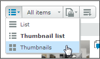

# Pagina-indeling op het tabblad Weergaven in [!DNL Workfront Proof]

>[!IMPORTANT]
>
>Dit artikel verwijst naar functionaliteit in het standalone product [!DNL Workfront Proof]. Voor informatie over proefdrukken binnen [!DNL Adobe Workfront], zie [Proofing](../../../review-and-approve-work/proofing/proofing.md).

U kunt de pagina-indeling aanpassen in het dialoogvenster [!UICONTROL Views] tab. De volgende lay-outopties zijn beschikbaar:

## Lijst

* Toont proef- of dossier - naam plus standaardmeningskolommen
* De [!UICONTROL proof actions] bevindt zich aan de rechterkant van de regel (1)

   

## Miniatuurlijst

* Toont proefdruk van afbeelding/bestand, pictogram, proefdruk of bestandsnaam plus kolommen in de standaardweergave
* De [!UICONTROL proof actions] bevindt zich aan de rechterkant van de regel (1)
* Dit is de standaardweergave.

   

## Miniaturen

* Alleen proefdruk weergeven van afbeeldings-/bestandspictogram en proef-/bestandsnaam
* De [!UICONTROL proof actions] bevindt zich in de rechterbovenhoek van elke proefdruk (1)

   

## De pagina-indeling wijzigen

Als u de pagina-indeling op het dashboard of de prullenbak wilt wijzigen, kiest u de gewenste weergave door op een van de weergaveknoppen boven aan de pagina te klikken:

Als u de paginalay-out op alle andere weergavepagina&#39;s in uw account wilt wijzigen, vouwt u het vervolgkeuzemenu boven aan de pagina uit en klikt u op de pagina-indeling van uw voorkeur:

