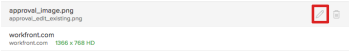

# Proefdrukken genereren in [!DNL Workfront Proof]

>[!IMPORTANT]
>
>Dit artikel verwijst naar functionaliteit in het zelfstandige product [!DNL Workfront Proof] . Voor informatie bij het proef binnen [!DNL Adobe Workfront], zie [ het Bewijzen ](../../../review-and-approve-work/proofing/proofing.md).

Met [!DNL Workfront Proof] kunt u proefdrukken maken van documenten of websites en deze proefdrukken delen met anderen. In de volgende stappen worden de verschillende configuratieopties beschreven die beschikbaar zijn:

## Een proefdruk maken voor een document

1. Voer een van de volgende handelingen uit om een nieuwe proefdruk te maken en de pagina [!UICONTROL New Proof] weer te geven:

   * Klik op de groene **[!UICONTROL New proof]** knop in de linkerbovenhoek van een pagina.
   * Klik in het gebied **[!UICONTROL Dashboard]** op de tab **[!UICONTROL Overview]** op de koppeling **[!UICONTROL New proof]** .

   * Verzenden via Dropzone (Enterprise-functie).
   * De pagina **[!UICONTROL New Proof]** wordt weergegeven.

1. Als u een of meer documenten wilt proefdrukken, voegt u documenten toe die op een van de volgende manieren moeten worden gecontroleerd (herhaalt u dit proces om meerdere te controleren documenten toe te voegen):

   * Sleep een document van het bestandssysteem naar het gebied voor slepen en neerzetten in het **[!UICONTROL Add Files]** -gebied.
   * Klik in het gebied voor slepen en neerzetten in het gebied **[!UICONTROL Add Files]** en blader naar het document dat u wilt uploaden en selecteer het in het bestandssysteem op uw werkstation.

     

1. Als u een of meer websites wilt controleren, geeft u de URL op van de website die u wilt controleren in het **[!UICONTROL Add Files]** -gebied en drukt u vervolgens op **[!UICONTROL Enter]** .

1. (Optioneel) Herhaal dit proces om meerdere websites aan een proefdruk toe te voegen.

   Voor meer details over het proefdrukken van websites, zie [ een proef voor een URL ](#generate-a-proof-for-a-url) produceren.

   

1. (Optioneel) Wijzig de bestandsnamen van geüploade bestanden:

   1. Plaats de muis boven de documentnaam die u wilt wijzigen in de documentlijst in het gebied **[!UICONTROL Add Files]** en klik vervolgens op het pictogram **[!UICONTROL Edit]** .

      

   1. Geef in het veld **[!UICONTROL Proof name]** een nieuwe naam op en klik vervolgens op **[!UICONTROL Done]** .

   1. (Optioneel) Als u bestanden wilt verwijderen die u wilt uploaden, beweegt u de muis over het document dat u wilt verwijderen in de documentlijst in het gebied **[!UICONTROL Add Files]** en klikt u op het pictogram **[!UICONTROL Delete]** .

      

   1. (Optioneel) Schakel de optie in **[!UICONTROL Combine all compatible files into single proof]** .

      **wanneer deze optie wordt toegelaten:** Alle statische dossiers en websites zijn beschikbaar in één enkele proef, en u kunt tot 50 dossiers in een bepaalde tijd uploaden.

      >[!NOTE]
      >
      >Interactieve bestanden, zoals video&#39;s en interactieve websites, kunnen niet worden gecombineerd tot één proefdruk.

      **wanneer deze optie wordt onbruikbaar gemaakt:** Alle documenten en websites worden geproduceerd als individuele proeven, en u kunt tot 20 dossiers in een bepaald ogenblik uploaden.

      Alle geüploade bestanden en websites combineren in één proefdruk:

      1. Schakel de optie **[!UICONTROL Combine all compatible files into single proof]** in.
      1. Geef in het veld **[!UICONTROL Proof name]** een nieuwe naam op voor de gecombineerde proefdruk.
      1. Wijzig in het gebied **[!UICONTROL Add Files]** de volgorde van de opgenomen bestanden door een bestand in de gewenste volgorde te slepen. De volgorde van de bestanden is de paginavolgorde van de gecombineerde proefdruk. Voor meer informatie over het creëren van gecombineerde proeven, zie [ tot een multi-paginaproef ](../../../review-and-approve-work/proofing/creating-proofs-within-workfront/create-multi-page-proof.md) leiden.

1. (Optioneel) Als u een geautomatiseerde workflow wilt gebruiken die meerdere fasen omvat, kunt u in de sectie **[!UICONTROL Workflow]** een van de volgende opties kiezen:

   * **Basis:** selecteer deze optie om gebruikers aan te wijzen die u toegang tot de proef onmiddellijk wilt hebben nadat het wordt gecreeerd. U kunt de proefdruk delen met meerdere gebruikers.

     Voor meer informatie over het delen van een proef, zie &quot;Toevoegend Gebruikers aan een Bewijs&quot;in [ Deel een proef binnen  [!DNL Adobe Workfront]](../../../review-and-approve-work/proofing/managing-proofs-within-workfront/share-a-proof-in-workfront.md).

   * **Geautomatiseerd:** selecteer deze optie om inhoudsoverzicht en goedkeuring te beheren wanneer u complexe overzichtsprocessen hebt, of als u inhoud voor overzicht naar de zelfde groepen regelmatig verzendt. Met een geautomatiseerde workflow wordt de proefdruk verplaatst van het werkgebied naar het werkgebied tot de definitieve goedkeuring. De betrokken gebruikers worden op elk moment op de hoogte gebracht dat zij een goedkeuring moeten verlenen.

     Voor meer informatie over het creëren van een Geautomatiseerd Werkschema, zie [ Opstelling een bewijs met een Geautomatiseerde Werkschema in  [!DNL Workfront Proof]](../../../workfront-proof/wp-work-proofsfiles/automated-workflow/set-up-proof-auto-workflow.md#create2).

1. Geef op of u e-mailmeldingen en een aangepast bericht wilt verzenden naar de gebruikers die u in de vorige stap hebt geselecteerd:

   * **breng ontvangers op de hoogte over deze proef:** selecteer deze optie om een e-mailbericht naar gebruikers te verzenden. Wanneer **[!UICONTROL Basic sharing]** is geselecteerd in de **[!UICONTROL Workflow]** -sectie, wordt een e-mailmelding verzonden wanneer de proefdruk wordt gemaakt. Wanneer **[!UICONTROL Automated workflow]** is geselecteerd in de **[!UICONTROL Workflow]** -sectie, wordt een e-mailmelding verzonden wanneer de proefdruk het werkgebied van de geautomatiseerde workflow ingaat waaraan de gebruiker is gekoppeld.

   * **voeg douanebericht toe:** selecteer deze optie om een douanebericht in het bericht te omvatten. U kunt een onderwerp en berichttekst opgeven. De berichttekst kan tekstopmaak bevatten, zoals vet, opsommingstekens en hyperlinks.

1. Selecteer een van de volgende proefdrukinstellingen:

   <table style="table-layout:auto"> 
    <col> 
    <col> 
    <tbody> 
     <tr> 
      <td role="rowheader">Aanmelding vereisen - proefdruk kan alleen worden gedeeld met andere gebruikers</td> 
      <td> 
<strong> vereist login - de proef kan slechts met andere gebruikers worden gedeeld:</strong> wanneer deze optie wordt geselecteerd, slechts [!DNL Workfront Proof] gebruikers kunnen de proef bekijken.
 
Deze optie is standaard uitgeschakeld. Iedereen met de URL kan de proefdruk bekijken.
 
Wanneer deze optie is geselecteerd:
 
       <ul> 
        <li>Gebruikers kunnen zich alleen aanmelden bij de proefdruk als ze aan de proefdruk zijn toegevoegd.</li> 
        <li>Abonnementen kunnen niet worden ingeschakeld.</li> 
       </ul> </td> 
     </tr> 
     <tr> 
      <td role="rowheader">Voor dit bewijs is slechts één besluit vereist</td> 
      <td> 
Wanneer deze optie is geselecteerd, wordt de evaluatie voltooid nadat een van de besluitvormers zijn besluit heeft genomen.
 
Deze optie is standaard uitgeschakeld.
 </td> 
     </tr> 
     <tr> 
      <td role="rowheader">Vereisen dat besluiten elektronisch worden ondertekend</td> 
      <td>Gebruikers moeten hun gebruikersnaam en wachtwoord opgeven op het moment dat zij een beslissing nemen over een bewijs.</td> 
     </tr> 
     <tr> 
      <td role="rowheader">Bewijs vergrendelen wanneer alle vereiste beslissingen zijn genomen</td> 
      <td> 
<strong></strong> Als deze instelling is ingeschakeld, wordt de proefdrukstatus vergrendeld nadat alle beslissingen zijn genomen. De status wordt automatisch gewijzigd van ontgrendeld in vergrendeld wanneer de laatste fiatteur zijn beslissing neemt.
 
Deze optie is standaard uitgeschakeld.
 </td> 
     </tr> 
     <tr> 
      <td role="rowheader">Origineel bestand downloaden</td> 
      <td> 
<strong></strong> Als deze optie is geselecteerd, kunnen revisoren het originele bestand downloaden van waaruit de proefdruk is gemaakt.
 
Wanneer deze optie is uitgeschakeld, is het pictogram Downloaden niet meer zichtbaar.  Deze optie wordt toegelaten door gebrek.
 </td> 
     </tr> 
     <tr> 
      <td role="rowheader">Proef delen via een openbare URL of insluitcode</td> 
      <td>Als deze optie is geselecteerd, kan de proefdruk worden gedeeld via een openbare URL of insluitcode.</td> 
     </tr> 
     <tr> 
      <td role="rowheader">Abonneren op bewijs via een openbare URL of insluitcode</td> 
      <td> 
Als deze optie is geselecteerd, kunnen personen die niet expliciet aan de proefdruk zijn toegevoegd, zich op de proefdruk abonneren. De persoon die zich op de proef abonneert, krijgt de rol en e-mail die u in de volgende montages bepaalt:
 
       <ul> 
        <li><strong> rol van de Abonnee </strong>: De standaardproefdrukrol die aan alle recensenten wordt toegewezen die aan de proef intekenen.</li> 
        <li><strong> e-mail waakzame montages voor abonnees </strong>: Het standaard e-mailalarm dat aan alle recensenten wordt toegewezen die aan de proef intekenen.</li> 
        <li> 
<strong> toegang van het Bewijs via e-mailverbinding die voor </strong> wordt vereist: Vorm of de abonnee een e-mail met een verbinding aan de proef ontvangt. U kunt <strong> Geen e-mail </strong> selecteren (de e-mailverbinding wordt niet vereist om tot de proef toegang te hebben), <strong> het bericht van het Bewijs slechts </strong> (de abonnee ontvangt een verbinding aan de proef via e-mail zonder enige controle), of <strong> Bevestiging en proef bericht e-mails </strong> (de abonnee ontvangt een verbinding aan de proef via e-mail en moet de verbinding klikken om tot een proef toegang te hebben; het doel is ervoor te zorgen dat de persoon een persoon is ingegaan e-mailadres corrigeren waartoe zij toegang hebben).
 
Opmerking: als de proefdrukken de automatische werkstroom hebben gekoppeld, worden alle abonnementen per e-mail met bevestiging verzonden naar de eigenaar van het bewijs, zodat ze kunnen beslissen in welk stadium de persoon moet worden toegevoegd.
 </li> 
       </ul> </td> 
     </tr> 
    </tbody> 
   </table>

1. Klik op **[!UICONTROL Create Proof]**.

   Workfront begint met het genereren van een proefdruk van de geselecteerde documenten of websites. Afhankelijk van de bestandsgrootte en het type varieert de vertraging bij het uploaden van een document. Wees geduld, want het duurt langer om grotere bestanden te genereren. U kunt van de pagina weg navigeren en Workfront blijft uw bestand genereren. De maximale grootte voor het uploaden van bestanden is 4 GB.

   Nadat de proefdruk is gegenereerd, klikt u op **[!UICONTROL Go to proof]** om het proefdrukprogramma te starten.

   

   Het document wordt weergegeven in het proefdrukprogramma.

   Gebruikers die geen proefdrukken op hun account hebben ingeschakeld, kunnen het document nog steeds bekijken en opmerkingen naar de proefdruk maken.

## Een proef voor een URL genereren {#generate-a-proof-for-a-url}

U kunt voor het eerst een proef voor een URL produceren. U kunt ook een nieuwe versie van een URL-proefdruk genereren waarvoor eerder een proefdruk is gegenereerd.

>[!NOTE]
>
>U kunt alleen een interactieve proefdruk voor een URL genereren als uw [!DNL Workfront] -omgeving is geïntegreerd met een [!DNL Workfront Proof] Premium-account. Als u geen proef zoals besproken in deze sectie kunt gebruiken, contacteer uw systeembeheerder.

Een proef voor een URL produceren:

1. Voer een van de volgende handelingen uit om een nieuwe proefdruk te maken en de pagina [!UICONTROL New Proof] weer te geven:

   * Klik op de groene **[!UICONTROL New proof]** knop in de linkerbovenhoek van een pagina.
   * Klik in het gebied **[!UICONTROL Dashboard]** op de tab **[!UICONTROL Overview]** op de koppeling **[!UICONTROL New proof]** .

   * Verzenden via Dropzone (Enterprise-functie).

1. (Voorwaardelijk) Maak op de pagina **[!UICONTROL New proof]** die wordt weergegeven een nieuwe versie van een bestaande proefdruk:

   1. Selecteer de proefdruk URL waar u een nieuwe versie wilt toevoegen.
   1. Klik op de knop **[!UICONTROL New Version]** boven aan de pagina.

      

1. Geef op de pagina Nieuwe proefdrukversie die wordt weergegeven de URL op van de website die u wilt controleren in het gebied **[!UICONTROL Add Files]** en druk vervolgens op **[!UICONTROL Enter]** .

1. (Optioneel) Herhaal dit proces om meerdere websites aan een proefdruk toe te voegen.

   

1. Klik op de website in de documentlijst in het gebied **[!UICONTROL Add Files]** .

   

1. Geef een **[!UICONTROL Proof name]** voor de proefdruk op.

   Standaard is de proefdruknaam dezelfde als de URL van de site.

1. Selecteer **[!UICONTROL Handle site contents]** opties:

   <table style="table-layout:auto"> 
    <col> 
    <col> 
    <tbody> 
     <tr> 
      <td role="rowheader">Schermopname vastleggen</td> 
      <td>Maakt een proefdruk van een statische afbeelding van de voorpagina van de URL.</td> 
     </tr> 
     <tr> 
      <td role="rowheader">Interactief</td> 
      <td> 
Hiermee maakt u een proefdruk waarmee revisoren door de site kunnen navigeren, HTML5-afbeeldingen, Flash-elementen enzovoort kunnen bekijken.
 
Als u een interactief proefdrukken wilt maken, moet de website worden gehost met een beveiligd protocol (https). Bovendien kunnen websites die niet in een iframe kunnen worden ingesloten, niet worden gegenereerd als een interactieve proefdruk (beperkingen voor het insluiten van iframes worden bepaald door de website die u probeert in te sluiten).
 
Nadat de eerste proefdruk is gemaakt, kan deze instelling niet worden gewijzigd wanneer u volgende versies maakt.
 
Voor meer informatie over het interactieve proef, zie <a href="#generate-a-proof-for-interactive-content" class="MCXref xref"> een proef voor interactieve inhoud </a> produceren.
 </td> 
     </tr> 
     <tr> 
      <td role="rowheader">Schermresolutie</td> 
      <td> 
(Deze optie is niet beschikbaar voor interactieve proefdrukken.) U kunt de resolutie aanpassen waarin uw inhoud wordt weergegeven, of u kunt meerdere resoluties selecteren.
 
Hierdoor kunnen gebruikers de proefdruk controleren om te zien hoe inhoud op verschillende apparaten, zoals verschillende formaten telefoons, tablets en monitoren, wordt weergegeven.
 
Als u meerdere resoluties selecteert, wordt voor elke resolutie die u selecteert een afzonderlijke proefdruk gemaakt.
 
Wanneer gebruikers opmerkingen plaatsen over de proefdruk, wordt de huidige schermresolutie automatisch weergegeven in de opmerking om ervoor te zorgen dat andere gebruikers weten met welke resolutie de opmerking wordt geassocieerd.
 </td> 
     </tr> 
     <tr> 
      <td role="rowheader">Zoeken naar subpagina's</td> 
      <td>(Deze optie is niet beschikbaar voor interactieve proefdrukken.) Selecteer deze optie om door pagina's van de website te navigeren. U kunt de website tot 2 niveaus diep van de hoofdpagina uitbreiden. Plaats de muis boven een pagina om de URL van de pagina weer te geven. Selecteer alleen de pagina's waarvan u een proefdruk wilt maken. Elke pagina u selecteert wordt gecreeerd als individuele proef door gebrek; of, laat <strong> combineren in enige proef </strong> optie toe om alle geselecteerde pagina's in één enkel bewijs te combineren.</td> 
     </tr> 
    </tbody> 
   </table>

1. (Optioneel) Configureer eventuele geavanceerde opties voor proefdrukken, zoals het delen van de proefdruk, het toevoegen van een geautomatiseerde workflow of het instellen van toegangs- en abonnementsinstellingen. Raadpleeg de volgende artikelen voor meer informatie over deze opties:

   * [Een proefdruk delen binnen  [!DNL Adobe Workfront]](../../../review-and-approve-work/proofing/managing-proofs-within-workfront/share-a-proof-in-workfront.md)
   * [Opstelling een proef met een Geautomatiseerde Werkschema in  [!DNL Workfront Proof]](../../../workfront-proof/wp-work-proofsfiles/automated-workflow/set-up-proof-auto-workflow.md)
   * [Toegang- en abonnementsinstellingen configureren voor een proefdruk](../../../review-and-approve-work/proofing/managing-proofs-within-workfront/configure-access-subscription-settings-proof.md)

1. Klik op **[!UICONTROL Done]**.

   Als u een nieuwe versie toevoegt aan een bestaande URL-proefdruk, blijven de opties die op de oorspronkelijke proefdruk of vorige versie zijn geconfigureerd, behouden in deze versie. Als u een nieuwe versie toevoegt aan een bestaande URL-proefdruk, blijven de opties die op de oorspronkelijke proefdruk of vorige versie zijn geconfigureerd, behouden in deze versie.

1. Klik op **[!UICONTROL Create Proof]**.

## Een proefdruk maken voor interactieve inhoud {#generate-a-proof-for-interactive-content}

Voor het gebruik van deze functie is een Pro Workfront-abonnement of hoger vereist. Voor meer informatie over de diverse beschikbare plannen, zie [ Abonnementen van Workfront ](https://www.workfront.com/plans).

Voor meer informatie over Interactieve inhoud, zie [ Interactieve inhoudsproeven overzicht ](../../../review-and-approve-work/proofing/proofing-overview/interactive-content-proofs.md).

* [Interactieve inhoud toevoegen als een URL](#add-interactive-content-as-a-url)
* [Interactieve inhoud toevoegen als ZIP-bestand](#add-interactive-content-as-a-zip-file)

### Interactieve inhoud toevoegen als een URL {#add-interactive-content-as-a-url}

Voor informatie over hoe te om een interactieve proef toe te voegen URL, zie [ een proef voor een URL ](#generate-a-proof-for-a-url) produceren.

### Interactieve inhoud toevoegen als ZIP-bestand {#add-interactive-content-as-a-zip-file}

1. Bereid uw inhoud voor door een ZIP-gebundeld bestand te maken.

   Voor informatie over .zip gebundelde dossierspecificaties, zie [ Ongeveer voorbereidend interactieve inhoud in een dossier van het PIT voor het proef ](../../../review-and-approve-work/proofing/proofing-overview/interactive-content-proofs.md#howtoprepareaninteractiveziparchive) in het artikel [ Interactieve inhoudsproefdrukken ](../../../review-and-approve-work/proofing/proofing-overview/interactive-content-proofs.md).

1. Voer een van de volgende handelingen uit om een nieuwe proefdruk te maken en de pagina [!UICONTROL New Proof] weer te geven:

   * Klik op de groene **[!UICONTROL New proof]** knop in de linkerbovenhoek van een pagina.
   * Klik in het gebied **[!UICONTROL Dashboard]** op de tab **[!UICONTROL Overview]** op de koppeling **[!UICONTROL New proof]** .

   * Verzenden via Dropzone (Enterprise-functie).

1. Sleep op de pagina **[!UICONTROL New proof]** die wordt weergegeven de interactieve ZIP-bundel naar het **[!UICONTROL Add files]** -gebied.

1. (Optioneel) Configureer eventuele geavanceerde opties voor proefdrukken, zoals het delen van de proefdruk, het toevoegen van een geautomatiseerde workflow of het instellen van toegangs- en abonnementsinstellingen. Raadpleeg de volgende artikelen voor meer informatie over deze opties:

   * [Een proefdruk delen binnen  [!DNL Adobe Workfront]](../../../review-and-approve-work/proofing/managing-proofs-within-workfront/share-a-proof-in-workfront.md)
   * in het artikel
   * [Toegang- en abonnementsinstellingen configureren voor een proefdruk](../../../review-and-approve-work/proofing/managing-proofs-within-workfront/configure-access-subscription-settings-proof.md)

1. Klik op **[!UICONTROL Create Proof]**.

   Workfront begint een bewijs van de ZIP-bundel te genereren. Afhankelijk van de bundelgrootte varieert de vertragingstijd bij het uploaden van een document. Het genereren van grotere bestanden duurt langer. U kunt van de pagina weg navigeren en Workfront blijft uw bestand genereren. De maximale grootte voor het uploaden van bestanden is 4 GB.

   Nadat de proefdruk is gegenereerd, kunt u op de knop **[!UICONTROL Go to proof]** klikken om de proefdruk te openen.
