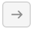
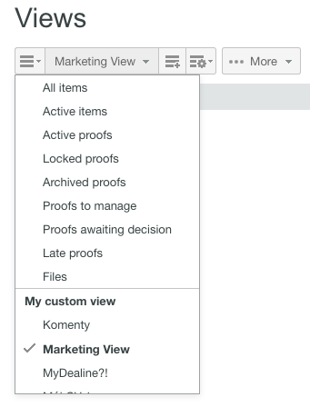
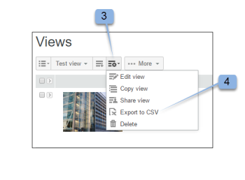

# Aangepaste weergaven maken en beheren in [!DNL Workfront Proof]

>[!IMPORTANT]
>
>Dit artikel verwijst naar functionaliteit in het zelfstandige product [!DNL Workfront Proof] . Voor informatie bij het proef binnen [!DNL Adobe Workfront], zie [ het Bewijzen ](../../../review-and-approve-work/proofing/proofing.md).

U kunt aangepaste weergaven van uw bestanden en proefdrukken maken om de gewenste items weer te geven op de manier waarop u ze wilt weergeven. U kunt de informatie in uw mening van de Douane ook uitvoeren als rapport (in CSV, komma gescheiden waarde, dossierformaat).

>[!NOTE]
>
>Aangepaste weergaven zijn alleen beschikbaar voor Select- en Premium-abonnementen. Neem contact op met ons verkoopteam voor een prijsopgave.

## Een aangepaste weergave maken

Wanneer u een aangepaste weergave maakt, kunt u kiezen:

* Of proefdrukken, bestanden of beide moeten worden opgenomen
* Welke kolommen worden weergegeven
* Op welke kolom sorteren
* De sorteervolgorde voor de kolom (oplopend of aflopend)
* Welke typen filters moeten worden gebruikt om te bepalen welke informatie in de weergave wordt opgenomen

Nadat de aangepaste weergave is gemaakt, kunt u deze direct gebruiken. De naam van de nieuwe weergave is ook opgenomen in het vervolgkeuzemenu onder Mijn aangepaste weergaven (onder de standaardweergaven).

Een aangepaste weergave maken:

1. Ga naar de pagina **[!UICONTROL Views]** .
1. Voor meer informatie over meningen, zie [ Punten op de Pagina van Weergaven in  [!DNL Workfront Proof]](../../../workfront-proof/wp-work-proofsfiles/manage-your-work/manage-items-on-views-page.md) leiden.
1. Voer een van de volgende handelingen uit, afhankelijk van het feit of u een nieuwe aangepaste weergave helemaal opnieuw wilt maken of een nieuwe aangepaste weergave wilt maken op basis van een bestaande standaardweergave:

   * Als u een nieuwe aangepaste weergave wilt maken op basis van een bestaande standaardweergave, selecteert u in het keuzemenu de bestaande standaardweergave die u als basis voor de nieuwe aangepaste weergave wilt gebruiken. Klik op het pictogram **[!UICONTROL View Settings]** en klik vervolgens op **[!UICONTROL Copy]** om een nieuwe aangepaste weergave te maken.

   * 

   * Als u een geheel nieuwe aangepaste weergave wilt maken, klikt u op het pictogram **[!UICONTROL New View]** .
   * 

1. Geef in de sectie **[!UICONTROL Details]** de volgende informatie op:

   * **[!UICONTROL Name]** (vereist): De naam voor de nieuwe weergave. Gebruik een unieke naam, zodat gebruikers de aangepaste weergave gemakkelijk kunnen vinden in het vervolgkeuzemenu in Weergaven.
   * **[!UICONTROL Items]**: selecteer of u zowel proefdrukken als bestanden, alleen proefdrukken of alleen bestanden in de weergave wilt opnemen. Standaard worden zowel proefdrukken als bestanden opgenomen.

1. Bepaal in de sectie **[!UICONTROL Columns]** welke kolommen u in de aangepaste weergave wilt opnemen.

   1. Klik op het pictogram Pijl-rechts.
   1. 

   1. Klik de naam van de geselecteerde kolom tweemaal.
   1. U moet ten minste één kolom selecteren en er kan slechts één kolom worden toegevoegd.
   1. Selecteer een kolom in het **[!UICONTROL Available columns]** -gebied dat u in de nieuwe weergave wilt opnemen.
   1. De kolommen worden verplaatst van de lijst **[!UICONTROL Available columns]** naar de lijst **[!UICONTROL Selected columns]** .

   1. U kunt uit de standaardkolommen selecteren, of u kunt de gebieden van de Douane en BeslissingsRedenen kiezen om kolommen in uw douanemening te zijn. (Als u deze hebt geconfigureerd in uw account, worden ze weergegeven onder de standaardlijst met beschikbare kolommen.)
   1. Standaardkolommen die u kunt opnemen

      <table style="table-layout:auto">
      <thead>

      </thead>
      <tbody>  
      <tr>   
      <td><strong>Naam van actief werkgebied</strong></td>   
      <td>Naam van het actieve werkgebied in de geautomatiseerde workflow.</td>  
      </tr>  
      <tr>   
      <td><strong>Opmerkingen</strong></td>   
      <td>Het aantal ontvangen opmerkingen.</td>
      </tr>  
      <tr>   
      <td><strong>Teller</strong></td>
      <td>Hier wordt een aantal van de proefdrukken weergegeven die op uw account zijn geüpload (u moet een optie voor de proefdrukteller hebben ingeschakeld in Accountinstellingen).</td>
      </tr>
      <tr>
      <td><strong>Gemaakt</strong></td>
      <td>De datum en tijd waarop het item is gemaakt.</td>
      </tr>
      <tr>
      <td><strong>Maker</strong></td>
      <td>De gebruiker die het item heeft gemaakt.</td>
      </tr>
      <tr>
      <td><strong>[!UICONTROL Date added to proof]</strong></td>
      <td>De datum waarop u aan het bewijs bent toegevoegd. </td>
      </tr>
      <tr>
      <td><strong>Deadline</strong></td>
      <td>De uiterste datum voor het volledige bewijs.</td>
      </tr>
      <tr>
      <td><strong>Besluiten</strong></td>
      <td>Het aantal besluiten dat wordt gegeven uit het verwachte aantal (bv. 0 van 1, 1 van 1, enz.)</td>
      </tr>
      <tr>
      <td><strong>[!UICONTROL Downloads]</strong></td>
      <td>Het aantal keren dat het oorspronkelijke bestand is gedownload.</td>
      </tr>
      <tr>
      <td><strong>Bestandsnaam</strong></td>
      <td>De naam van het bestand of de proefdruk.</td>
      </tr>
      <tr>
      <td><strong>Map</strong></td>
      <td>De map met het item.</td>
      </tr>
      <tr>
      <td><strong>Laatste activiteit</strong></td>
      <td>De datum en het tijdstip van de laatste activiteit op het item.</td>
      </tr>
      <tr>
      <td><strong>Laatste beslissing</strong></td>
      <td>Datum en tijdstip van de laatste beslissing.</td>
      </tr>
      <tr>
      <td><strong>Mijn deadline</strong></td>
      <td>Uw eigen deadline op de proefdrukken waar u expliciet als revisor/fiatteur wordt toegevoegd (indien van toepassing).</td>
      </tr>
      <tr>
      <td><strong>Eigenaar</strong></td>
      <td>De eigenaar van het item.</td>
      </tr>
      <tr>
      <td><strong>Land van eigenaar</strong></td>
      <td>Het land dat in het systeem is geregistreerd voor de eigenaar van het bewijs. </td>
      </tr>
      <tr>
      <td><strong>Bovenliggende proefdruk</strong></td>
      <td>De naam van de bovenliggende proefdruk.</td>
      </tr>
      <tr>
      <td><strong>Voortgang</strong></td>
      <td>
Voortgangsbalk. Hiermee geeft u proefdrukken weer die nog niet zijn gestart, geopend, opmerkingen geplaatst of ingeschakeld.

Deze informatie is niet gesorteerd op.
</td>
      </tr>
      <tr>
      <td><strong>Proefnaam</strong></td>
      <td>De naam van de proefdruk.</td>
      </tr>
      <tr>
      <td><strong>Type proef</strong></td>
      <td>
Het type proefdruk: Statisch bestand, Statische webpagina, Interactief web (.zip-upload), Interactieve webpagina (https), Video, Audio en Overige. 

Gecombineerde proefdrukken worden aangeduid als "Gecombineerde proefdrukken". Bestandstype van de proefdruk.
</td>
      </tr>
      <tr>
      <td><strong>Bestandsgrootte (MB)</strong></td>
      <td>
De bestandsgrootte van de proefdruk heeft betrekking op de quota voor schijfgebruik.

Deze informatie werd verstrekt voor de huidige versie van het bewijs. Als er geen huidige versie is, is het voor de meest recente versie.
</td>
      </tr>
      <tr>
      <td>
 

<strong>Termijn actieve fase</strong>
</td>
      <td>Deadline van de fasen in de geautomatiseerde workflow.</td>
      </tr>
      <tr>
      <td><strong>Werkgebiednaam</strong></td>
      <td>Naam van elk werkgebied in de geautomatiseerde workflow. Dit omvat eerdere fasen, actieve fasen en toekomstige fasen.</td>
      </tr>
      <tr>
      <td><strong>Staat</strong></td>
      <td>Actief, Vergrendeld, Concept of Verzenden.</td>
      </tr>
      <tr>
      <td><strong>Status</strong></td>
      <td>In behandeling, vereiste veranderingen, Goedgekeurd met veranderingen, Goedgekeurd, of niet relevant.</td>
      </tr>
      <tr>
      <td><strong>Tags</strong></td>
      <td>Alle tags die aan het item zijn gekoppeld.</td>
      </tr>
      <tr>
      <td><strong>Opkomende werkgebiednamen</strong></td>
      <td> Naam van elk werkgebied dat nog niet is gestart in de geautomatiseerde workflow. </td>
      </tr>
      <tr>
      <td><strong>Versieteller</strong></td>
      <td> Het aantal versies van het item. </td>
      </tr>
      <tr>
      <td><strong>Versienummer proefexemplaar</strong></td>
      <td><i>Het versienummer van de proefdruk.</i></td>
      </tr> 
      </tbody>
      </table>

   1. (Optioneel) Voer een van de volgende handelingen uit om de kolom naar het **[!UICONTROL Selected columns]** -gebied te verplaatsen, zodat deze wordt opgenomen in de nieuwe weergave:

      * Kolommen in de lijst **[!UICONTROL Selected columns]** opnieuw rangschikken.
      * De volgorde waarin kolommen in de lijst **[!UICONTROL Selected columns]** worden weergegeven, bepaalt de volgorde waarin de kolommen in de aangepaste weergave worden weergegeven.
      * De kolommen zijn zichtbaar in de lijst **[!UICONTROL Selected columns]** in de volgorde waarin u ze uit de lijst **[!UICONTROL Available columns]** hebt toegevoegd.

      * Als u de volgorde van een kolom in de lijst **[!UICONTROL Selected columns]** wilt wijzigen, selecteert u de naam van de kolom en sleept u deze omhoog of omlaag in de lijst.

      * Verwijder een kolom uit de lijst **[!UICONTROL Selected columns]** door op de naam van de geselecteerde kolom te klikken en vervolgens op de pijl **[!UICONTROL Left]** te klikken. U kunt ook dubbelklikken op de naam van de geselecteerde kolom (de kolom wordt weer naar de lijst van **[!UICONTROL Available columns]** verplaatst).

      * Een kolom kan slechts eenmaal worden toegevoegd. Als u bijvoorbeeld de kolom Opmerkingen verplaatst van [!UICONTROL Available] naar de lijst [!UICONTROL Selected columns] , verdwijnt de naam van deze kolom uit de lijst in [!UICONTROL Available columns] .

1. Geef in de sectie **[!UICONTROL Sorting]** de volgende informatie op:

   * **Soort door:** gebruik het [!UICONTROL Sorting] lusje als u een bepaalde orde wilt plaatsen waarin de punten in uw douanemening vermeld zijn. Als u geen kolom selecteert om te sorteren, is het gebrek Geen kolom - namelijk geen speciale soortkolom of orde.
   * Alleen de kolommen die u hebt geselecteerd op het tabblad [!UICONTROL Columns] , worden opgenomen in de vervolgkeuzelijst [!UICONTROL Sort by column] .
   * **het stijgen of het Dalen:** selecteer of u de kolom of het stijgen of het Dalen door gebrek wilt sorteren.

1. Gebruik de sectie **[!UICONTROL Filters]** om een of meer criteria te definiëren voor het selecteren van items die u wilt opnemen in de aangepaste weergave. Filters zijn vooral handig als u de aangepaste weergave als een rapport wilt gebruiken.
1. Als u alle items in uw aangepaste weergave wilt opnemen, slaat u de sectie **[!UICONTROL Filters]** over.
1. Beschikbare filters:

   * **Gebied:** selecteer het Gebied voor deze filter (de Commentaren zijn het standaardgebied.) De lijst Veld bevat alle velden Standaard (zoals op het tabblad [!UICONTROL Columns] ). De lijst is niet beperkt tot de kolommen die u hebt geselecteerd voor weergave.
   * **Exploitant:** de operatoren beschikbaar voor de filter hangen van het type van Gebied af u selecteerde. Selecteer een operator die de relatie tussen het veld en het waardeveld weergeeft. U vult deze gegevens later in.
   * **Waarde:** selecteer of ga uw gekozen waarde op dit Gebied in, volgens het gebied en de Exploitant u selecteerde. Afhankelijk van de operator die u hebt gekozen, kan er één waardeveld of twee of geen veld zijn. Zie de onderstaande voorbeelden.
   * **de Filters worden toegepast gebruikend de volgende logica:** de criteria van de Filter tussen verschillende gebieden zullen de exploitant EN gebruiken. Meerdere filtercriteria met hetzelfde veld gebruiken de operator OR voor hetzelfde veld.

     Selecteer de volgende waarden als u alleen proefdrukken met opmerkingen van nul wilt weergeven:

      * Veld: opmerkingen
      * Operator: gelijk aan
      * Waardeveld: 0

     Als u alleen proefdrukken met twee of meer opmerkingen wilt zien, selecteert u de volgende waarden:

      * Veld: opmerkingen
      * Operator: groter of gelijk aan
      * Waarde veld: 2

     Selecteer de volgende waarden als u alleen proefdrukken met tussen 1 en 4 opmerkingen wilt weergeven:

      * Veld: opmerkingen
      * Operator: tussen
      * Waarde veld (eerste veld): 1
      * Waarde veld (tweede veld): 4

        U kunt een filter dat u zonder problemen aan uw mening van de Douane hebt toegevoegd veranderen of het verwijderen door het dwarspictogram naast het [!UICONTROL setup] filter te klikken indien nodig.

        Omdat de lijst Veld niet beperkt is tot de kolommen die u op het tabblad [!UICONTROL Columns] hebt geselecteerd, moet u voorzichtig zijn wanneer u een filter maakt dat een kolom bevat die u niet hebt geselecteerd voor weergave in de aangepaste weergave. Met het volgende filter voor de weergave selecteert u bijvoorbeeld alle proefdrukken met een versieteller van 2 of meer:

         * Veld = versieteller
         * Operator = Groter of gelijk aan
         * Waarde veld = 2

           >[!NOTE]
           >
           >U kunt een filter dat u zonder problemen aan uw mening van de Douane hebt toegevoegd veranderen of het verwijderen door het dwarspictogram naast het [!UICONTROL setup] filter te klikken indien nodig.

1. Selecteer in de sectie **[!UICONTROL Sharing]** welke gebruikers in uw account uw aangepaste weergave kunnen bekijken.
1. Aangepaste weergaven zijn specifiek voor de gebruiker die ze maakt. Standaard is de nieuwe weergave Aangepast alleen zichtbaar voor de maker. U kunt er echter voor kiezen om de aangepaste weergave te delen door een van de volgende opties te kiezen:

   * **slechts kunt u deze douanemening** zien (gebrek): Selecteer deze optie als u de douanemening beschikbaar slechts aan u wilt zijn.
   * **alle gebruikers kunnen deze douanemening** zien: Selecteer deze optie om de douanemening beschikbaar te maken aan alle gebruikers op uw rekening.
   * **Uitgezochte gebruikers die deze douanemening** kunnen zien: Selecteer deze optie om de douanemening beschikbaar te maken slechts aan specifieke gebruikers.
   * Typ de naam of het e-mailadres van de gebruiker die u toegang tot de aangepaste weergave wilt geven en klik vervolgens op de naam wanneer deze wordt weergegeven in de vervolgkeuzelijst.
   * Als u ervoor kiest om uw weergave op dit moment niet te delen met andere gebruikers, kunt u dat later doen door de aangepaste weergave te bewerken.

1. Klik op **[!UICONTROL Create]**.
1. De weergave Aangepast wordt weergegeven en is beschikbaar op de pagina [!DNL Views] . Voor meer informatie over meningen, zie [ Punten op de  [!DNL Views]  Pagina in  [!DNL Workfront Proof]](../../../workfront-proof/wp-work-proofsfiles/manage-your-work/manage-items-on-views-page.md) leiden.

## Aangepaste weergaven bewerken

U kunt een aangepaste weergave gemakkelijk bewerken. Een aangepaste weergave bewerken:

1. Ga naar de pagina **[!UICONTROL Views]** .\
   Voor meer informatie over meningen, zie [ Punten op de Pagina van Weergaven in  [!DNL Workfront Proof]](../../../workfront-proof/wp-work-proofsfiles/manage-your-work/manage-items-on-views-page.md) leiden.

1. Klik op de knop [!UICONTROL Views] (1)
1. Selecteer de weergave die u wilt bewerken in het keuzemenu.\
   

1. Klik op de knop **[!UICONTROL View Options]** en klik vervolgens op **[!UICONTROL Edit view]** .\
   \
   De pagina Aangepaste weergave bewerken wordt weergegeven.

1. Klik op het menu [!UICONTROL Actions] . (3)\
   Deze knop is alleen beschikbaar als u de kolom Proefnaam in uw weergave opneemt.
1. Selecteer [!UICONTROL Edit view] in het menu. (4) \
   

1. De aangepaste weergavepagina Bewerken wordt weergegeven.

>[!NOTE]
>
>Als u de weergave Aangepast bewerkt, worden de kolommen in de lijst Geselecteerde kolommen automatisch in alfabetische volgorde gerangschikt. U moet deze indien nodig opnieuw rangschikken voordat u de weergave bijwerkt.

## Aangepaste weergaven kopiëren

Met de functie Kopiëren kunt u eenvoudig een kopie van een bestaande aangepaste weergave maken. Dit is bijvoorbeeld handig als u verschillende weergaven wilt instellen voor al uw ontwerpers, waarbij elke weergave hetzelfde is, behalve de eigenaar van de proefdruk (ontwerper).

Een aangepaste weergave kopiëren:

1. Ga naar de pagina **[!UICONTROL Views]** .\
   Voor meer informatie over meningen, zie [ Punten op de Pagina van Weergaven in  [!DNL Workfront Proof]](../../../workfront-proof/wp-work-proofsfiles/manage-your-work/manage-items-on-views-page.md) leiden.

1. Klik op de knop **[!UICONTROL Views]** . (1)
1. Selecteer de aangepaste weergave in de lijst. (2)
1. Klik op het menu **[!UICONTROL Actions]** . (3)\
   Deze knop is alleen beschikbaar als u de kolom Proefnaam in uw weergave opneemt.

1. Selecteer [!UICONTROL Copy] in het menu. (4)\
   

1. Op de aangepaste weergavepagina Kopiëren worden alle oorspronkelijke instellingen gevuld. Wijzig de weergave Aangepast naar keuze en klik op de knop **[!UICONTROL Copy view]** . U wordt direct naar de nieuwe weergave geleid.\
   

## Aangepaste weergaven delen

Met de functie voor de weergave Delen kunt u een weergave delen met andere gebruikers in uw account als u deze nog niet hebt geselecteerd in de sectie Delen voor de weergave. Wanneer u een aangepaste weergave deelt met andere gebruikers, wordt de weergave weergegeven in het gedeelte [!UICONTROL My custom views] van de vervolgkeuzelijst Weergaven.

Een aangepaste weergave delen met andere gebruikers:

1. Ga naar de pagina **[!UICONTROL Views]** .\
   Voor meer informatie over meningen, zie [ Punten op de Pagina van Weergaven in  [!DNL Workfront Proof]](../../../workfront-proof/wp-work-proofsfiles/manage-your-work/manage-items-on-views-page.md) leiden.

1. Klik op de knop **[!UICONTROL Views]** (1)
1. Selecteer de aangepaste weergave in de lijst (2)
1. Klik op het menu **[!UICONTROL Actions]** . (3)\
   Deze knop is alleen beschikbaar als u de kolom Proefnaam in uw weergave opneemt.

1. Selecteer [!UICONTROL Share view] in het menu (4)
1. De pagina Aangepaste weergave bewerken wordt weergegeven.
1. Selecteer in de sectie [!UICONTROL Sharing] de gebruikers met wie u de weergave wilt delen en klik op **[!UICONTROL Update view]** .

   

## Aangepaste weergaven exporteren naar CSV-bestanden

De gegevens vanuit een aangepaste weergave exporteren naar een CSV-bestand:

1. Ga naar de pagina **[!UICONTROL Views]** .\
   Voor meer informatie over meningen, zie [ Punten op de Pagina van Weergaven in  [!DNL Workfront Proof]](../../../workfront-proof/wp-work-proofsfiles/manage-your-work/manage-items-on-views-page.md) leiden.

1. Klik op de knop **[!UICONTROL Views]** . (1)
1. Selecteer de aangepaste weergave in de lijst. (2)
1. Klik op het menu **[!UICONTROL Actions]** . (3)\
   Deze knop is alleen beschikbaar als u de kolom Proefnaam in uw weergave opneemt.

1. Selecteer [!UICONTROL Export to CSV] in het menu. (4)\
   \
   In een afzonderlijk browservenster wordt &#39;Rapport genereren: 100%&#39; weergegeven plus het aantal records (het aantal items dat in het rapport is opgenomen vanuit de aangepaste weergave)

1. (Voorwaardelijk) Als er een beveiligingsbericht verschijnt dat het downloaden van het rapport momenteel is geblokkeerd, klikt u om het downloaden toe te staan.
1. Klik op **[!UICONTROL Save]** wanneer het venster Bestanden downloaden verschijnt met de vraag of u het bestand wilt openen of opslaan.
1. Selecteer een locatie op de computer en sla het bestand op.

## Aangepaste weergaven verwijderen

U kunt een aangepaste weergave gemakkelijk verwijderen. Dit doet u als volgt:

1. Ga naar de pagina **[!UICONTROL Views]** .\
   Voor meer informatie over meningen, zie [ Punten op de Pagina van Weergaven in  [!DNL Workfront Proof]](../../../workfront-proof/wp-work-proofsfiles/manage-your-work/manage-items-on-views-page.md) leiden.

1. Klik op de knop **[!UICONTROL Views]** .
1. Selecteer de aangepaste weergave in de lijst
1. Klik op het menu **[!UICONTROL Actions]** . (3)\
   Deze knop is alleen beschikbaar als u de kolom Proefnaam in uw weergave opneemt.

1. Selecteer [!UICONTROL Delete] in het menu. (4)\
   

1. Klik op **[!UICONTROL Delete]** (5) om te bevestigen dat u de huidige aangepaste weergave wilt verwijderen\
   

1. De standaardweergave Alle items wordt weergegeven en de verwijderde aangepaste weergave wordt niet meer weergegeven in het vervolgkeuzemenu **[!UICONTROL Views]** .
