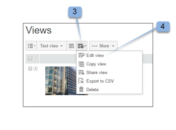
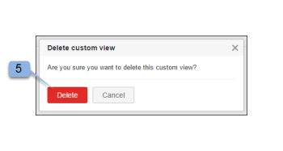

# Aangepaste weergaven maken en beheren in [!DNL Workfront Proof]

>[!IMPORTANT]
>
>Dit artikel verwijst naar functionaliteit in het standalone product [!DNL Workfront Proof]. Voor informatie over proefdrukken binnen [!DNL Adobe Workfront], zie [Proofing](../../../review-and-approve-work/proofing/proofing.md).

U kunt aangepaste weergaven van uw bestanden en proefdrukken maken om de gewenste items weer te geven op de manier waarop u ze wilt weergeven. U kunt de informatie in uw mening van de Douane ook uitvoeren als rapport (in CSV, komma gescheiden waarde, dossierformaat).

>[!NOTE]
>
>Aangepaste weergaven zijn alleen beschikbaar voor Select- en Premium-abonnementen. Neem contact op met ons verkoopteam voor een prijsopgave.

## Een aangepaste weergave maken

Wanneer u een aangepaste weergave maakt, kunt u kiezen:

* Of proefdrukken, bestanden of beide moeten worden opgenomen
* Welke kolommen worden weergegeven
* Op welke kolom sorteren
* De sorteervolgorde voor de kolom (oplopend of aflopend)
* Welke typen filters moeten worden gebruikt om te bepalen welke informatie in de weergave wordt opgenomen

Nadat de aangepaste weergave is gemaakt, kunt u deze direct gebruiken. De naam van de nieuwe weergave is ook opgenomen in het vervolgkeuzemenu onder Mijn aangepaste weergaven (onder de standaardweergaven).

Een aangepaste weergave maken:

1. Ga naar de **[!UICONTROL Views]** pagina.
1. Voor meer informatie over weergaven raadpleegt u [Items op de weergavepagina beheren in [!DNL Workfront Proof]](../../../workfront-proof/wp-work-proofsfiles/manage-your-work/manage-items-on-views-page.md).
1. Voer een van de volgende handelingen uit, afhankelijk van het feit of u een nieuwe aangepaste weergave helemaal opnieuw wilt maken of een nieuwe aangepaste weergave wilt maken op basis van een bestaande standaardweergave:

   * Een nieuwe aangepaste weergave maken op basis van een bestaande standaardweergave: Selecteer in het keuzemenu de bestaande standaardweergave die u als basis voor de nieuwe aangepaste weergave wilt gebruiken. Klik op de knop **[!UICONTROL View Settings]** pictogram, klik vervolgens op **[!UICONTROL Copy]** naar nieuwe aangepaste weergave.

   * 

   * Een geheel nieuwe aangepaste weergave maken: Klik op de knop **[!UICONTROL New View]** pictogram.
   * 

1. In de **[!UICONTROL Details]** de volgende informatie op:

   * **[!UICONTROL Name]** (vereist): De naam voor de nieuwe weergave. Gebruik een unieke naam, zodat gebruikers de aangepaste weergave gemakkelijk kunnen vinden in het vervolgkeuzemenu in Weergaven.
   * **[!UICONTROL Items]**: Selecteer of u zowel proefdrukken als bestanden, alleen proefdrukken of bestanden alleen in de weergave wilt opnemen. Standaard worden zowel proefdrukken als bestanden opgenomen.

1. In de **[!UICONTROL Columns]** , bepaalt u welke kolommen u in de aangepaste weergave wilt opnemen.

   1. Klik op het pictogram Pijl-rechts.
   1. 

   1. Dubbelklik op de naam van de geselecteerde kolom.
   1. U moet ten minste één kolom selecteren en er kan slechts één kolom worden toegevoegd.
   1. Selecteer een kolom in het menu **[!UICONTROL Available columns]** gebied dat u in de nieuwe weergave wilt opnemen.
   1. De kolommen worden verplaatst van de **[!UICONTROL Available columns]** aan de **[!UICONTROL Selected columns]** lijst.

   1. U kunt uit de standaardkolommen selecteren, of u kunt de gebieden van de Douane en BeslissingsRedenen kiezen om kolommen in uw douanemening te zijn. (Als u deze hebt geconfigureerd in uw account, worden ze weergegeven onder de standaardlijst met beschikbare kolommen.)
   1. Standaardkolommen die u kunt opnemen

      <table style="table-layout:auto">
      <thead>

      </thead>
      <tbody>  
      <tr>   
      <td><strong>Naam van actief werkgebied</strong></td>   
      <td>Naam van het actieve werkgebied in de geautomatiseerde workflow.</td>  
      </tr>  
      <tr>   
      <td><strong>Opmerkingen</strong></td>   
      <td>Het aantal ontvangen opmerkingen.</td>
      </tr>  
      <tr>   
      <td><strong>Teller</strong></td>
      <td>Hier wordt een aantal van de proefdrukken weergegeven die op uw account zijn geüpload (u moet een optie voor de proefdrukteller hebben ingeschakeld in Accountinstellingen).</td>
      </tr>
      <tr>
      <td><strong>Gemaakt</strong></td>
      <td>De datum en tijd waarop het item is gemaakt.</td>
      </tr>
      <tr>
      <td><strong>Maker</strong></td>
      <td>De gebruiker die het item heeft gemaakt.</td>
      </tr>
      <tr>
      <td><strong>[!UICONTROL Date added to proof]</strong></td>
      <td>De datum waarop u aan het bewijs bent toegevoegd. </td>
      </tr>
      <tr>
      <td><strong>Deadline</strong></td>
      <td>De uiterste datum voor het volledige bewijs.</td>
      </tr>
      <tr>
      <td><strong>Besluiten</strong></td>
      <td>Het aantal besluiten dat wordt gegeven op basis van het verwachte aantal (bv. 0 van 1, 1 van 1, enz.)</td>
      </tr>
      <tr>
      <td><strong>[!UICONTROL Downloads]</strong></td>
      <td>Het aantal keren dat het oorspronkelijke bestand is gedownload.</td>
      </tr>
      <tr>
      <td><strong>Bestandsnaam</strong></td>
      <td>De naam van het bestand of de proefdruk.</td>
      </tr>
      <tr>
      <td><strong>Map</strong></td>
      <td>De map met het item.</td>
      </tr>
      <tr>
      <td><strong>Laatste activiteit</strong></td>
      <td>De datum en het tijdstip van de laatste activiteit op het item.</td>
      </tr>
      <tr>
      <td><strong>Laatste beslissing</strong></td>
      <td>Datum en tijdstip van de laatste beslissing.</td>
      </tr>
      <tr>
      <td><strong>Mijn deadline</strong></td>
      <td>Uw eigen deadline op de proefdrukken waar u expliciet als revisor/fiatteur wordt toegevoegd (indien van toepassing).</td>
      </tr>
      <tr>
      <td><strong>Eigenaar</strong></td>
      <td>De eigenaar van het item.</td>
      </tr>
      <tr>
      <td><strong>Land van eigenaar</strong></td>
      <td>Het land dat in het systeem is geregistreerd voor de eigenaar van het bewijs. </td>
      </tr>
      <tr>
      <td><strong>Bovenliggende proefdruk</strong></td>
      <td>De naam van de bovenliggende proefdruk.</td>
      </tr>
      <tr>
      <td><strong>Voortgang</strong></td>
      <td>
Voortgangsbalk. Hiermee geeft u proefdrukken weer die nog niet zijn gestart, geopend, ingeschakeld of ingeschakeld.

Deze informatie is niet gesorteerd op.
</td>
      </tr>
      <tr>
      <td><strong>Proefnaam</strong></td>
      <td>De naam van de proefdruk.</td>
      </tr>
      <tr>
      <td><strong>Type proef</strong></td>
      <td>
Het type bewijs: Statisch bestand, statische webpagina, Interactief web (.zip-upload), Interactieve webpagina (https), Video, Audio en Overige. 

Gecombineerde proefdrukken worden aangeduid als "Gecombineerde proefdrukken". Bestandstype van de proefdruk.
</td>
      </tr>
      <tr>
      <td><strong>Bestandsgrootte (MB)</strong></td>
      <td>
De bestandsgrootte van de proefdruk heeft betrekking op de quota voor schijfgebruik.

Deze informatie werd verstrekt voor de huidige versie van het bewijs. Als er geen huidige versie is, is het voor de meest recente versie.
</td>
      </tr>
      <tr>
      <td>
 

<strong>Termijn actieve fase</strong>
</td>
      <td>Deadline van de fasen in de geautomatiseerde workflow.</td>
      </tr>
      <tr>
      <td><strong>Werkgebiednaam</strong></td>
      <td>Naam van elk werkgebied in de geautomatiseerde workflow. Dit omvat eerdere fasen, actieve fasen en toekomstige fasen.</td>
      </tr>
      <tr>
      <td><strong>Staat</strong></td>
      <td>Actief, Vergrendeld, Concept of Verzenden.</td>
      </tr>
      <tr>
      <td><strong>Status</strong></td>
      <td>In behandeling, vereiste veranderingen, Goedgekeurd met veranderingen, Goedgekeurd, of niet relevant.</td>
      </tr>
      <tr>
      <td><strong>Tags</strong></td>
      <td>Alle tags die aan het item zijn gekoppeld.</td>
      </tr>
      <tr>
      <td><strong>Opkomende werkgebiednamen</strong></td>
      <td> Naam van elk werkgebied dat nog niet is gestart in de geautomatiseerde workflow. </td>
      </tr>
      <tr>
      <td><strong>Versieteller</strong></td>
      <td> Het aantal versies van het item. </td>
      </tr>
      <tr>
      <td><strong>Versienummer proefexemplaar</strong></td>
      <td><i>Het versienummer van de proefdruk.</i></td>
      </tr> 
      </tbody>
      </table>

   1. (Optioneel) Voer een van de volgende handelingen uit om de kolom naar de **[!UICONTROL Selected columns]** in de nieuwe weergave op te nemen:

      * Kolommen in het dialoogvenster opnieuw ordenen **[!UICONTROL Selected columns]** lijst.
      * De volgorde waarin kolommen worden weergegeven in de **[!UICONTROL Selected columns]** bepaalt de volgorde waarin de kolommen worden weergegeven in de aangepaste weergave.
      * De kolommen zijn zichtbaar in de **[!UICONTROL Selected columns]** in de volgorde waarin u ze hebt toegevoegd vanuit de **[!UICONTROL Available columns]** lijst.

      * Een kolom opnieuw rangschikken in het dialoogvenster **[!UICONTROL Selected columns]** selecteert u de naam van de kolom en sleept u deze omhoog of omlaag in de lijst.

      * Een kolom verwijderen uit het dialoogvenster **[!UICONTROL Selected columns]** door op de naam van de geselecteerde kolom te klikken en vervolgens op de knop **[!UICONTROL Left]** pijl. U kunt ook dubbelklikken op de naam van de geselecteerde kolom (de kolom wordt weer naar de **[!UICONTROL Available columns]** lijst).

      * Een kolom kan slechts eenmaal worden toegevoegd. Als u bijvoorbeeld de kolom Opmerkingen verplaatst [!UICONTROL Available] tot [!UICONTROL Selected columns] lijst, verdwijnt de naam van deze kolom uit [!UICONTROL Available columns] lijst.

1. In de **[!UICONTROL Sorting]** de volgende informatie op:

   * **Sorteren op:** Gebruik de [!UICONTROL Sorting] als u een bepaalde volgorde wilt instellen waarin items worden weergegeven in uw aangepaste weergave. Als u geen kolom selecteert om te sorteren, is het gebrek Geen kolom - dat wil zeggen, geen speciale soortkolom of orde.
   * Alleen de kolommen die u hebt geselecteerd in het dialoogvenster [!UICONTROL Columns] worden opgenomen in het dialoogvenster [!UICONTROL Sort by column] vervolgkeuzelijst.
   * **Oplopend of Aflopend:** Selecteer of u de kolom standaard wilt sorteren in oplopende of aflopende volgorde.

1. Gebruik de **[!UICONTROL Filters]** om een of meer criteria te definiëren voor het selecteren van items die u wilt opnemen in de aangepaste weergave. Filters zijn vooral handig als u de aangepaste weergave als een rapport wilt gebruiken.
1. Als u alle items in uw aangepaste weergave wilt opnemen, slaat u de **[!UICONTROL Filters]** sectie.
1. Beschikbare filters:

   * **Veld:** Selecteer het veld voor dit filter (Opmerkingen zijn het standaardveld.) De lijst Veld bevat alle standaardvelden (zoals in het dialoogvenster [!UICONTROL Columns] ). De lijst is niet beperkt tot de kolommen die u hebt geselecteerd voor weergave.
   * **Operator:** Welke operatoren beschikbaar zijn voor het filter, is afhankelijk van het type veld dat u hebt geselecteerd. Selecteer een operator die de relatie tussen het veld en het waardeveld weergeeft. U vult deze gegevens later in.
   * **Waarde:** Selecteer of typ de gekozen waarde in dit veld, afhankelijk van het veld en de operator die u hebt geselecteerd. Afhankelijk van de operator die u hebt gekozen, kan er één waardeveld of twee of geen veld zijn. Zie de onderstaande voorbeelden.
   * **Filters worden toegepast met de volgende logica:** Filtercriteria tussen verschillende velden gebruiken de operator AND. Meerdere filtercriteria die hetzelfde veld gebruiken, gebruiken de operator OR voor hetzelfde veld.

      Selecteer de volgende waarden als u alleen proefdrukken met opmerkingen van nul wilt weergeven:

      * Veld: Opmerkingen
      * Operator: Gelijk
      * Waardeveld: 0

      Als u alleen proefdrukken met twee of meer opmerkingen wilt zien, selecteert u de volgende waarden:

      * Veld: Opmerkingen
      * Operator: Groter of gelijk aan
      * Waardeveld: 2

      Selecteer de volgende waarden als u alleen proefdrukken met tussen 1 en 4 opmerkingen wilt weergeven:

      * Veld: Opmerkingen
      * Operator: Tussen
      * Waarde veld (eerste veld): 1
      * Waarde veld (tweede veld): 4

         U kunt een filter dat u zonder problemen aan uw aangepaste weergave hebt toegevoegd, wijzigen of het verwijderen door op het kruispictogram naast het pictogram [!UICONTROL setup] filter indien nodig.

         Omdat de lijst Veld niet beperkt is tot de kolommen die u in het dialoogvenster [!UICONTROL Columns] , zorgt u ervoor dat u een filter maakt dat een kolom bevat die u niet hebt geselecteerd voor weergave in uw aangepaste weergave. Met het volgende filter voor de weergave selecteert u bijvoorbeeld alle proefdrukken met een versieteller van 2 of meer:

         * Veld = versieteller
         * Operator = Groter of gelijk aan
         * Waarde veld = 2

            >[!NOTE]
            >
            >U kunt een filter dat u zonder problemen aan uw aangepaste weergave hebt toegevoegd, wijzigen of het verwijderen door op het kruispictogram naast het pictogram [!UICONTROL setup] filter indien nodig.

1. In de **[!UICONTROL Sharing]** selecteert u welke gebruikers in uw account uw aangepaste weergave kunnen bekijken.
1. Aangepaste weergaven zijn specifiek voor de gebruiker die ze maakt. Standaard is de nieuwe weergave Aangepast alleen zichtbaar voor de maker ervan. u kunt er echter voor kiezen om uw aangepaste weergave te delen door een van de volgende opties te kiezen:

   * **Alleen u kunt deze aangepaste weergave zien** (standaard): Selecteer deze optie als de aangepaste weergave alleen voor u beschikbaar moet zijn.
   * **Alle gebruikers kunnen deze aangepaste weergave zien**: Selecteer deze optie om de aangepaste weergave beschikbaar te maken voor alle gebruikers in uw account.
   * **Gebruikers selecteren die deze aangepaste weergave kunnen zien**: Selecteer deze optie als u de aangepaste weergave alleen beschikbaar wilt maken voor specifieke gebruikers.
   * Typ de naam of het e-mailadres van de gebruiker die u toegang wilt tot de aangepaste weergave en klik vervolgens op de naam wanneer deze wordt weergegeven in de vervolgkeuzelijst.
   * Als u ervoor kiest om uw weergave op dit moment niet te delen met andere gebruikers, kunt u dat later doen door de aangepaste weergave te bewerken.

1. Klik op **[!UICONTROL Create]**.
1. De weergave Aangepast wordt weergegeven en is beschikbaar op het tabblad [!DNL Views] pagina. Voor meer informatie over weergaven raadpleegt u [Items beheren op de [!DNL Views] Pagina in [!DNL Workfront Proof]](../../../workfront-proof/wp-work-proofsfiles/manage-your-work/manage-items-on-views-page.md).

## Aangepaste weergaven bewerken

U kunt een aangepaste weergave gemakkelijk bewerken. Een aangepaste weergave bewerken:

1. Ga naar de **[!UICONTROL Views]** pagina.\
   Voor meer informatie over weergaven raadpleegt u [Items op de weergavepagina beheren in [!DNL Workfront Proof]](../../../workfront-proof/wp-work-proofsfiles/manage-your-work/manage-items-on-views-page.md).

1. Klik op de knop [!UICONTROL Views] knop (1)
1. Selecteer de weergave die u wilt bewerken in het keuzemenu.\
   

1. Klik op de knop **[!UICONTROL View Options]** klikt u vervolgens op **[!UICONTROL Edit view]**.\
   \
   De pagina Aangepaste weergave bewerken wordt weergegeven.

1. Klik op de knop [!UICONTROL Actions] -menu. (3)\
   Deze knop is alleen beschikbaar als u de kolom Proefnaam in uw weergave opneemt.
1. Selecteren [!UICONTROL Edit view] in het menu. (4) \
   

1. De aangepaste weergavepagina Bewerken wordt weergegeven.

>[!NOTE]
>
>Als u de weergave Aangepast bewerkt, worden de kolommen in de lijst Geselecteerde kolommen automatisch in alfabetische volgorde gerangschikt. U moet deze indien nodig opnieuw rangschikken voordat u de weergave bijwerkt.

## Aangepaste weergaven worden gekopieerd

Met de functie Kopiëren kunt u eenvoudig een kopie van een bestaande aangepaste weergave maken. Dit is bijvoorbeeld handig als u verschillende weergaven wilt instellen voor al uw ontwerpers, waarbij elke weergave hetzelfde is, behalve de eigenaar van de proefdruk (ontwerper).

Een aangepaste weergave kopiëren:

1. Ga naar de **[!UICONTROL Views]** pagina.\
   Voor meer informatie over weergaven raadpleegt u [Items op de weergavepagina beheren in [!DNL Workfront Proof]](../../../workfront-proof/wp-work-proofsfiles/manage-your-work/manage-items-on-views-page.md).

1. Klik op de knop **[!UICONTROL Views]** knop. (1)
1. Selecteer de aangepaste weergave in de lijst. (2)
1. Klik op de knop **[!UICONTROL Actions]** -menu. (3)\
   Deze knop is alleen beschikbaar als u de kolom Proefnaam in uw weergave opneemt.

1. Selecteren [!UICONTROL Copy] in het menu. (4)\
   

1. Op de aangepaste weergavepagina Kopiëren worden alle oorspronkelijke instellingen gevuld. Pas de aangepaste weergave naar keuze aan en klik op de knop **[!UICONTROL Copy view]** knop. U wordt direct naar de nieuwe weergave geleid.\
   

## Aangepaste weergaven delen

Met de functie voor de weergave Delen kunt u een weergave delen met andere gebruikers in uw account als u deze nog niet hebt geselecteerd in de sectie Delen voor de weergave. Wanneer u een aangepaste weergave deelt met andere gebruikers, wordt de weergave weergegeven in hun [!UICONTROL My custom views] in het vervolgkeuzemenu Weergaven.

Een aangepaste weergave delen met andere gebruikers:

1. Ga naar de **[!UICONTROL Views]** pagina.\
   Voor meer informatie over weergaven raadpleegt u [Items op de weergavepagina beheren in [!DNL Workfront Proof]](../../../workfront-proof/wp-work-proofsfiles/manage-your-work/manage-items-on-views-page.md).

1. Klik op de knop **[!UICONTROL Views]** knop (1)
1. Selecteer de aangepaste weergave in de lijst (2)
1. Klik op de knop **[!UICONTROL Actions]** -menu. (3)\
   Deze knop is alleen beschikbaar als u de kolom Proefnaam in uw weergave opneemt.

1. Selecteren [!UICONTROL Share view] uit het menu (4)
1. De aangepaste weergavepagina Bewerken wordt weergegeven.
1. In de [!UICONTROL Sharing] selecteert u de gebruikers waarmee u de weergave wilt delen en klikt u op **[!UICONTROL Update view]**.

   

## Aangepaste weergaven exporteren naar CSV-bestanden

De gegevens vanuit een aangepaste weergave exporteren naar een CSV-bestand:

1. Ga naar de **[!UICONTROL Views]** pagina.\
   Voor meer informatie over weergaven raadpleegt u [Items op de weergavepagina beheren in [!DNL Workfront Proof]](../../../workfront-proof/wp-work-proofsfiles/manage-your-work/manage-items-on-views-page.md).

1. Klik op de knop **[!UICONTROL Views]** knop. (1)
1. Selecteer de aangepaste weergave in de lijst. (2)
1. Klik op de knop **[!UICONTROL Actions]** -menu. (3)\
   Deze knop is alleen beschikbaar als u de kolom Proefnaam in uw weergave opneemt.

1. Selecteren [!UICONTROL Export to CSV] in het menu. (4)\
   \
   In een afzonderlijk browservenster wordt het volgende bericht gegenereerd: 100%&#39; wordt weergegeven plus het aantal records (het aantal items dat in het rapport is opgenomen vanuit de aangepaste weergave)

1. (Voorwaardelijk) Als er een beveiligingsbericht verschijnt dat het downloaden van het rapport momenteel is geblokkeerd, klikt u om het downloaden toe te staan.
1. Klikken **[!UICONTROL Save]** wanneer het venster Bestanden downloaden verschijnt met de vraag of u het bestand wilt openen of opslaan.
1. Selecteer een locatie op de computer en sla het bestand op.

## Aangepaste weergaven verwijderen

U kunt een aangepaste weergave gemakkelijk verwijderen. Dit doet u als volgt:

1. Ga naar de **[!UICONTROL Views]** pagina.\
   Voor meer informatie over weergaven raadpleegt u [Items op de weergavepagina beheren in [!DNL Workfront Proof]](../../../workfront-proof/wp-work-proofsfiles/manage-your-work/manage-items-on-views-page.md).

1. Klik op de knop **[!UICONTROL Views]** knop.
1. Selecteer de aangepaste weergave in de lijst
1. Klik op de knop **[!UICONTROL Actions]** -menu. (3)\
   Deze knop is alleen beschikbaar als u de kolom Proefnaam in uw weergave opneemt.

1. Selecteren [!UICONTROL Delete] in het menu. (4)\
   

1. Klikken **[!UICONTROL Delete]** (5) om te bevestigen dat u de huidige weergave Aangepast wilt verwijderen\
   

1. De standaardweergave Alle items wordt weergegeven en de verwijderde aangepaste weergave wordt niet meer weergegeven in het dialoogvenster **[!UICONTROL Views]** vervolgkeuzemenu.
