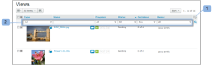

# Items op de [!UICONTROL Views] pagina beheren in [!DNL Workfront Proof]

>[!IMPORTANT]
>
>Dit artikel verwijst naar functionaliteit in het zelfstandige product [!DNL Workfront Proof] . Voor informatie bij het proef binnen [!DNL Adobe Workfront], zie [&#x200B; het Bewijzen &#x200B;](../../../review-and-approve-work/proofing/proofing.md).

Met de pagina [!UICONTROL Views] kunt u al uw proefdrukken, bestanden en mappen op één locatie bekijken en bewerken.

## De [!UICONTROL Views] pagina weergeven

1. Klik op **[!UICONTROL Views]** in de linkerzijbalk.
1. Klik in het keuzemenu (2) op de weergave (3) die u wilt zien.

## De pagina-indeling van [!UICONTROL Views] wijzigen

De standaardpagina-indeling [!UICONTROL Views] is de miniatuurlijst. In deze indeling ziet u een miniatuur van elke proefdruk, elk bestand (indien mogelijk om te genereren) en elke map (indien ingesteld), met andere gegevens die in aparte kolommen zijn opgenomen.

1. Klik op het pictogram **[!UICONTROL Page Layout]** (1) en kies de gewenste indeling.

## De [!UICONTROL Views] -lijst wijzigen

Zo wijzigt u wat u in de lijst [!UICONTROL Views] ziet:

1. Klik op **[!UICONTROL Change view]** .\
   De naam die op deze knop wordt weergegeven, is afhankelijk van de weergave die u de laatste keer hebt geselecteerd dat u de knop hebt gebruikt.\
   

1. Klik op een andere weergave in de vervolgkeuzelijst:

   * **[!UICONTROL All items]**: bevat alle proefdrukken, bestanden en mappen die u kunt zien. Dit is de standaardinstelling wanneer u de pagina [!UICONTROL Views] opent. U kunt gearchiveerde proefdrukken in deze weergave opnemen of uitsluiten.
   * **[!UICONTROL Active items]**: alle actieve proefdrukken, bestanden en mappen.
   * **[!UICONTROL Active proofs]**: alle actieve (niet gearchiveerde) proefdrukken die u kunt zien.
   * **[!UICONTROL Locked proofs]**: Alleen vergrendelde proefdrukken.
   * **[!UICONTROL Archived proofs]**: Slechts gearchiveerde proefdrukken (zie [&#x200B; Archief in  [!DNL Workfront Proof]](../../../workfront-proof/wp-work-proofsfiles/organize-your-work/archive.md)).

   * **[!UICONTROL My Proofs]**: toont alleen proefdrukken waarvoor u de eigenaar bent en die aan u zijn gedelegeerd. Voor meer informatie, zie [&#x200B; Aanwijzend Tijdelijke Eigenaars van het Bewijs in  [!DNL Workfront Proof]](../../../workfront-proof/wp-getstarted/personal-settings/designate-temp-proof-owners.md).

   * **[!UICONTROL Proofs awaiting decision]**: toont alleen proefdrukken waarop u een beslissing moet nemen
   * **[!UICONTROL Late proofs]**: alleen proefdrukken tonen waarvoor de deadline is verstreken
   * **[!UICONTROL Files]**: alleen bestanden tonen

   In elk van deze weergaven worden de volgende kolommen opgenomen

   * **Type**: Pictogram van het punt met het pictogram van proef, dossier of omslag
   * **Naam**: Naam van de proef, het dossier of de omslag
   * **Voortgang**: S=Verzonden, O=Opened, C=Commentaar, D=Besluit (zie de Bar van de Voortgang)
   * **Status**: [!UICONTROL Pending, Changes required, Approved]
   * **Besluiten**: Aantal genomen besluiten en vereist aantal
   * **Eigenaar**: Naam van de persoon die het bewijs \ bezit

     Mijn proefdrukken, proefdrukken die wachten op een beslissing en de late proefdrukweergaven hebben een extra kolom met de naam Mijn deadline. In deze kolom worden uw eigen deadlines weergegeven op de proefdrukken waar u expliciet wordt toegevoegd als Revisor/fiatteur.

     >[!NOTE]
     >
     >Als u bij de pagina Weergaven vandaan navigeert en later in dezelfde sessie naar deze pagina terugkeert, wordt de laatst geselecteerde weergave weergegeven.

     U kunt ook uw eigen weergaven maken. Zie [&#x200B; creëren en leiden de Mening van de Douane in  [!DNL Workfront Proof]](../../../workfront-proof/wp-work-proofsfiles/manage-your-work/create-and-manage-custom-views.md) voor meer informatie.

## Items filteren

U kunt de informatie in een weergave filteren.

1. Klik **tonen filters** pictogram bij de rechterbovenkant van de pagina (1).\
   

1. De filterbalk (2) wordt weergegeven en elke categorie heeft een filtervervolgkeuzemenu (3) waarmee u de voorkeurswaarde kunt selecteren. De standaardwaarde voor elke categorie is Alles.
1. De filterbalk wordt niet weergegeven in aangepaste weergaven die u maakt. Voor deze weergaven kunt u filters toepassen en bewerken op het tabblad [!UICONTROL Filters] . Voor meer informatie, zie [&#x200B; creëren en leiden de Mening van de Douane in  [!DNL Workfront Proof]](../../../workfront-proof/wp-work-proofsfiles/manage-your-work/create-and-manage-custom-views.md).
1. Als u alle gekozen filters wilt toepassen, klikt u op het pictogram [!UICONTROL Filter] (4) aan het einde van de filterbalk.\
   

De filterwaarden die u selecteert, blijven van kracht totdat u ze wijzigt. Als u de volledige lijst met items weer wilt zien en openen, moet u alle filterwaarden weer instellen op de standaardwaarde, namelijk **[!UICONTROL All]** .

>[!NOTE]
>
>Als u filteropties instelt en vervolgens de filterbalk verbergt door op het pictogram [!UICONTROL Hide filters] (5) te klikken, wordt de balk automatisch opnieuw weergegeven als u de weergave wijzigt. Als u de filterbalk verbergt terwijl alle filters zijn ingesteld op de standaardoptie all, blijft de filterbalk verborgen wanneer u weergaven wijzigt.

## Items sorteren

Wanneer u een nieuwe proefdruk maakt (of een versie) of een nieuw bestand uploadt, wordt deze boven aan de lijst [!UICONTROL All items] weergegeven. Het oudste item wordt onder aan de lijst weergegeven.

De lijst in een andere sorteervolgorde weergeven:

1. Voer een van de volgende handelingen uit:

   * Klik op een van de kolomkoppen in de lijst: Type, Naam, Status, Besluiten of Eigenaar.\

     Als u bijvoorbeeld de proefdrukken/bestanden in alfabetische volgorde wilt weergeven, klikt u eenmaal op de kop Naam (1) om de lijst op naam te sorteren in oplopende volgorde (A - Z).\
      U kunt nogmaals op de kop Naam proef (2) klikken om de volgorde om te keren en de proefdrukken in aflopende volgorde weer te geven (Z - A).

   * Klik op de pijl-omlaag rechtsboven op de pagina [!UICONTROL Views] om te sorteren op de aanmaakdatum (Nieuwst of Oudst) of op Type, Naam, Status, Besluiten of Eigenaar.\

     \
      Als de kolom in oplopende volgorde wordt gesorteerd, wordt naast de kolomnaam een pijl-omhoog weergegeven. Als u de volgorde wilt omkeren (naar aflopend), klikt u op de desbetreffende kolomkop (hierbij wordt een pijl omlaag naast de kolomnaam weergegeven).

   * Wijzigingen die u aanbrengt in de sorteervolgorde van de items zijn alleen van kracht als u op de pagina Alle items blijft staan. Als u bij de pagina Alle items vandaan navigeert en later terugkeert, worden de items opnieuw in omgekeerde chronologische volgorde weergegeven.

## Een overzicht van proefdrukken weergeven

Meer gedetailleerde informatie over een proefdruk bekijken:

1. Klik op de pijl links van de proefdrukafbeelding.\
   De pijl wijst naar beneden en het overzicht van het Bewijs toont onder de basisinformatie over de proef. Het overzicht van het proefdrukken toont:

   * **Samenvatting van het Bewijs**: Algemene status van de proef
   * **Stadium**: Wijst op de proefdrukdeadline en aantal genomen en vereiste besluiten
   * **Recensenten**: De naam, de rol en de vooruitgang van elke recensent zullen worden vermeld
   * **Versies**: Versie van de proef die en het totale aantal beschikbare versies wordt bekeken
   * **Omslag**: Omslag waarin de proef wordt gevestigd
   * **Staat**: Actief, Vergrendeld, Ontwerp, of Voorgelegd

1. (Optioneel) Als u bewerkingsrechten hebt voor de proefdruk en de proefdruk bestaat uit proefdrukken, klikt u op het menu **[!UICONTROL More]** (met drie punten) rechts van het werkgebied voor toegang tot de volgende opties:

   * **[!UICONTROL Message all]**: stuur een e-mail naar alle revisoren in het werkgebied.
   * **[!UICONTROL Share]**: Nieuwe revisoren toevoegen
   * **[!UICONTROL Delete stage]**

1. (Optioneel) Klik op het menu **[!UICONTROL More]** (drie punten) van een revisor rechts van zijn of haar naam om een van de volgende handelingen uit te voeren:

   * Stuur de controleur een herinneringsbericht.
   * Bewerk de instellingen van de controleur op de proefdruk.\

     In het venster Revisor bewerken dat wordt weergegeven, kunt u niet alleen rol- en e-mailwaarschuwingen wijzigen, maar ook de weergavenaam voor de Revisor. De weergavenaam kan alleen worden gewijzigd op de desbetreffende proefdruk en niet in de details van de controleur op de pagina Contacten. Zie [&#x200B; Contacten &#x200B;](https://support.workfront.com/hc/en-us/sections/115000920808-Contacts) voor meer informatie.

   * Selecteer de recensent om de Primaire Maker van het Besluit op het bewijs te zijn.
   * Verwijder de controleur uit de proefdruk.
   * U kunt ook de waarschuwingen Rol en E-mail wijzigen voor een revisor die aan de proefdruk is toegevoegd.

## Inclusief en exclusief gearchiveerde proefdrukken

In de weergave [!UICONTROL All Items] worden standaard alle actieve en vergrendelde proefdrukken, bestanden en mappen weergegeven. Het biedt ook de optie om gearchiveerde proefdrukken in de weergave op te nemen of uit te sluiten.\
De gearchiveerde proefdrukken opnemen:

1. Klik op **[!UICONTROL Include archived proofs]** wanneer u een weergave kiest.\
   \
   Gearchiveerde proefdrukken worden weergegeven met een gearchiveerd pictogram om ze van andere proefdrukken te onderscheiden.\
   

## Een item openen vanuit een lijstweergave

1. Voer een van de volgende handelingen uit:

   * Klik op de naam van een proefdruk, bestand of map om de details weer te geven.
   * Klik op **[!UICONTROL Go to Proof]** om een proefdruk te openen in de conceptviewer.\

     Voor informatie over de het proeven kijker, zie [&#x200B; Overzicht een proef &#x200B;](../../../review-and-approve-work/proofing/reviewing-proofs-within-workfront/review-a-proof/review-a-proof.md).

## Handelingen uitvoeren op meerdere items

Meerdere items selecteren:

1. Klik op het selectievakje boven de lijst.\
   

1. Voer een of meer van de volgende handelingen uit in de extra opties die boven de weergavelijst worden weergegeven:

   * Klik op **[!UICONTROL Tags]** om een tag aan deze items toe te voegen.
   * Klik op **[!UICONTROL Move to]** om de geselecteerde items naar een andere map te verplaatsen (of verplaats de items uit de map als u deze selecteert (Geen map geselecteerd).
   * Klik op **[!UICONTROL Share selected items]** om al deze items te delen met extra revisoren.\

     

   * Klik op **[!UICONTROL Delete]** om de geselecteerde items naar de prullenmand te verplaatsen.\

     

   * Klik op het menu **[!UICONTROL More]** voor extra beschikbare handelingen.

   * De acties worden alleen toegepast op de geselecteerde items waarvoor een bepaalde optie beschikbaar is. Als u bijvoorbeeld bestanden en proefdrukken selecteert en [!UICONTROL Lock] kiest, worden alleen de proefdrukken vergrendeld (omdat u bestanden niet kunt vergrendelen)

## Een item naar een map verplaatsen

Als u hiervoor bewerkingsrechten hebt, kunt u proefdrukken, bestanden en mappen verplaatsen naar specifieke mappen op de pagina [!UICONTROL Views] .

1. Open de mappenstructuur in het zijpaneel door op de pijl links van de bovenste map te klikken.
1. Voer een van de volgende handelingen uit:

   * Als u één item wilt verplaatsen, klikt u erop en houdt u het ingedrukt terwijl u het naar de map sleept waar u het item wilt plaatsen.
   * Om veelvoudige punten tezelfdertijd te bewegen, kunt u de controlevakjes links van de punten selecteren, dan **&#x200B; [!UICONTROL Move to] &#x200B;** boven de lijst klikken, dan de omslag selecteren waar u hen wilt zetten, of een nieuwe omslag voor hen creëren.
