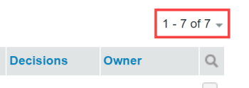
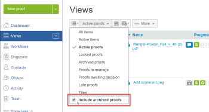

# Items beheren op de [!UICONTROL Views] Pagina in [!DNL Workfront Proof]

>[!IMPORTANT]
>
>Dit artikel verwijst naar functionaliteit in het standalone product [!DNL Workfront Proof]. Voor informatie over proefdrukken binnen [!DNL Adobe Workfront], zie [Proofing](../../../review-and-approve-work/proofing/proofing.md).

De [!UICONTROL Views] op deze pagina kunt u al uw proefdrukken, bestanden en mappen op één locatie bekijken en bewerken.

## De [!UICONTROL Views] Pagina

1. Klikken **[!UICONTROL Views]** in de linkerzijbalk.
1. Klik in het keuzemenu (2) op de weergave (3) die u wilt zien.

## Het wijzigen van [!UICONTROL Views] Pagina-indeling

De standaardwaarde [!UICONTROL Views] De paginalay-out is de lijst van Duimnagel. In deze indeling ziet u een miniatuur van elke proefdruk, elk bestand (indien mogelijk om te genereren) en elke map (indien ingesteld), met andere gegevens die in aparte kolommen zijn opgenomen.

1. Klik op de knop **[!UICONTROL Page Layout]** (1) en kiest u de gewenste lay-out.

## Het wijzigen van [!UICONTROL Views] Lijst

Om te wijzigen wat u ziet in het dialoogvenster [!UICONTROL Views] lijst:

1. Klik op de knop **[!UICONTROL Change view]** knop.\
   De naam die op deze knop wordt weergegeven, is afhankelijk van de weergave die u de laatste keer hebt geselecteerd dat u de knop hebt gebruikt.\
   

1. Klik op een andere weergave in de vervolgkeuzelijst:

   * **[!UICONTROL All items]**: Bevat alle proefdrukken, bestanden en mappen die u kunt bekijken. Dit is de standaardinstelling wanneer u de [!UICONTROL Views] pagina. U kunt gearchiveerde proefdrukken in deze weergave opnemen of uitsluiten.
   * **[!UICONTROL Active items]**: Alle actieve proefdrukken, bestanden en mappen.
   * **[!UICONTROL Active proofs]**: Alle actieve (niet gearchiveerde) proefdrukken die u kunt zien.
   * **[!UICONTROL Locked proofs]**: Alleen vergrendelde proefdrukken.
   * **[!UICONTROL Archived proofs]**: Alleen gearchiveerde proefdrukken (zie [Archiveren in [!DNL Workfront Proof]](../../../workfront-proof/wp-work-proofsfiles/organize-your-work/archive.md)).

   * **[!UICONTROL My Proofs]**: Hiermee geeft u alleen proefdrukken weer waarvoor u de eigenaar bent en die aan u zijn gedelegeerd. Zie voor meer informatie [Aanwijzing van eigenaars van tijdelijke bewijzen in [!DNL Workfront Proof]](../../../workfront-proof/wp-getstarted/personal-settings/designate-temp-proof-owners.md).

   * **[!UICONTROL Proofs awaiting decision]**: Alleen proefdrukken tonen waarop u een beslissing moet nemen
   * **[!UICONTROL Late proofs]**: Alleen proefdrukken tonen waarvoor de deadline is verstreken
   * **[!UICONTROL Files]**: Alleen bestanden tonen
   In elk van deze weergaven worden de volgende kolommen opgenomen

   * **Type**: Pictogram van het item met het pictogram van een proefdruk, bestand of map
   * **Naam**: Naam van de proefdruk, het bestand of de map
   * **Voortgang**: S=Verzonden, O=Openen, C=Opmerking, D=Besluit (zie de Bar van de Voortgang)
   * **Status**: [!UICONTROL Pending, Changes required, Approved]
   * **Besluiten**: Aantal genomen besluiten en vereiste aantal
   * **Eigenaar**: Naam van de persoon die eigenaar is van het bewijs\

      Mijn proefdrukken, proefdrukken die wachten op een beslissing en de late proefdrukweergaven hebben een extra kolom met de naam Mijn deadline. In deze kolom worden uw eigen deadlines weergegeven op de proefdrukken waar u expliciet wordt toegevoegd als Revisor/fiatteur.

      >[!NOTE]
      >
      >Als u bij de pagina Weergaven vandaan navigeert en later in dezelfde sessie naar deze pagina terugkeert, wordt de laatst geselecteerde weergave weergegeven.

      U kunt ook uw eigen weergaven maken. Zie [Aangepaste weergaven maken en beheren in [!DNL Workfront Proof]](../../../workfront-proof/wp-work-proofsfiles/manage-your-work/create-and-manage-custom-views.md) voor meer informatie .

## Items filteren

U kunt de informatie in een weergave filteren.

1. Klik op de knop **Filters tonen** rechts boven aan de pagina (1).\
   

1. De filterbalk (2) wordt weergegeven en elke categorie heeft een filtervervolgkeuzemenu (3) waarmee u de voorkeurswaarde kunt selecteren. De standaardwaarde voor elke categorie is Alles.
1. De filterbalk wordt niet weergegeven in aangepaste weergaven die u maakt. Voor deze weergaven kunt u filters toepassen en bewerken in het dialoogvenster [!UICONTROL Filters] tab. Zie voor meer informatie [Aangepaste weergaven maken en beheren in [!DNL Workfront Proof]](../../../workfront-proof/wp-work-proofsfiles/manage-your-work/create-and-manage-custom-views.md).
1. Als u alle gekozen filters wilt toepassen, klikt u op de knop [!UICONTROL Filter] pictogram (4) aan het einde van de filterbalk.\
   

De filterwaarden die u selecteert, blijven van kracht totdat u ze wijzigt. Als u de volledige lijst met items weer wilt zien en openen, moet u alle filterwaarden weer instellen op de standaardwaarde, namelijk **[!UICONTROL All]**.

>[!NOTE]
>
>Als u filteropties instelt en vervolgens de filterbalk verbergt door op de knop [!UICONTROL Hide filters] (5), wordt de balk automatisch opnieuw weergegeven als u de weergave wijzigt. Als u de filterbalk verbergt terwijl alle filters zijn ingesteld op de standaardoptie all, blijft de filterbalk verborgen wanneer u weergaven wijzigt.

## Items sorteren

Wanneer u een nieuwe proefdruk maakt (of een versie) of een nieuw bestand uploadt, wordt deze boven aan uw proefdruk weergegeven [!UICONTROL All items] lijst. Het oudste item wordt onder aan de lijst weergegeven.

De lijst in een andere sorteervolgorde weergeven:

1. Voer een van de volgende handelingen uit:

   * Klik op een van de kolomkoppen in de lijst: Type, Naam, Status, Besluiten of Eigenaar.\

      Als u bijvoorbeeld de proefdrukken/bestanden in alfabetische volgorde wilt weergeven, klikt u eenmaal op de kop Naam (1) om de lijst op naam te sorteren in oplopende volgorde (A - Z).\
      U kunt nogmaals op de kop Naam proef (2) klikken om de volgorde om te keren en de proefdrukken in aflopende volgorde weer te geven (Z - A).

   * Klik op de pijl-omlaag rechtsboven in het dialoogvenster [!UICONTROL Views] pagina die moet worden gesorteerd op de aanmaakdatum (Nieuwst of Oudst) of op Type, Naam, Status, Besluiten of Eigenaar.\

      \
      Als de kolom in oplopende volgorde wordt gesorteerd, wordt naast de kolomnaam een pijl omhoog weergegeven. Als u de volgorde wilt omkeren (naar aflopend), klikt u op de desbetreffende kolomkop (hierbij wordt een pijl omlaag naast de kolomnaam weergegeven).

   * Wijzigingen die u aanbrengt in de sorteervolgorde van de items zijn alleen van kracht als u op de pagina Alle items blijft staan. Als u bij de pagina Alle items vandaan navigeert en later terugkeert, worden de items opnieuw in omgekeerde chronologische volgorde weergegeven.

## Een overzicht van proefdrukken weergeven

Meer gedetailleerde informatie over een proefdruk bekijken:

1. Klik op de pijl links van de proefdrukafbeelding.\
   De pijl wijst naar beneden en het overzicht van het Bewijs toont onder de basisinformatie over de proef. Het overzicht van het proefdrukken toont:

   * **Overzicht van proefdrukken**: Algemene status van het bewijs
   * **Werkgebied**: Vermeld de uiterste datum voor het bewijs en het aantal genomen en vereiste besluiten
   * **Revisoren**: Naam, rol en voortgang van elke controleur worden vermeld
   * **Versies**: Versie van de proefdruk die wordt weergegeven en het totale aantal beschikbare versies
   * **Map**: Map waarin het bewijs zich bevindt
   * **Staat**: Actief, Vergrendeld, Concept of Verstuurd

1. (Optioneel) Als u bewerkingsrechten hebt voor de proefdruk en de proefdruk bestaat uit proefdrukken, klikt u op de knop **[!UICONTROL More]** (drie punten) rechts van het werkgebied voor toegang tot de volgende opties:

   * **[!UICONTROL Message all]**: Stuur een e-mail naar alle revisoren in het werkgebied.
   * **[!UICONTROL Share]**: Nieuwe revisoren toevoegen
   * **[!UICONTROL Delete stage]**

1. (Optioneel) Klik op de knop **[!UICONTROL More]** (drie punten) rechts van hun naam gebruiken om een van de volgende handelingen uit te voeren:

   * Stuur de controleur een herinneringsbericht.
   * Bewerk de instellingen van de controleur op de proefdruk.\

      In het venster Revisor bewerken dat wordt weergegeven, kunt u niet alleen rol- en e-mailwaarschuwingen wijzigen, maar ook de weergavenaam voor de Revisor. De weergavenaam kan alleen worden gewijzigd op de desbetreffende proefdruk en niet in de details van de controleur op de pagina Contacten. Zie [Contactpersonen](https://support.workfront.com/hc/en-us/sections/115000920808-Contacts) voor meer informatie .

   * Selecteer de recensent om de Primaire Maker van het Besluit op het bewijs te zijn.
   * Verwijder de controleur uit de proefdruk.
   * U kunt ook de waarschuwingen Rol en E-mail wijzigen voor een revisor die aan de proefdruk is toegevoegd.

## Inclusief en exclusief gearchiveerde proefdrukken

De [!UICONTROL All Items] Standaard worden alle actieve en vergrendelde proefdrukken, bestanden en mappen weergegeven. Het biedt ook de optie om gearchiveerde proefdrukken in de weergave op te nemen of uit te sluiten.\
De gearchiveerde proefdrukken opnemen:

1. Als u een weergave kiest, klikt u op **[!UICONTROL Include archived proofs]**.\
   \
   Gearchiveerde proefdrukken worden weergegeven met een gearchiveerd pictogram om ze van andere proefdrukken te onderscheiden.\
   

## Een item openen vanuit een lijstweergave

1. Voer een van de volgende handelingen uit:

   * Klik op de naam van een proefdruk, bestand of map om de details weer te geven.
   * Als u een proefdruk wilt openen in de proefdrukviewer, klikt u op **[!UICONTROL Go to Proof]**.\

      Voor informatie over de proefdrukviewer raadpleegt u [Een bewijs controleren](../../../review-and-approve-work/proofing/reviewing-proofs-within-workfront/review-a-proof/review-a-proof.md).

## Handelingen uitvoeren op meerdere items

Meerdere items selecteren:

1. Klik op het selectievakje boven de lijst.\
   

1. Voer een of meer van de volgende handelingen uit in de extra opties die boven de weergavelijst worden weergegeven:

   * Klikken op **[!UICONTROL Tags]** om een tag aan deze items toe te voegen.
   * Klikken op **[!UICONTROL Move to]** om de geselecteerde items naar een andere map te verplaatsen (of de items uit de map te verplaatsen als u deze selecteert (Geen map geselecteerd).
   * Klikken **[!UICONTROL Share selected items]** als u al deze items wilt delen met extra revisoren.\

      

   * Klikken **[!UICONTROL Delete]** om de geselecteerde items naar de prullenmand te verplaatsen.\

      

   * Klik op de knop **[!UICONTROL More]** voor extra beschikbare acties.

   * De acties worden alleen toegepast op de geselecteerde items waarvoor een bepaalde optie beschikbaar is. Als u bijvoorbeeld bestanden en proefdrukken selecteert en [!UICONTROL Lock], worden alleen de proefdrukken vergrendeld (omdat u bestanden niet kunt vergrendelen)

## Een item naar een map verplaatsen

Als u hiervoor bewerkingsrechten hebt, kunt u proefdrukken, bestanden en mappen verplaatsen naar specifieke mappen in de [!UICONTROL Views] pagina.

1. Open de mappenstructuur in het zijpaneel door op de pijl links van de bovenste map te klikken.
1. Voer een van de volgende handelingen uit:

   * Als u één item wilt verplaatsen, klikt u erop en houdt u het ingedrukt terwijl u het naar de map sleept waar u het item wilt plaatsen.
   * Als u meerdere items tegelijk wilt verplaatsen, selecteert u de selectievakjes links van de items en klikt u op **[!UICONTROL Move to]**boven de lijst, dan selecteer de omslag waar u hen wilt zetten, of een nieuwe omslag voor hen creëren.
