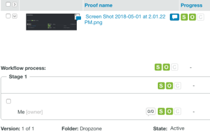

# Proef van staat in Workfront

>[!IMPORTANT]
>
>Dit artikel verwijst naar functionaliteit in het standalone product [!DNL Workfront Proof]. Voor informatie over proefdrukken binnen [!DNL Adobe Workfront], zie [Proofing](../../../review-and-approve-work/proofing/proofing.md).

In [!DNL Workfront Proof], bestaan er bewijzen in verschillende staten. Deze staten bepalen welke acties u kunt ondernemen op het bewijs, zoals het maken van opmerkingen of het nemen van beslissingen.

## Proefstatus

De vier staten zijn als volgt:

* [Actief](#active)
* [Vergrendeld](#locked)
* [Concept (alleen Dropzone)](#draft-dropzone-only)
* [Verzonden (alleen Dropzone)](#submitted-dropzone-only)

### Actief {#active}

Proefdrukken waarnaar wordt geüpload [!DNL Workfront Proof] door de Nieuwe pagina van het Bewijs of Dropzone verschijnen als Actief nadat zij worden verwerkt. Wanneer een proefdruk actief is, kunnen gebruikers opmerkingen maken en besluiten nemen over de proefdruk.

>[!NOTE]
>
>Proefdrukken die via de Dropzone worden geüpload, worden alleen als Actief weergegeven als de optie Proefdruk bij verzending activeren is ingeschakeld. Als deze optie niet is ingeschakeld, moet u de proefdruk handmatig activeren.

Zie voor meer informatie over Dropzone-instellingen [De dropzone configureren in [!DNL Workfront Proof]](../../../workfront-proof/wp-acct-admin/account-settings/configure-dropzone-in-wp.md).

### Vergrendeld {#locked}

U kunt een proefdruk vergrendelen wanneer u deze hebt gecontroleerd. Een bewijs vergrendelen betekent dat er geen opmerkingen of besluiten meer op de bewijsmiddelen kunnen worden genomen, maar dat het bewijs nog kan worden geopend.

Gebruikers die bewerkingsrechten hebben op de proefdruk, kunnen deze ontgrendelen.

Voor meer informatie over rechten raadpleegt u [Profielen met proefmachtigingen in [!DNL Workfront Proof]](../../../workfront-proof/wp-acct-admin/account-settings/proof-perm-profiles-in-wp.md).

>[!NOTE]
>
>E-mailberichten worden niet meer verzonden wanneer een proefdruk is vergrendeld. Als bijvoorbeeld een bewijs vóór de deadline is vergrendeld, wordt geen e-mailbericht verzonden wanneer de deadline is bereikt.

### Concept (alleen Dropzone) {#draft-dropzone-only}

Wanneer u een proef door Dropzone voorlegt, gaat het in de staat van het Ontwerp alvorens admin het activeert. Wanneer het zich in de ontwerpstreek bevindt, kunt u geen actie ondernemen met betrekking tot de proef.

### Verzonden (alleen Dropzone) {#submitted-dropzone-only}

Nadat de beheerder een concept heeft geactiveerd, wordt uw proefdruk weergegeven als Verzonden in de Dropzone. Nadat de proefdruk is verzonden, kunt u actie ondernemen.

## Proefstatus weergeven en wijzigen

Voor informatie over het bekijken van een lijst van alle proeven in een specifieke staat, zoals het bekijken van alle Actieve of Vergrendelde proeven, zie [Items op de weergavepagina beheren in [!DNL Workfront Proof]](../../../workfront-proof/wp-work-proofsfiles/manage-your-work/manage-items-on-views-page.md) in het artikel [Items op de weergavepagina beheren in [!DNL Workfront Proof]](../../../workfront-proof/wp-work-proofsfiles/manage-your-work/manage-items-on-views-page.md).

1. Toegang tot uw [!DNL Workfront Proof] Dashboard.

   Zie voor meer informatie [Toegang [!DNL Workfront Proof] uit Adobe Workfront](../../../review-and-approve-work/proofing/managing-proofs-within-workfront/access-wf-proof-in-workfront.md).

1. Op de **[!UICONTROL Dashboard]** klikt u op de knop **[!UICONTROL Expand]** de pijl naast de proef u de staat van bekijken of wilt veranderen.

   

   De **[!UICONTROL Workflow process]** wordt weergegeven.

   

1. De weergave van **[!UICONTROL State]** in de **[!UICONTROL Workflow process]**.

1. (Optioneel) Als u de status wilt wijzigen, beweegt u de muis over de huidige **[!UICONTROL State]** en klikt u op het vervolgkeuzemenu en selecteert u vervolgens een nieuwe staat.

   
