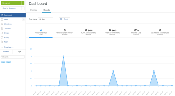

# Rapporten uitvoeren in [!DNL Workfront Proof]

>[!IMPORTANT]
>
>Dit artikel verwijst naar functionaliteit in het standalone product [!DNL Workfront Proof]. Voor informatie over proefdrukken binnen [!DNL Adobe Workfront], zie [Proofing](../../../review-and-approve-work/proofing/proofing.md).

Met Workfront Proof kunt u rapporten weergeven, zodat u de voortgang van het werk en de efficiëntie van uw teams kunt bijhouden.

U kunt het aantal proefdrukken dat in uw [!DNL Workfront Proof] -account, het aantal versies dat is gekoppeld aan elke proefdruk, de doorlooptijd en meer.

## Vereisten

Of rapporten beschikbaar zijn, hangt af van uw type van [!DNL Workfront Proof] account- en gebruikersmachtigingsniveaus.

* [Accountvereisten](#account-prerequisites)
* [Gebruikersvereisten](#user-prerequisites)

### Accountvereisten {#account-prerequisites}

Rapportinformatie is alleen beschikbaar bij Premium-abonnementen.

### Gebruikersvereisten {#user-prerequisites}

De rapportgegevens zijn alleen beschikbaar voor gebruikers met volledige toegang tot alle proefdrukken op uw account (dus gebruikers met ten minste [Profielen met proefmachtigingen in [!DNL Workfront Proof]](../../../workfront-proof/wp-acct-admin/account-settings/proof-perm-profiles-in-wp.md)).

In dit deelvenster kunt u

* De tijdsperiode bepalen van de weergegeven gegevens
* Wijzigingen in metriek in de loop der tijd analyseren
* Controleer de details van een geselecteerd punt in de tijd door er boven te houden
* Controleer het totale aantal proefdrukken dat in het geselecteerde tijdbereik is gemaakt
* Controleer het gemiddelde aantal versies dat is opgenomen in de voltooide proefdrukken

## Rapporten weergeven {#viewing-reports}

1. Ga naar de **[!UICONTROL Dashboards]** pagina.
1. Klik op de knop **[!UICONTROL Reports]** tab.\
   

1. In de **[!UICONTROL Time frame]** selecteert u of u informatie wilt weergeven over proefdrukken die zijn gemaakt in de afgelopen 24 uur, 7 dagen, 30 dagen, 90 dagen of een aangepaste tijdsperiode.\
   Als u een aangepaste tijdsperiode selecteert, selecteert u de begin- en einddatum en klikt u op **[!UICONTROL Apply]**.\
   De volgende informatie wordt weergegeven voor de tijdsperiode die u hebt geselecteerd:\
   **Maken proef:** Aantal proefdrukken gemaakt binnen de geselecteerde tijdsperiode.\
   **Versies per proefdruk:** Gemiddeld aantal versies per proefdruk voor alle voltooide proefdrukken (goedgekeurd of goedgekeurd met wijzigingen) binnen de geselecteerde tijdsperiode.\
   **Omhoog draaien:** Gemiddelde tijd vanaf het tijdstip waarop de eerste versie werd gemaakt tot het tijdstip waarop de beslissing werd genomen over de definitieve versie.\
   **Tijd van eerste activiteit:** Gemiddelde tijd vanaf het tijdstip waarop de proef is gemaakt tot het tijdstip van de eerste activiteit op de proefdruk.\
   **Proeftijden te laat:** Gemiddeld percentage voltooide proefdrukken (goedgekeurd of goedgekeurd met wijzigingen) met ten minste één versie die binnen de geselecteerde periode te laat was.\
   **Opmerkingen en antwoorden:** Gemiddeld aantal opmerkingen en antwoorden die binnen de geselecteerde periode op alle proefdrukken zijn gemaakt.

1. (Optioneel) Schakel de optie **[!UICONTROL Show min-max range]** om te bepalen of minimum- en maximumwaarden in de grafiek worden weergegeven.\
   Als u deze optie selecteert, wordt een blauwe schaduw weergegeven tussen de minimale en maximale geregistreerde waarden.

1. (Optioneel) U kunt de weergegeven gegevens filteren, zoals beschreven in [Filterrapporten](#filtering-reports).

## Filterrapporten {#filtering-reports}

Standaard bevatten de gegevens in rapporten alle gegevens van uw [!DNL Workfront Proof] systeem. U kunt filters gebruiken om alleen informatie weer te geven die relevant is voor uw behoeften.

Rapportgegevens filteren:

1. Ga naar de **[!UICONTROL Dashboards]** pagina.
1. Klik op de knop **[!UICONTROL Reports]** tab.\
   

1. Een rapport uitvoeren, zoals wordt beschreven in [Rapporten weergeven](#viewing-reports).
1. Klik op **[!UICONTROL Filter]**.

1. Selecteer links op de pagina een van de volgende filteropties:\
   **[!UICONTROL Proof Type]:** Selecteer het type proefdrukken dat u in het rapport wilt opnemen.\
   **[!UICONTROL Decisions]:** Selecteer opties om te bepalen of alleen proefdrukken met bepaalde beslissingen zijn gemaakt.\
   **[!UICONTROL Recipients]:** Selecteer afzonderlijke gebruikers om informatie weer te geven over proefdrukken die met de geselecteerde gebruikers worden gedeeld.\
   **[!UICONTROL Proof Owners]:** Selecteer afzonderlijke gebruikers om informatie weer te geven over proefdrukken die eigendom zijn van de geselecteerde gebruikers.\
   **[!UICONTROL Proof Creators]:** Selecteer individuele gebruikers om informatie te bekijken over proeven die door de geselecteerde gebruikers worden gecreeerd.\
   **[!UICONTROL Accounts]:** Selecteer welke accounts u in het rapport wilt opnemen.

1. Klik op **[!UICONTROL Apply]**.
1. (Optioneel) Schakel de optie **[!UICONTROL Show min-max range]** om te bepalen of minimum- en maximumwaarden in de grafiek worden weergegeven.\
   Als u deze optie selecteert, wordt een blauwe schaduw weergegeven tussen de minimale en maximale geregistreerde waarden.

## Rapporten afdrukken

1. Ga naar de **[!UICONTROL Dashboards]** pagina.
1. Klik op de knop **[!UICONTROL Reports]** tab, en klik vervolgens op **[!UICONTROL Print]**.\
   

1. Maak een keuze uit de verschillende beschikbare afdrukopties.\
   De afdrukopties variëren afhankelijk van de gebruikte browser- en browserversie.
