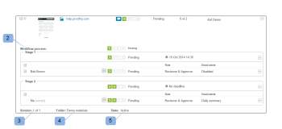

# De voortgang en status van een proefdruk weergeven [!DNL Workfront Proof]

>[!IMPORTANT]
>
>Dit artikel verwijst naar functionaliteit in het zelfstandige product [!DNL Workfront Proof] . Voor informatie bij het proef binnen [!DNL Adobe Workfront], zie [&#x200B; het Bewijzen &#x200B;](../../../review-and-approve-work/proofing/proofing.md).

## Proefvoortgang

Het bewijs van voortgang geeft het werk aan dat is verricht op een bewijs vanaf het moment dat u de bewijzen aan de controleurs stuurt tot het moment dat zij een beslissing nemen over het bewijs.

* [Voortgangspictogrammen](#progress-icons)
* [Voortgangsniveaus proefdrukken](#levels-of-proof-progress)

### Voortgangspictogrammen {#progress-icons}

De voortgangspictogrammen S, O, C en D worden weergegeven op de voortgangsbalk en geven de voortgang van de proefdruk aan.

Zij geven de volgende informatie over een bewijs aan:

<table style="table-layout:auto"> 
 <col> 
 <col> 
 <thead> 
  <tr> 
   <td> 
<strong> Pictogram van de Voortgang </strong> 
 </td> 
   <td> 
<strong> Beschrijving </strong> 
 </td> 
  </tr> 
 </thead> 
 <tbody> 
  <tr> 
   <td> 
  
 </td> 
   <td> 
<strong> Verzonden </strong>. Het bewijs is naar de controleurs gestuurd.
 </td> 
  </tr> 
  <tr> 
   <td> 
  
 
 
 </td> 
   <td> 
<strong> Geopend </strong>. Een revisor heeft de pagina Proefgegevens geopend of de proefdruk zelf geopend in de proefdrukviewer.
 </td> 
  </tr> 
  <tr> 
   <td> 
  
 </td> 
   <td> 
<strong> Commentaren </strong>. Revisoren (gebruikers die opmerkingen kunnen maken) hebben opmerkingen gemaakt over de proefdruk.
 
Als er geen controleurs zijn aangewezen voor de proefdruk, wordt dit pictogram niet weergegeven.
 </td> 
  </tr> 
  <tr> 
   <td> 
  
 </td> 
   <td> 
<strong> Besluit </strong>. Een controleur heeft een besluit genomen over het bewijs.
 
Als er geen fiatteurs (besluitvormers) voor de proefdruk zijn aangewezen, wordt dit pictogram niet weergegeven. 
 </td> 
  </tr> 
 </tbody> 
</table>

Deze pictogrammen kunnen in de volgende kleuren worden weergegeven om bepaalde informatie over de voortgang van het bewijs aan te geven:

* **Groen**. Voltooid.
* **Wit**. Niet voltooid.
* **Oranje**. Niet voltooid en de deadline is minder dan 24 uur.
* **Rood**. Niet volledig en na de deadline.

### Voortgangsniveaus proefdrukken {#levels-of-proof-progress}

Workfront Proof gebruikt de voortgangspictogrammen om de voortgang van een bewijs op elk van de volgende niveaus bij te houden:

* Voor elke controleur, op basis van de activiteit van die persoon op het bewijs.
* Voor elk stadium, gebaseerd op de vooruitgang de recensent op het stadium die het meest achterop in het proefdrukproces is. Voor meer informatie, zie [&#x200B; Geautomatiseerd overzicht van de Staven van het Werkschema &#x200B;](../../../review-and-approve-work/proofing/proofing-overview/stages.md).
* Voor de proefdruk, op basis van de voortgang van het werkgebied (groep van controleurs), dat het meest achterloopt in het proefdrukproces.

Als u bijvoorbeeld wilt zien hoe de voortgang in [!DNL Workfront Proof] wordt bepaald met de revisor of het werkgebied dat het meest achterloopt, stelt u dat drie revisoren op basis van een proefdruk een beslissing moeten nemen. Als twee van hen hun besluit hebben genomen, maar de derde niet, dan blijkt de voortgangsbalk voor het bewijs niet groen uit het feit dat de D nog niet is afgehandeld.

Als de instelling [!UICONTROL Primary Decision Maker] is geselecteerd op een bewijs en de primaire besluitvormer een beslissing indient, wordt de D in de voortgangsbalk van het bewijs groen voor alle revisoren omdat er geen andere beslissingen vereist zijn.

En als de instelling [!UICONTROL Only One Decision Required] is geselecteerd op een proefdruk en een revisor een beslissing verzendt, wordt de D in de voortgangsbalk van de proefdruk groen voor alle revisoren, omdat er geen andere beslissingen nodig zijn.

## Proefstatus

De status van de proefdruk geeft de status aan van de beslissingen die voor de proefdruk vereist zijn.

\
De standaardstatusopties zijn:

* In behandeling
* Goedgekeurd
* Goedgekeurd met wijzigingen
* Wijzigingen vereist
* Niet relevant

Als er aangepaste beslissingen in uw account zijn geconfigureerd, weerspiegelen de statusopties uw aangepaste beslissingsinstellingen.

De status van het bewijs wordt aangestuurd door de &quot;worst case&quot;-deelnemer. Bijvoorbeeld, veronderstel er drie besluiten over de proef zijn: twee hebben het statuut van **Toegelaten** en één heeft het statuut van **Afgewezen**. Het &quot;slechtste geval&quot;besluit van Geweigerd over-regels de andere besluiten en de algemene status van het bewijs wordt getoond zoals **Verworpen**.

## Voortgang en status weergeven {#viewing-progress-and-status}

U kunt de voortgang en status van proefdrukken, fasen en revisoren in elk werkgebied bekijken.

* [Proefoverzicht](#proof-summary)
* [Menu Werkgebiedhandelingen](#stage-actions-menu)
* [In de sectie [!UICONTROL Summary] hebt u ook toegang tot de menu&#39;s voor revisieacties, op voorwaarde dat u bewerkingsrechten hebt voor de proefdruk. Zie Proefmachtigingenprofielen in Workfront Proof en Proefdrukrollen beheren in Workfront Proof voor meer informatie. Het menu [!UICONTROL Reviewer actions] (1) wordt weergegeven wanneer u de muisaanwijzer op de details van de recensent plaatst en u in staat stelt:](#in-the-summary-section-you-can-also-access-the-reviewer-actions-menus-provided-you-have-edit-rights-on-the-proof-for-more-information-see-proof-permissions-profiles-in-workfront-proof-and-manage-proof-roles-in-workfront-proof-the-reviewer-actions-menu-1-appears-when-you-hover-over-the-reviewer-s-details-and-allows-you-to)
* [Menu Proefacties](#proof-actions-menu)

### Proefoverzicht {#proof-summary}

Elke proef in de omslag heeft een uitbreidbare samenvatting die u snel de details van de proef kunt bekijken en uitgeven.

Het overzicht uitvouwen of samenvouwen:

1. Klik op de pijl links van de proefdruk in het dashboard of in een lijstweergave.

De samenvatting bevat het volgende:

* Workflow (2)
* Versie 3
* Map (4)
* Staat (5)\
   

In het overzicht kunt u de volgende gegevens van uw proefdruk weergeven en bewerken:

* Voortgang proefdruk (1)
* Voortgang van elke fase (2)
* Termijn voor het werkgebied (3)
* Details revisor:

   * Aantal opmerkingen en antwoorden van elke controleur (4)
   * Voortgang van elke controleur (5)
   * Beslissing (als een besluit een elektronische handtekening heeft, wordt naast de beslissing die dit aangeeft een pictogram weergegeven.) (6)
   * Rol op het bewijs (7)
   * Instellingen voor e-mailwaarschuwingen (8)

>[!NOTE]
>
>Uw capaciteit om de proefdrukdetails uit te geven hangt van uw rechten op de proef (zie [&#x200B; Profielen van de Toestemmingen van de Bewijs in  [!DNL Workfront Proof]](../../../workfront-proof/wp-acct-admin/account-settings/proof-perm-profiles-in-wp.md) af en [&#x200B; Beheert de Rollen van het Bewijs in  [!DNL Workfront Proof]](../../../workfront-proof/wp-work-proofsfiles/share-proofs-and-files/manage-proof-roles.md)).

### [!UICONTROL Stage Actions] Menu  {#stage-actions-menu}

Elk stadium van uw werkstroom heeft een afzonderlijk menu, dat u toestaat om bulkacties met betrekking tot de recensenten in dat stadium uit te voeren.

Het menu [!UICONTROL Stage actions] wordt weergegeven wanneer u de cursor op de sectie Werkgebied plaatst (1) en kunt u

* [!UICONTROL Message all] (2)
* [!UICONTROL Share] (3)
* [!UICONTROL Delete stage] (4)

>[!NOTE]
>
>De beschikbaarheid van deze opties hangt van uw rechten op de proef af (zie [&#x200B; Profielen van de Toestemmingen van de Bewijs in  [!DNL Workfront Proof]](../../../workfront-proof/wp-acct-admin/account-settings/proof-perm-profiles-in-wp.md) en [&#x200B; Beheren de Rollen van het Bewijs in  [!DNL Workfront Proof]](../../../workfront-proof/wp-work-proofsfiles/share-proofs-and-files/manage-proof-roles.md)).

In de sectie Samenvatting kunt u ook de menu&#39;s voor revisieacties openen, op voorwaarde dat u bewerkingsrechten hebt voor de proefdruk. Voor meer informatie, zie [&#x200B; Profielen van de Toestemmingen van de Bewijs in  [!DNL Workfront Proof]](../../../workfront-proof/wp-acct-admin/account-settings/proof-perm-profiles-in-wp.md) en [&#x200B; Beheer de Rollen van het Bewijs in  [!DNL Workfront Proof]](../../../workfront-proof/wp-work-proofsfiles/share-proofs-and-files/manage-proof-roles.md). Het menu Acties van Revisor (1) wordt weergegeven wanneer u de muisaanwijzer boven de details van de Revisor houdt. U kunt dan het volgende doen:

* Een bericht naar de controleur sturen (2)
* Details van revisor bewerken (3)- Hiermee kunt u de weergavenaam, de proefdrukrol en de e-mailwaarschuwing voor die revisor bewerken
* Van hen de eigenaar van het bewijs maken (4)
* Van hen de primaire besluitvormer maken (5)
* Uit het bewijs halen (6)

>[!NOTE]
>
>De zichtbaarheid van deze opties hangt af van uw rechten op de proef (zie [&#x200B; Profielen van de Toestemmingen van de Bewijs in  [!DNL Workfront Proof]](../../../workfront-proof/wp-acct-admin/account-settings/proof-perm-profiles-in-wp.md) en [&#x200B; Beheren de Rollen van het Bewijs in  [!DNL Workfront Proof]](../../../workfront-proof/wp-work-proofsfiles/share-proofs-and-files/manage-proof-roles.md)).

### Menu Proefacties {#proof-actions-menu}

Elke proef heeft ook een menu (1) dat u toestaat om de hieronder acties uit te voeren:

* U hebt toegang tot de pagina Proefgegevens (2)
* Het bewijs delen met andere personen (3)
* Een bericht verzenden aan revisoren (4)
* Een nieuwe versie van de proefdruk maken (5)
* Bewijs kopiëren (6)
* Het oorspronkelijke bestand downloaden (7)
* Proofingkoppelingen delen (8)
* Opmerkingen afdrukken (9)
* Een Excel-overzicht van de proefdruk aanvragen (10)
* De proefdruk vergrendelen (11)
* De proefdruk verwijderen (12)

>[!NOTE]
>
>De beschikbaarheid van deze opties hangt van uw rechten op de proef af (zie [&#x200B; Profielen van de Toestemmingen van de Bewijs in  [!DNL Workfront Proof]](../../../workfront-proof/wp-acct-admin/account-settings/proof-perm-profiles-in-wp.md) en [&#x200B; Beheren de Rollen van het Bewijs in  [!DNL Workfront Proof]](../../../workfront-proof/wp-work-proofsfiles/share-proofs-and-files/manage-proof-roles.md)).

Voor informatie over het bekijken van proefvooruitgang en status binnen [!DNL Workfront], zie [&#x200B; het Bekijken Voortgang en Status &#x200B;](#viewing-progress-and-status).

Voor informatie over het bekijken van vooruitgang en status in de Desktop het Proofing Kijker, zie [&#x200B; Overzicht een Werkschema in de het proeven kijker &#x200B;](../../../workfront-proof/wp-work-proofsfiles/review-proofs-wpv/review-workflow.md).
