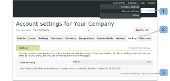

# Back-up maken van uw [!DNL Workfront Proof] gegevens

>[!IMPORTANT]
>
>Dit artikel verwijst naar functionaliteit in het zelfstandige product [!DNL Workfront Proof] . Voor informatie bij het proef binnen [!DNL Adobe Workfront], zie [ het Bewijzen ](../../../review-and-approve-work/proofing/proofing.md).

## Inleiding tot back-ups

U kunt een back-up van al uw gegevens in [!DNL Workfront Proof] aanvragen met behulp van de back-upfunctie.

De back-up wordt als ZIP-bestand aan u geleverd. Het omvat een XML-export van al uw gegevens (inclusief opmerkingen en reacties voor alle versies van alle proefdrukken), maar het omvat niet de originele bestanden die u als proefdrukken hebt geüpload.

Elk ZIP-bestand voor een back-up dat u wilt downloaden, heeft een unieke bestandsnaam, zoals:

9789_05_05_2011_61703.zip

De bestandsnaam in dit voorbeeld bevat de volgende informatie:

* 9789 is de [!DNL Workfront Proof] account-id
* 05_05_2011 is de aanmaakdatum, 5 mei 2011
* 61703 is een willekeurig door het systeem toegewezen nummer

Met deze naamgevingsconventie kunt u eenvoudig al uw ZIP-back-upbestanden opslaan op één locatie op uw computer en precies weten wanneer elke back-up voor u is gemaakt.

Met de functie [!UICONTROL Backup] kunt u bepalen hoe u uw bronnen gebruikt:

* Hiermee kunt u opslagruimte vrijmaken zonder dat u uw actieve of gearchiveerde proefdrukken kwijtraakt. U kunt om een steun verzoeken, de proefdrukken schrappen, en dan leeg [ herstellen en de Prullenbak binnen  [!DNL Workfront Proof]](../../../workfront-proof/wp-work-proofsfiles/manage-your-work/restore-and-empty-trash.md) leegmaken.
* Hiermee hebt u toegang tot bestanden die u oorspronkelijk naar [!DNL Workfront] Proef hebt geüpload. U kunt ze downloaden met de functie [!UICONTROL download original file] voordat u de proefdrukken verwijdert.

>[!NOTE]
>
>Houd rekening met het volgende wanneer u back-ups gebruikt:
>
>* Voor Enterprise- en Onbeperkte plannen zijn back-ups beschikbaar. Gelieve te contacteren ons [ verkoopteam ](mailto:sales@proofhq.com) voor een citaat.
>* Het gegevenstype voor gegevenscodering is standaard ingesteld op UTF-8 en we raden deze instelling aan. Dit is het coderingstype dat het meest wordt gebruikt door internettoepassingen.
>* U kunt slechts één [!DNL backup] tegelijk aanvragen. Wanneer uw .zip-bestand voor een back-up wordt verwerkt, wordt de koppeling Nieuwe back-up aanvragen op het tabblad Back-ups niet weergegeven en blijft het weergegeven bericht ongewijzigd. Voor informatie bij het verzoeken van om een steun, zie [ een nieuwe gegevenssteun in  [!DNL Workfront Proof]](../../../workfront-proof/wp-acct-admin/account-settings/request-new-data-backup-in-wp.md) verzoeken.
>

## Back-up maken van uw gegevens

1. Klik op **[!UICONTROL Account settings]** in de rechterbovenhoek van de interface [!DNL Workfront Proof] . (1)
1. Klik op de tab **[!UICONTROL Backups]** . (2)
1. Klik op de koppeling **[!UICONTROL Request new backup]** (3)

Wanneer de back-up gereed is, gebeurt het volgende:

* U ontvangt een e-mail van [!DNL Workfront Proof] waarin u hiervan op de hoogte wordt gesteld (&quot;Uw [!DNL Workfront Proof] back-up is gereed&quot;). Het e-mailbericht bevat een downloadkoppeling voor uw back-upgegevens.
* De [ montages van de Rekening ](https://support.workfront.com/hc/en-us/sections/115000912147-Account-settings) reserve tabel toont een downloadverbinding voor uw reservegegevens.
* De koppeling Nieuwe back-up aanvragen (3) verschijnt weer op het tabblad Back-ups

Uw gegevens kunnen als ZIP-bestand worden gedownload. U kunt het ZIP-bestand voor de reservekopie downloaden via de e-mail met de melding of in de [!UICONTROL account settings] , zoals beschreven in de volgende secties:

* [Uw ZIP-bestand voor back-up downloaden vanuit uw e-mailbericht](#downloading-your-backup-zip-file-from-your-email-notification)
* [Het .zip-bestand voor de back-up downloaden vanaf de accountinstellingen](#downloading-your-backup-zip-file-from-the-account-settings)

## Uw ZIP-bestand voor back-up downloaden vanuit uw e-mailbericht {#downloading-your-backup-zip-file-from-your-email-notification}

Wanneer uw .zip-back-upbestand kan worden gedownload, ontvangt u een e-mail van [!DNL Workfront Proof] met de onderwerpregel &#39;Uw [!DNL Workfront Proof] -back-up is gereed&#39;.

U kunt als volgt het ZIP-bestand voor de back-up downloaden van de e-mail:

1. Klik op de downloadkoppeling in de e-mail.\
   \
   Als u momenteel niet bent aangemeld bij [!DNL Workfront Proof] , wordt een nieuw browservenster geopend en wordt de aanmeldingspagina weergegeven.

## Het .zip-bestand voor de back-up downloaden vanaf de accountinstellingen {#downloading-your-backup-zip-file-from-the-account-settings}

Wanneer uw .zip-back-upbestand kan worden gedownload, geeft het tabblad [!UICONTROL Backup] dit aan door een downloadkoppeling weer te geven. Bovendien wordt de koppeling [!UICONTROL Request new backup] weer weergegeven.

1. Klik op **[!UICONTROL Account settings]** in de rechterbovenhoek van de interface [!DNL Workfront Proof] . (1)
1. Klik op de tab **[!UICONTROL Backups]** . (2)\
   Als er geen gebruikers in uw account zijn die om back-ups hebben gevraagd, geeft het tabblad [!UICONTROL Backups] aan dat u geen back-ups hebt. Als een gebruiker een back-up heeft aangevraagd, wordt op het tabblad de aanmaakdatum en downloadkoppeling voor de laatste back-up weergegeven.

1. Klik op de koppeling **[!UICONTROL Download backup]** . (3)\
    Het scherm van de Download van het Dossier verschijnt, vragend of wilt u het downloaddossier openen of opslaan.

1. Klik op **[!UICONTROL Save]** en selecteer vervolgens de locatie op uw computer waar u het ZIP-bestand voor de back-up wilt opslaan.\
   Het bericht met de datum van de meest recente back-up wordt onder aan de pagina van [!UICONTROL Backup] weergegeven tot de volgende keer dat u een back-up aanvraagt. De koppeling Back-up downloaden is van toepassing op de laatste back-up. Wanneer de koppeling [!UICONTROL Request new backup] wordt weergegeven, kunt u erop klikken om een andere back-up aan te vragen.

## De bestanden in uw ZIP-bestand voor back-ups

Uw .zip-back-upbestand bevat zeven CSV-bestanden (door komma&#39;s gescheiden waarden of komma&#39;s gescheiden) met gegevens van uw actieve en gearchiveerde proefdrukken tot aan het moment waarop een back-up van uw gegevens is gemaakt:

* comments.csv - bevat opmerkingen over proefdrukken
* comment_responses.csv - omvat reacties op commentaren op proofs organisation.csv - omvat numerieke herkenningsteken en naam van uw organisatie (uw account)
* contacten.csv - omvat numerieke herkenningsteken, naam en organisatie voor elk contact
* files.csv - bevat informatie van de pagina Proefgegevens of de pagina Bestandsdetails op proefdrukken of bestanden die zijn geüpload naar [!DNL Workfront Proof]
* receiving.csv - bevat een numerieke id, een rol en beslissingen van elke persoon die is opgegeven als revisor, revisor en fiatteur, enzovoort, wanneer proefdrukken worden geüpload voor revisie op [!DNL Workfront Proof]
* users.csv - bevat numerieke id&#39;s en namen van alle gebruikers in de account

U kunt deze bestanden uit het ZIP-bestand van de back-up extraheren met welk ZIP-hulpprogramma u ook gebruikt en ze vervolgens opslaan op de locatie die u kiest. Nadat u het ZIP-bestand hebt opgeslagen en de afzonderlijke CSV-bestanden hebt uitgepakt, kunt u de gegevens naar wens manipuleren voor het intern bijhouden van de records.

Elk .zip-back-upbestand dat op uw verzoek wordt gemaakt, heeft een eigen naam die de aanmaakdatum van de back-up bevat, maar de CSV-bestanden die in elk ZIP-bestand voor back-up staan, hebben altijd dezelfde naam. Mogelijk wilt u een van de volgende methoden gebruiken om ervoor te zorgen dat uw back-upbestanden van elkaar verschillen:

* Maak een nieuwe map voor elk ZIP-bestand van de back-up en de CSV-bestanden die u eruit extraheert.
* Wijzig de naam van elk afzonderlijk CSV-bestand om de back-updatum op te nemen wanneer u het uit het ZIP-bestand extraheert.

>[!NOTE]
>
>Als [!DNL Microsoft Excel] op uw computer is geïnstalleerd, wordt het bestandstype voor de afzonderlijke CSV-bestanden mogelijk weergegeven als [!DNL Microsoft Office Excel] door komma&#39;s gescheiden bestand. U kunt een geëxtraheerd CSV-bestand openen met [!DNL Excel] en het bestand opslaan als een [!DNL Excel] werkmap (&#42; .xlsx) of een ander bestandstype.
