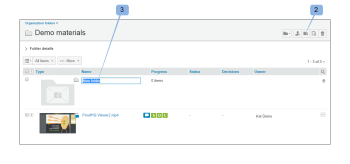
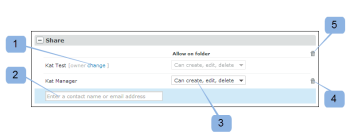

# Mappen maken in [!DNL Workfront Proof]

>[!IMPORTANT]
>
>Dit artikel verwijst naar functionaliteit in het zelfstandige product [!DNL Workfront Proof] . Voor informatie bij het proef binnen [!DNL Adobe Workfront], zie [&#x200B; het Bewijzen &#x200B;](../../../review-and-approve-work/proofing/proofing.md).

## Een nieuwe map op hoofdniveau maken {#creating-a-new-top-level-folder}

1. Klik in het zijpaneel op de vervolgkeuzepijl (1) naast de groene **[!UICONTROL New proof]** knop.
1. Selecteer **[!UICONTROL New folder]** . (2)\
   De pagina [!UICONTROL New folder] wordt weergegeven.

1. Ga met [&#x200B; Vormend de nieuwe omslag &#x200B;](#configuring-the-new-folder) verder.\
   

## Een nieuwe submap maken {#creating-a-new-sub-folder}

U kunt submappen op een van de volgende manieren maken:

* [Een submap maken op de pagina met mapdetails](#creating-a-sub-folder-from-the-folder-details-page)
* [Een submap maken op de pagina Accountmappen](#creating-a-sub-folder-from-the-account-folders-page)

>[!NOTE]
>
>Wanneer u een nieuwe submap maakt, wordt de lijst Delen overgenomen van de bovenliggende map.

### Submappen maken op de pagina [!UICONTROL Folder details] {#creating-a-sub-folder-from-the-folder-details-page}

Voor informatie over de [!UICONTROL Folder details] pagina, zie [&#x200B; Mappen en hun Inhoud in Workfront Proof beheren &#x200B;](../../../workfront-proof/wp-work-proofsfiles/organize-your-work/manage-folders-and-contents.md).

Een submap maken op basis van de pagina [!UICONTROL Folder details] :

1. Klik in de zijbalk op de mapnaam in de lijst [!UICONTROL My folders] (1) om de pagina met mapdetails te openen

1. Klik op de knop Nieuwe submap (2) boven aan de pagina.\
   Er wordt een nieuwe map weergegeven in de lijst met items in de map.
1. Typ een naam voor de nieuwe submap. (3)
1. Druk op **[!UICONTROL Enter]**.\
   of\
   Klik buiten het veld Mapnaam.

1. (Optioneel) Bewerk de gegevens van de nieuwe submap op de pagina met mapdetails.
1. Ga met [&#x200B; Vormend de nieuwe omslag &#x200B;](#configuring-the-new-folder) verder.

### Een submap maken op de pagina Accountmappen {#creating-a-sub-folder-from-the-account-folders-page}

1. Klik [ de omslagen van uw rekeningsnaam ] in Sidebar om tot de de omslagen van de Rekening pagina (1) toegang te hebben\
   

1. De map zoeken waaraan u een submap wilt toevoegen en het menu [!UICONTROL actions] openen (2)
1. Selecteer [!UICONTROL New sub-folder] in het menu (3)\
   De pagina [!UICONTROL New folder] wordt weergegeven.
1. Ga met [&#x200B; Vormend de nieuwe omslag &#x200B;](#configuring-the-new-folder) verder.

## De nieuwe map configureren {#configuring-the-new-folder}

Nadat u begint creërend een nieuwe omslag (zoals die in of [&#x200B; wordt beschreven Creërend een nieuwe top-level omslag &#x200B;](#creating-a-new-top-level-folder) of [&#x200B; Creërend een nieuwe subfolder &#x200B;](#creating-a-new-sub-folder)), kunt u de configuratieopties plaatsen zoals die in deze sectie worden beschreven.

* [&#x200B; Breadcrumb navigatie &#x200B;](#breadcrumb-navigation) (1)
* [&#x200B; de details van de Omslag &#x200B;](#folder-details) (2)
* [&#x200B; details van de Cliënt &#x200B;](#client-details) (3)
* [&#x200B; Aandeel &#x200B;](#share) (4)

### Breadcrumb-navigatie {#breadcrumb-navigation}

De navigatie breadcrumb geeft aan of u een map op hoofdniveau of een submap maakt (1)

### Mapdetails {#folder-details}

In deze sectie kunt u de volgende informatie toevoegen (en controleren) aan de map die u maakt:

* Mapnaam - dit veld is verplicht (1)
* Als u op de koppeling [!UICONTROL See the list] (2) klikt, wordt een pop-up weergegeven met een lijst met personen met wie deze map wordt gedeeld. Deze informatie is vooral handig wanneer u submappen maakt, omdat submappen automatisch worden gedeeld met dezelfde personen als de bovenliggende map
* Beschrijving (3) - hier kunt u een korte beschrijving van de map toevoegen. Deze wordt weergegeven op de pagina Mapdetails
* Maak de omslag privé (4) - het tikken van de doos zal deze omslag privé maken (zo zichtbaar slechts aan de mensen u uitdrukkelijk de omslag met en de gebruikers in uw rekening met de profielen van [&#x200B; Profielen van de Toestemmingen van de Bewijs in  [!DNL Workfront Proof]](../../../workfront-proof/wp-acct-admin/account-settings/proof-perm-profiles-in-wp.md), [&#x200B; Profielen van de Toestemmingen van de Bevoegdheden van de Bewijs in  [!DNL Workfront Proof]](../../../workfront-proof/wp-acct-admin/account-settings/proof-perm-profiles-in-wp.md) of [&#x200B; Profielen van de Toestemmingen van de Bevoegdheden van de Bewijs in  [!DNL Workfront Proof]](../../../workfront-proof/wp-acct-admin/account-settings/proof-perm-profiles-in-wp.md) ). Gelieve te zien [&#x200B; Begrijp de Toestemmingen van de Omslag in  [!DNL Workfront Proof]](../../../workfront-proof/wp-work-proofsfiles/organize-your-work/folder-permissions.md) om meer over privé en openbare omslagen in Workfront Proof te weten te komen.

### Clientgegevens {#client-details}

In deze sectie kunt u de details van uw cliënt invullen - dit zal u toestaan om de Mijn omslagpagina op cliënt/projectnaam te sorteren:

* Clientnaam (1)
* Projectnaam (2)

### Delen {#share}

In de sectie [!UICONTROL Share] kunt u:

* Wijs een nieuwe eigenaar van de map (1) toe. De maker van de map blijft in de lijst en kan niet worden verwijderd. U kunt echter een andere gebruiker in uw account de eigenaar maken, die hem bewerkingsrechten geeft voor de map.
* Deel de map met andere [!DNL Workfront Proof] -gebruikers door hun e-mailadres (2) in te voeren. Mappen kunnen alleen worden gedeeld met personen die hun eigen [!DNL Workfront Proof] -aanmeldingen hebben.
* Stel de machtigingen in voor de personen met wie u de map deelt (3). Dit is nuttig om privé omslagen met gebruikers van uw rekening te delen - u kunt beslissen als de gebruikers met het [&#x200B; Profielen van de Toestemmingen van de Bewijs in  [!DNL Workfront Proof]](../../../workfront-proof/wp-acct-admin/account-settings/proof-perm-profiles-in-wp.md) profiel zouden moeten worden toegestaan om punten in de omslag tot stand te brengen uit te geven en te schrappen.
* Verwijder een gebruiker uit de lijst voor gedeelde mappen door op het prullenbakpictogram (4) rechts van de gebruikersnaam te klikken.
* Verwijder iedereen uit de lijst met gedeelde mappen door op het bovenste prullenbakpictogram (5) te klikken. U kunt de maker of eigenaar van de map niet verwijderen.

Gelieve te zien ook [&#x200B; Omslagen van het Aandeel in  [!DNL Workfront Proof]](../../../workfront-proof/wp-work-proofsfiles/organize-your-work/share-folders.md).

