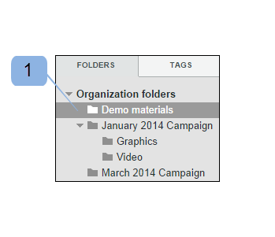

# Mappen maken in [!DNL Workfront Proof]

>[!IMPORTANT]
>
>Dit artikel verwijst naar functionaliteit in het standalone product [!DNL Workfront Proof]. Voor informatie over proefdrukken binnen [!DNL Adobe Workfront], zie [Proofing](../../../review-and-approve-work/proofing/proofing.md).

## Een nieuwe map op hoofdniveau maken {#creating-a-new-top-level-folder}

1. Klik in het zijpaneel op de vervolgkeuzepijl (1) naast het groene **[!UICONTROL New proof]** knop.
1. Selecteren **[!UICONTROL New folder]**. (2)\
   De pagina [!UICONTROL New folder] wordt weergegeven.

1. Doorgaan met [De nieuwe map configureren](#configuring-the-new-folder).\
   

## Een nieuwe submap maken {#creating-a-new-sub-folder}

U kunt submappen op een van de volgende manieren maken:

* [Een submap maken op de pagina met mapdetails](#creating-a-sub-folder-from-the-folder-details-page)
* [Een submap maken op de pagina Accountmappen](#creating-a-sub-folder-from-the-account-folders-page)

>[!NOTE]
>
>Wanneer u een nieuwe submap maakt, wordt de lijst Delen overgenomen van de bovenliggende map.

### Submappen maken vanuit de [!UICONTROL Folder details] page {#creating-a-sub-folder-from-the-folder-details-page}

Voor informatie over de [!UICONTROL Folder details] pagina, zie [Mappen en de inhoud ervan beheren in Workfront Proef](../../../workfront-proof/wp-work-proofsfiles/organize-your-work/manage-folders-and-contents.md).

Een submap maken vanuit de [!UICONTROL Folder details] pagina:

1. Klik in de zijbalk op de mapnaam in het dialoogvenster [!UICONTROL My folders] lijst (1) voor toegang tot de pagina met mapdetails

1. Klik op de knop Nieuwe submap (2) boven aan de pagina.\
   Er wordt een nieuwe map weergegeven in de lijst met items in de map.
1. Typ een naam voor de nieuwe submap. (3)
1. Druk **[!UICONTROL Enter]**.\
   of\
   Klik buiten het veld Mapnaam.

1. (Optioneel) Bewerk de gegevens van de nieuwe submap op de pagina met mapdetails.
1. Doorgaan met [De nieuwe map configureren](#configuring-the-new-folder).

### Een submap maken op de pagina Accountmappen {#creating-a-sub-folder-from-the-account-folders-page}

1. Klikken [Uw accountnaam] mappen op de zijbalk voor toegang tot de pagina met accountmappen (1)\
   

1. Zoek de map waaraan u een submap wilt toevoegen en open de map [!UICONTROL actions] menu (2)
1. Selecteren [!UICONTROL New sub-folder] uit het menu (3)\
   De pagina [!UICONTROL New folder] wordt weergegeven.
1. Doorgaan met [De nieuwe map configureren](#configuring-the-new-folder).

## De nieuwe map configureren {#configuring-the-new-folder}

Nadat u een nieuwe map hebt gemaakt (zoals wordt beschreven in [Een nieuwe map op hoofdniveau maken](#creating-a-new-top-level-folder) of [Een nieuwe submap maken](#creating-a-new-sub-folder)), kunt u de configuratieopties instellen zoals beschreven in deze sectie.

* [Breadcrumb-navigatie](#breadcrumb-navigation) (1)
* [Mapdetails](#folder-details) (2)
* [Clientgegevens](#client-details) (3)
* [Delen](#share) (4)

### Breadcrumb-navigatie {#breadcrumb-navigation}

De navigatie breadcrumb geeft aan of u een map op hoofdniveau of een submap maakt (1)

### Mapdetails {#folder-details}

In deze sectie kunt u de volgende informatie toevoegen (en controleren) aan de map die u maakt:

* Mapnaam - dit veld is verplicht (1)
* Klik op de knop [!UICONTROL See the list] koppeling (2) geeft een pop-up met een lijst weer van personen met wie deze map wordt gedeeld. Deze informatie is vooral handig wanneer u submappen maakt, omdat submappen automatisch worden gedeeld met dezelfde personen als de bovenliggende map
* Beschrijving (3) - hier kunt u een korte beschrijving van de map toevoegen. Deze wordt weergegeven op de pagina Mapdetails
* Maak de map privé (4) - door het selectievakje in te schakelen, wordt deze map privé (zodat deze alleen zichtbaar is voor de personen met wie u de map expliciet deelt en de gebruikers in uw account met de profielen van [Profielen met proefmachtigingen in [!DNL Workfront Proof]](../../../workfront-proof/wp-acct-admin/account-settings/proof-perm-profiles-in-wp.md), [Profielen met proefmachtigingen in [!DNL Workfront Proof]](../../../workfront-proof/wp-acct-admin/account-settings/proof-perm-profiles-in-wp.md) of [Profielen met proefmachtigingen in [!DNL Workfront Proof]](../../../workfront-proof/wp-acct-admin/account-settings/proof-perm-profiles-in-wp.md) ). Zie [Mapmachtigingen begrijpen in [!DNL Workfront Proof]](../../../workfront-proof/wp-work-proofsfiles/organize-your-work/folder-permissions.md) voor meer informatie over openbare en privémappen in Workfront Proof.

### Clientgegevens {#client-details}

In deze sectie kunt u de details van uw cliënt invullen - dit zal u toestaan om de Mijn omslagpagina op cliënt/projectnaam te sorteren:

* Naam klant (1)
* Projectnaam (2)

### Delen {#share}

In de [!UICONTROL Share] sectie die u kunt instellen:

* Wijs een nieuwe eigenaar van de map (1) toe. De maker van de map blijft in de lijst en kan niet worden verwijderd. U kunt echter een andere gebruiker in uw account de eigenaar maken, die hem bewerkingsrechten geeft voor de map.
* De map delen met andere [!DNL Workfront Proof] gebruikers door hun e-mailadres in te voeren (2) - houd er rekening mee dat mappen alleen kunnen worden gedeeld met personen die een eigen map hebben [!DNL Workfront Proof] logins.
* Stel de machtigingen in voor de personen met wie u de map deelt (3). Dit is handig als u privémappen wilt delen met gebruikers van uw account. U kunt bepalen of gebruikers [Profielen met proefmachtigingen in [!DNL Workfront Proof]](../../../workfront-proof/wp-acct-admin/account-settings/proof-perm-profiles-in-wp.md) mag profiel items in de map maken, bewerken en verwijderen.
* Verwijder een gebruiker uit de lijst voor gedeelde mappen door op het prullenbakpictogram (4) rechts van de gebruikersnaam te klikken.
* Verwijder iedereen uit de lijst met gedeelde mappen door op het bovenste prullenbakpictogram (5) te klikken. U kunt de maker of eigenaar van de map niet verwijderen.

Zie ook [Mappen delen in [!DNL Workfront Proof]](../../../workfront-proof/wp-work-proofsfiles/organize-your-work/share-folders.md).

