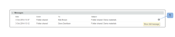

# Mappen en de inhoud ervan beheren in [!DNL Workfront Proof]

>[!IMPORTANT]
>
>Dit artikel verwijst naar functionaliteit in het standalone product [!DNL Workfront Proof]. Voor informatie over proefdrukken binnen [!DNL Adobe Workfront], zie [Proofing](../../../review-and-approve-work/proofing/proofing.md).

Een van de voordelen van het organiseren van projecten en proefdrukken in mappen is de mogelijkheid om deze op de [!UICONTROL Folder details] pagina. Deze pagina is een controlecentrum voor uw project. Vanaf dit punt kunt u eenvoudig afzonderlijke proefdrukken en bestanden beheren en acties in grote hoeveelheden uitvoeren.

## Items groeperen zodat revisoren samen aan deze items kunnen werken

U kunt mappen gebruiken om proefdrukken te groeperen waaraan u revisoren wilt laten samenwerken. Wanneer een controleur een van de proefdrukken in de map opent om de proefdrukviewer te starten, zijn alle andere proefdrukken in de map beschikbaar. De controleur kan aan elke proefdruk in de map werken zonder de proefdrukviewer te verlaten. Zie voor meer informatie [Werken met meerdere proefdrukken in de proefdrukviewer](../../../workfront-proof/wp-work-proofsfiles/review-proofs-wpv/work-with-multiple-proofs.md).

## Nieuwe items aan een map toevoegen

Wanneer u een proef creeert of een dossier uploadt, kunt u de omslag selecteren waar u het in wilt opslaan [!UICONTROL Organize] de [!UICONTROL New proof] of de [!UICONTROL New file] pagina.

Zie voor meer informatie [Proefdrukken genereren in [!DNL Workfront Proof]](../../../workfront-proof/wp-work-proofsfiles/create-proofs-and-files/generate-proofs.md) of [Bestanden en webinhoud uploaden naar [!DNL Workfront Proof]](../../../workfront-proof/wp-work-proofsfiles/create-proofs-and-files/upload-files-web-content.md).

>[!NOTE]
>
>Als u momenteel de map bekijkt waaraan u een nieuw item wilt toevoegen, wordt die map automatisch weergegeven in het dialoogvenster [!UICONTROL Organize] als u de pagina Nieuwe proefdruk of de [!UICONTROL New file] pagina.

## Bestaande items toevoegen aan een map

U kunt een bestaand bestand of proefdruk toevoegen aan een map.

Zie voor meer informatie [Bestanden beheren in [!DNL Workfront Proof]](../../../workfront-proof/wp-work-proofsfiles/manage-your-work/manage-files.md) of [Proefdrukgegevens beheren in Workfront Proof](../../../workfront-proof/wp-work-proofsfiles/manage-your-work/manage-proof-details.md).

1. (Voorwaardelijk) Voer een van de volgende handelingen uit:

   * Als u een proefdruk aan een omslag toevoegt, ga naar [!UICONTROL Proof details] pagina zoals beschreven in [[!UICONTROL Manage Proof Details] in [!DNL Workfront Proof]](../../../workfront-proof/wp-work-proofsfiles/manage-your-work/manage-proof-details.md)
   * Als u een bestand aan een map toevoegt, gaat u naar de pagina Bestandsdetails, zoals beschreven in [Bestanden beheren in [!DNL Workfront Proof]](../../../workfront-proof/wp-work-proofsfiles/manage-your-work/manage-files.md).&quot;

1. Klik op de naam van de **Map** Klik op de locatie van het bestand of de proefdruk en klik vervolgens op de naam van de map waarnaar u het bestand of de proefdruk wilt verplaatsen.\
   

## Items uit een map verplaatsen

1. (Voorwaardelijk) Voer een van de volgende handelingen uit:

   * Als u een proef uit een omslag verplaatst, ga naar [!UICONTROL Proof details] pagina zoals beschreven in [[!UICONTROL Manage Proof Details] in [!DNL Workfront Proof]](../../../workfront-proof/wp-work-proofsfiles/manage-your-work/manage-proof-details.md)\

      of\
      Als u een bestand uit een map verplaatst, gaat u naar de pagina Bestandsdetails, zoals beschreven in [Bestanden beheren in [!DNL Workfront Proof]](../../../workfront-proof/wp-work-proofsfiles/manage-your-work/manage-files.md).&quot;

1. Klik op de naam van de **Map** waar het bestand of de proefdruk zich bevindt, klikt u op **[!UICONTROL Move to]** > **[!UICONTROL (No folder selected)]**.\
   

## Een map en de bijbehorende items in het dialoogvenster [!UICONTROL Folder Details] Pagina

U kunt uw bestanden eenvoudig beheren vanuit de [!UICONTROL Folder details] pagina.

>[!NOTE]
>
>Als u niet de maker of eigenaar van het bestand bent, zijn de beschikbare opties afhankelijk van de gebruiker [Profielen met proefmachtigingen in [!DNL Workfront Proof]](../../../workfront-proof/wp-acct-admin/account-settings/proof-perm-profiles-in-wp.md).

1. Op de **[!UICONTROL Folders]** in het navigatiemenu links klikt u op een willekeurige map om het dialoogvenster [!UICONTROL Folder details] pagina.
1. Als de map alleen gearchiveerde proefdrukken bevat, wordt boven aan de pagina een geel bericht weergegeven. Als u op de koppeling in het bericht klikt, verandert de mappenweergave in de [!UICONTROL Archived proofs] weergeven.
1. Klikken **[!UICONTROL Folder details]** Voer vervolgens een van de volgende handelingen uit met de map met de weergegeven opties:

   * Voeg de miniatuurafbeelding voor de map toe of wijzig deze.
   * De **Beschrijving**, **Bovenliggende map**, **Eigenaar**, **Client**, of **Project** is gekoppeld aan de map.

   * Map maken **Persoonlijk**.
   * Controleren of de map **Gemaakt**.
   * Zie de naam van de map **Maker**.

1. (Optioneel) Als u de informatie wilt wijzigen die aan een item in de map is gekoppeld, klikt u op de knop **[!UICONTROL More]** rechts van het item en gebruik vervolgens een van de opties die worden weergegeven.\
   \
   Welke opties worden weergegeven, is afhankelijk van het feit of het een proefdruk of een bestand is.

   * **[!UICONTROL View proof details]** of **[!UICONTROL View file details]**: Hiermee opent u de pagina Proefgegevens of Bestandsgegevens. Zie voor meer informatie [Bestanden beheren in [!DNL Workfront Proof]](../../../workfront-proof/wp-work-proofsfiles/manage-your-work/manage-files.md) of [Proofinggegevens beheren in [!DNL Workfront Proof]](../../../workfront-proof/wp-work-proofsfiles/manage-your-work/manage-proof-details.md).

   * **[!UICONTROL Share]**: Hiermee kunt u het bestand delen met extra personen. Zie voor meer informatie [Bestanden delen in [!UICONTROL Workfront Proof]](../../../workfront-proof/wp-work-proofsfiles/share-proofs-and-files/share-files.md).

   * **[!UICONTROL Message]**: Stuur een e-mail naar de personen met wie de proefdruk is gedeeld.
   * **[!UICONTROL New Version]**: Maak een nieuwe versie van de proefdruk.
   * **[!UICONTROL Copy]**: Kopieer de proefdruk met eventuele opmerkingen als een nieuwe versie van een bestaande proefdruk of als een nieuwe proefdruk.
   * **[!UICONTROL Download original]**: Hiermee kunt u het oorspronkelijke bestand downloaden. Zie voor meer informatie [Bestanden downloaden die zijn opgeslagen in [!DNL Workfront Proof]](../../../workfront-proof/wp-work-proofsfiles/manage-your-work/download-files-stored.md).

   * **[!UICONTROL Delegate ownership]**: Eigendom van de proefdruk toewijzen aan een andere gebruiker.
   * **[!UICONTROL Share proof links]**: Stuur een e-mail met een koppeling naar de proefdruk.
   * **[!UICONTROL Print comments]**: Druk de opmerkingen af die revisoren op de proefdruk hebben gemaakt.
   * **[!UICONTROL Excel summary]**: Maak een Excel-bestand met het afdrukoverzicht voor de proefdruk.
   * **[!UICONTROL Lock]**: Vergrendel de proefdruk zodat andere gebruikers deze niet kunnen openen.
   * **[!UICONTROL Delete]**: Hiermee verwijdert u het bestand uit [!DNL Workfront] Proef.

1. (Optioneel) In het dialoogvenster **[!UICONTROL Shared with]** als u een herinnering wilt verzenden aan een controleur op de proefdruk, klikt u op de knop **[!UICONTROL More]** rechts van de naam van de gebruiker klikt u op **[!UICONTROL Message]**.\
   U kunt op **[!UICONTROL Remove]** om het delen van de map met de persoon op te heffen.\
   Eigenaars en makers van mappen worden altijd in deze lijst weergegeven en kunnen niet worden verwijderd. Als een gebruiker de eigendom van een map overneemt, worden deze automatisch weergegeven en kunnen deze niet worden verwijderd.\
   U kunt een omslag met individuele gebruikers en de bedrijven van de Partner delen. Als de omslag met een bedrijf van de Partner wordt gedeeld, kunt u de volledige lijst van ontvangers zien door te klikken [!UICONTROL information] pictogram dat wordt weergegeven wanneer u de muisaanwijzer op de rij plaatst. Zie voor meer informatie [Partneraccounts.](https://support.workfront.com/hc/en-us/sections/115000912107-Partner-accounts)

1. (Optioneel) Bewerk de machtigingen van de manager voor privémappen door onder **[!UICONTROL Allow on folder]** en geeft u vervolgens op of de persoon items in die map moet kunnen maken, bewerken en verwijderen. **OPMERKING** Deze optie is alleen beschikbaar voor managers van dezelfde account als de eigenaar van de map die zijn toegevoegd aan persoonlijke mappen. Supervisors, beheerders en factureringsbeheerders hebben bewerkingsrechten voor alle mappen in de account en waarnemers kunnen geen items maken. Voor informatie over toestemmingen, zie [Profielen met proefmachtigingen in [!DNL Workfront Proof]](../../../workfront-proof/wp-acct-admin/account-settings/proof-perm-profiles-in-wp.md).

1. (Optioneel) Klik op **[!UICONTROL Activity]** om alle handelingen die in de map zijn uitgevoerd, in chronologische volgorde weer te geven.
1. (Optioneel) Klik op **[!UICONTROL Messages]** om de berichten weer te geven die naar gebruikers in de map zijn verzonden.\
   Wanneer u de muisaanwijzer op een bericht plaatst, kunt u op de knop **i** aan de rechterkant om het volledige bericht te bekijken.\
   \
   Een pop-up met de volledige e-mailvertoningen:\
   

## Submappen beheren

U kunt de submappen beheren via de detailpagina Mappen.

1. Op de **[!UICONTROL Folders]** klikt u in het navigatiemenu aan de linkerkant op de naam van de bovenliggende map die de submap bevat om het dialoogvenster **[!UICONTROL Folder details]** pagina.

1. Klik op de knop **[!UICONTROL More]** rechts van de submap.\
   

1. Klik op een van de volgende opties:

   * **[!UICONTROL View folder details]**: Hiermee opent u de [!UICONTROL Folder details] pagina.
   * **[!UICONTROL New proof]**: Hiermee kunt u een nieuwe proefdruk toevoegen aan de submap.
   * **[!UICONTROL Upload file]**: Hiermee kunt u een bestand uploaden naar de submap.
   * **[!UICONTROL New sub-folder]**: Hiermee maakt u een nieuwe submap in de submap.
   * **[!UICONTROL Share]**: Hiermee kunt u de submap delen met andere gebruikers.
   * **[!UICONTROL Excel summary]**: Hiermee kunt u een Excel-overzicht van de submap aanvragen.
   * **[!UICONTROL Delete]**: Hiermee kunt u de submap verwijderen.
