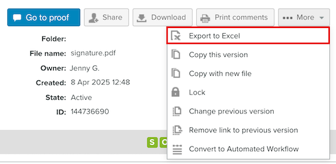

# Opmerkingen afdrukken en exporteren in [!DNL Workfront Proof]

<!-- Audited: 4/2025 -->

>[!IMPORTANT]
>
>Dit artikel verwijst naar functionaliteit in het zelfstandige product [!DNL Workfront Proof] . Voor informatie bij het proef binnen [!DNL Adobe Workfront], zie [ het Bewijzen ](../../../review-and-approve-work/proofing/proofing.md).

## Opmerkingen afdrukken

U hebt rechtstreeks vanuit de volgende gebieden toegang tot het overzicht met opmerkingen:

* [De Proefweergave](#the-proof-viewer)
* [De pagina Proefgegevens](#the-proof-details-page)
* [Het  [!DNL Proof]  Menu van Acties](#the-proof-actions-menu)

### De Proefweergave {#the-proof-viewer}

U kunt het overzicht met opmerkingen van de proefdruk, inclusief de miniaturen of de volledige weergave van de proefdruk, afdrukken door op het pictogram **[!UICONTROL Print]** in de Proefweergave te klikken.

Om tot de Kijker van het Bewijs toegang te hebben, klik **gaan aan proef** knoop van de de detailpagina van het Bewijs.

### De pagina Proefgegevens {#the-proof-details-page}

U kunt de opmerkingssamenvatting van de proefdruk afdrukken door op het pictogram **[!UICONTROL Print]** op de pagina Proefgegevens te klikken.

Als u de pagina Proefgegevens wilt openen voor een specifieke proefdruk, klikt u in de lijstweergave op de naam van de proefdruk.

### Het menu Handelingen van [!DNL Proof] {#the-proof-actions-menu}

U kunt de opmerkingssamenvatting van de proefdruk afdrukken door op het pictogram **[!UICONTROL Print]** in het menu [!UICONTROL Proof actions] te klikken.

U kunt als volgt de pagina [!UICONTROL Comments Summary] openen vanuit een lijstweergave:

1. Klik op het menu **[!UICONTROL Actions]** .
1. Selecteer **[!UICONTROL Print comments]** .

   

   Selecteer op de overzichtspagina Opmerkingen een van de volgende afdrukopties:

   * Miniatuurweergave (1)
   * Volledige paginaweergave (2)
   * De pagina afdrukken (3)
   * De proefdruk met opmerkingen exporteren naar een PDF-bestand (4)
   * De proefdrukopmerkingen exporteren naar een [!DNL Excel] -bestand (5)

### Miniatuurweergave

In de miniatuurweergave worden alle opmerkingen weergegeven op volgorde van de volledige thread voor elke opmerking. U kunt ook opmerkingen sorteren en de miniatuur van elke opmerking zien waaraan markeringen zijn toegevoegd.

Als u de miniatuurweergave wilt afdrukken, klikt u op het pictogram **[!UICONTROL Printer]** in de rechterbovenhoek van de pagina en selecteert u een van de volgende opties:

* Sorteren op opmerking-id of pagina (1)
* Miniatuur voor elke opmerking waaraan markeringen zijn toegevoegd (2)

### Volledige weergave

In de weergave van de volledige pagina wordt elke pagina weergegeven in volgorde van de opmerkingen op die pagina en een punt dat aangeeft waar de opmerking zich bevindt.

Als u de weergave van de volledige pagina wilt afdrukken, klikt u op het pictogram **[!UICONTROL Printer]** rechtsboven op de pagina.

## Een [!DNL Excel] overzicht exporteren

U kunt als volgt de samenvatting van [!DNL Excel] exporteren uit het menu Proefacties:

1. Klik het **pictogram van Acties** rechts van de proef, dan uitgezocht **[!UICONTROL [!DNL Excel] summary]**.
   

U kunt als volgt het overzicht van [!DNL Excel] downloaden van de pagina Proefgegevens:

1. Klik de **Meer** knoop, dan uitgezochte **Uitvoer aan Excel**.

   

## Exporteren naar PDF

Wanneer u naar een PDF-bestand exporteert, worden alle opmerkingen in de PDF-lezer weergegeven. Als aan een opmerking meerdere markeringen zijn gekoppeld, wordt de opmerking meerdere keren weergegeven in de lijst met opmerkingen (één keer voor elke markering).

>[!IMPORTANT]
>
>De functie Exporteren naar PDF is alleen beschikbaar voor statische bestanden.

Een proefdruk met markeringen en opmerkingen exporteren naar PDF:

1. Klik links in het scherm op **[!UICONTROL Views]** .
1. Klik op de knop **[!UICONTROL More]** in lijn met de specifieke proefdruk en selecteer vervolgens **[!UICONTROL Print comments]** .

1. In de hoger-juiste hoek van de pagina, klik de **Uitvoer aan PDF** knoop. De PDF begint met downloaden en ontvangt een e-mail zodra het is voltooid.
