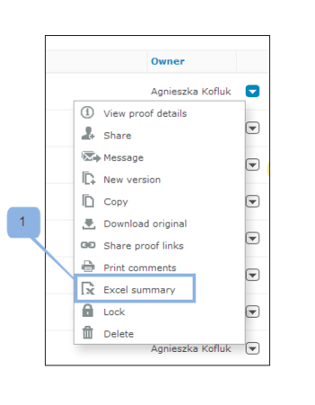

# Opmerkingen afdrukken en exporteren in [!DNL Workfront Proof]

>[!IMPORTANT]
>
>Dit artikel verwijst naar functionaliteit in het zelfstandige product [!DNL Workfront Proof] . Voor informatie bij het proef binnen [!DNL Adobe Workfront], zie [ het Bewijzen ](../../../review-and-approve-work/proofing/proofing.md).

## Opmerkingen afdrukken

U hebt rechtstreeks vanuit de volgende gebieden toegang tot het overzicht met opmerkingen:

* [De Proefweergave](#the-proof-viewer)
* [De pagina Proefgegevens](#the-proof-details-page)
* [Het  [!DNL Proof]  Menu van Acties](#the-proof-actions-menu)

### De Proefweergave {#the-proof-viewer}

U kunt het overzicht met opmerkingen van de proefdruk, inclusief de miniaturen of de volledige weergave van de proefdruk, afdrukken door op het pictogram **[!UICONTROL Print]** in de Proefweergave te klikken.

### De pagina Proefgegevens {#the-proof-details-page}

U kunt de samenvatting van de opmerkingen van de proefdruk afdrukken door op het pictogram **[!UICONTROL Print]** op de pagina Proefgegevens te klikken.

### Het menu Handelingen van [!DNL Proof] {#the-proof-actions-menu}

U kunt het overzicht met opmerkingen van de proefdruk afdrukken door op het pictogram **[!UICONTROL Print]** in het menu [!UICONTROL Proof actions] te klikken.

U kunt als volgt de pagina [!UICONTROL Comments Summary] openen vanuit een lijstweergave:

1. Klik op het menu **[!UICONTROL Actions]** .
1. Selecteer **[!UICONTROL Print comments]** .

   

   Op de overzichtspagina met opmerkingen kunt u uit de volgende afdrukopties kiezen:

   * Miniatuurweergave (1)
   * Volledige paginaweergave (2)
   * De pagina afdrukken (3)
   * De proefdruk met opmerkingen exporteren naar een PDF-bestand (4)
   * De proefdrukopmerkingen exporteren naar een [!DNL Excel] -bestand (5)

### Miniatuurweergave

In de miniatuurweergave worden alle opmerkingen op volgorde weergegeven, samen met de volledige thread voor elke opmerking. U kunt ook opmerkingen sorteren en de miniatuur van elke opmerking zien waaraan markeringen zijn toegevoegd.

Als u de miniatuurweergave wilt afdrukken, klikt u op het pictogram **[!UICONTROL Printer]** in de rechterbovenhoek van de pagina en selecteert u een van de volgende opties:

* Sorteren op opmerking-id of pagina (1)
* Miniatuur voor elke opmerking waaraan markeringen zijn toegevoegd (2)

### Volledige weergave

In de weergave van de volledige pagina wordt elke pagina in de juiste volgorde weergegeven, samen met de opmerkingen op die pagina en een punt dat aangeeft waar de markering voor de opmerking zich op de pagina bevindt.

Als u de volledige paginaweergave wilt afdrukken, klikt u op het pictogram **[!UICONTROL Printer]** rechtsboven op de pagina.

## Een [!DNL Excel] overzicht exporteren

U kunt als volgt het [!DNL Excel] -overzicht downloaden:

1. Open het menu Handelingen van de proefdruk rechts van de proefdruk en klik op **[!UICONTROL [!DNL Excel] summary]** . (1)\
   

U kunt als volgt het overzicht van [!DNL Excel] downloaden van de pagina Proefgegevens:

1. Klik op het pictogram Naar **[!DNL Excel]** exporteren. (2)

   

## Exporteren naar PDF

Voer de volgende stappen uit om een proefdruk samen met alle markeringen en opmerkingen te exporteren naar PDF:

1. Ga naar **[!UICONTROL Views]** aan de linkerkant van het scherm.
1. Klik op het pictogram **[!UICONTROL More]** inline met een proefdruk en klik vervolgens op **[!UICONTROL Print comments]** .

1. Klik op het pictogram Exporteren naar PDF rechtsboven op de pagina.

   Als de PDF klaar is, ontvangt u een e-mail met een downloadkoppeling.

Alle opmerkingen worden weergegeven in de PDF-lezer. Als aan een opmerking meerdere markeringen zijn gekoppeld, wordt de opmerking meerdere keren weergegeven in de lijst met opmerkingen (één keer voor elke markering).

>[!IMPORTANT]
>
>De functie Exporteren naar PDF is alleen beschikbaar voor statische bestanden.
