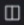

# Proofs vergelijken in de proefdrukviewer

>[!IMPORTANT]
>
>Dit artikel verwijst naar functionaliteit in het standalone product [!DNL Workfront Proof]. Voor informatie over proefdrukken binnen [!DNL Adobe Workfront], zie [Proofing](../../../review-and-approve-work/proofing/proofing.md).

U kunt vergelijkingen van twee proefdrukken naast elkaar weergeven. Dit kunnen twee versies van dezelfde proefdruk zijn, of twee volledig verschillende proefdrukken.

## Versies met proefdrukken vergelijken {#compare-proof-versions}

1. Open de proefdruk met meerdere versies die u wilt vergelijken.
1. Klik in de linkerbovenhoek van de proefdrukviewer die wordt weergegeven op de naam van de proefdruk. Klik vervolgens in de lijst met versies die wordt weergegeven op de knop **Vergelijken** naast de versie die u wilt openen en vergelijken.

   

   De proefdrukken worden naast elkaar weergegeven, met de nieuwere versie aan de linkerkant.

   <!--
   
Separate breadcrumbs above each proof allow you to view and go to the work item associated with the proof:

   -->

   <!--
   
  

   -->

1. Doorgaan met [De vergelijkingsgereedschappen gebruiken](#use-the-compare-tools).

## Afzonderlijke proefdrukken vergelijken {#compare-separate-proofs}

U kunt twee afzonderlijke proefdrukken vergelijken.

* [Afzonderlijke proefdrukken vergelijken in [!DNL Workfront]](#compare-separate-proofs-in-workfront)
* [Afzonderlijke proefdrukken vergelijken in [!DNL Workfront Proof]](#compare-separate-proofs-in-workfront-proof)

### Afzonderlijke proefdrukken vergelijken in [!DNL Workfront] {#compare-separate-proofs-in-workfront}

Voor informatie over het vergelijken van afzonderlijke proefdrukken van de documentlijst binnen [!DNL Workfront], zie de [Twee verschillende proefdrukken vergelijken](../../../review-and-approve-work/proofing/reviewing-proofs-within-workfront/review-a-proof/compare-proofs.md#comparing-two-proofs-from-a-document-list) in de [Proofs vergelijken](../../../review-and-approve-work/proofing/reviewing-proofs-within-workfront/review-a-proof/compare-proofs.md) artikel.

### Afzonderlijke proefdrukken vergelijken in [!DNL Workfront Proof] {#compare-separate-proofs-in-workfront-proof}

>[!NOTE]
>
>De proefdrukken die u vergelijkt, moeten zich in dezelfde map en op hetzelfde hiërarchische niveau binnen de mappenstructuur bevinden. Zie voor meer informatie over het gebruik van mappen om proeven te groeperen die u wilt vergelijken [Werken met meerdere proefdrukken in de proefdrukviewer](../../../workfront-proof/wp-work-proofsfiles/review-proofs-wpv/work-with-multiple-proofs.md)

1. Open een van de proefdrukken die u wilt vergelijken in de proefdrukviewer.
1. Klik op de knop **[!UICONTROL Compare Mode]** pictogram.

   \
   Het weergavegebied wordt in tweeën gesplitst en de proefdruk wordt zowel aan de linkerkant als aan de rechterkant van de proefdrukviewer weergegeven.

   

1. Klik op de knop [!UICONTROL folder] links of rechts boven de proefdruk om de andere proefdrukken in dezelfde map weer te geven.

   

1. Klik in de lijst op de naam van de proefdruk die u wilt vergelijken met de proefdruk die momenteel is geopend in de proefdrukviewer.

   

   Beide proefdrukken worden weergegeven.

1. Doorgaan met [De vergelijkingsgereedschappen gebruiken](#use-the-compare-tools).

## De vergelijkingsgereedschappen gebruiken {#use-the-compare-tools}

De proefdrukviewer beschikt over verschillende gereedschappen waarmee u proefdrukken op effectieve en efficiënte wijze kunt vergelijken.

* [Proefdrukken automatisch vergelijken](#auto-compare-proofs)
* [Proefdrukken in een bedekking vergelijken](#compare-proofs-in-an-overlay)
* [Gelijktijdige vergelijking van navigatie](#simultaneous-navigation-comparison)

### Proefdrukken automatisch vergelijken {#auto-compare-proofs}

Met Automatisch vergelijken kunt u per pixel twee statische of videoproefdrukken vergelijken. Eventuele geconstateerde verschillen worden rood gemarkeerd in de proefdruk aan de linkerkant.

Automatisch vergelijken is niet beschikbaar wanneer u interactieve proefdrukken vergelijkt.

Twee proefdrukken automatisch vergelijken:

1. Vergelijk proefdrukken op een van de volgende manieren:

   * Twee versies van dezelfde proefdruk vergelijken (zie [Versies met proefdrukken vergelijken](#compare-proof-versions) in dit artikel).
   * Twee afzonderlijke proefdrukken vergelijken (zie [Afzonderlijke proefdrukken vergelijken](#compare-separate-proofs) in dit artikel).

1. Klik op de knop **[!UICONTROL Autocompare]** pictogram.

   

   Eventuele verschillen tussen de twee proefdrukken worden rood gemarkeerd in de proefdruk aan de linkerkant.

1. (Optioneel) Klik op de knop **[!UICONTROL Switch]** pictogram om de actieve zijde te wijzigen zodat de verschillen op de proef op de rechterkant worden getoond. De verschillen worden standaard links in de proefdruk weergegeven.

   

1. (Optioneel) Klik op de knop **[!UICONTROL Color]** om de kleur en dekking te wijzigen die worden gebruikt wanneer verschillen worden gemarkeerd.

   

### Proefdrukken in een bedekking vergelijken {#compare-proofs-in-an-overlay}

Met de bedekkingsvergelijking kunt u verschillen tussen twee statische proefdrukken weergeven door de twee proefdrukken als één enkel bewijs weer te geven en tegelijkertijd een verticale scheidingslijn in het midden van de proefdruk te geven. Terwijl u de proefdruk over de verticale scheidingslijn beweegt, worden de verschillen weergegeven.

>[!NOTE]
>
>Overlayvergelijking is niet beschikbaar wanneer u video of interactieve proefdrukken vergelijkt.

Bedekkingsvergelijking inschakelen:

1. Vergelijk proefdrukken op een van de volgende manieren:

   * Twee versies van dezelfde proefdruk vergelijken (zie [Versies met proefdrukken vergelijken](#compare-proof-versions) in dit artikel).
   * Twee afzonderlijke proefdrukken vergelijken (zie [Afzonderlijke proefdrukken vergelijken](#compare-separate-proofs) in dit artikel).

1. Klik op de knop **[!UICONTROL Overlay]** pictogram.

   

   De twee proefdrukken worden weergegeven als één proefdruk met een verticale scheidingslijn langs het midden van de proefdruk.

1. Voer een van de volgende handelingen uit:

   * De proefdruk over de verticale scheidingslijn pannen. Tijdens het pannen ziet u de proef aan de linkerkant van de verticale scheidingslijn, terwijl de proef aan de rechterkant aan de rechterkant wordt weergegeven.
   * Verplaats de verticale scheidingslijn naar links en rechts. Als u de scheidingslijn verplaatst, ziet u de proef links op de verticale scheidingslijn, terwijl de proef aan de rechterkant aan de rechterkant wordt weergegeven.

### Gelijktijdige vergelijking van navigatie {#simultaneous-navigation-comparison}

Gelijktijdige navigatie is standaard ingeschakeld wanneer proefdrukken worden vergeleken. Deze optie is beschikbaar wanneer u een statische proefdruk en een statische proefdruk vergelijkt of wanneer u een videoproefdruk en een videoproefdruk vergelijkt. Deze optie is niet beschikbaar bij het vergelijken van een statische proefdruk en een videoproefdruk.

**Statische proefdrukken:** Wanneer deze optie is ingeschakeld op statische proefdrukken, vergrendelt gelijktijdige navigatie het zoomniveau en de positie van de twee proefdrukken tijdens het pannen of schuiven. Als een proefdruk meerdere pagina&#39;s bevat en gelijktijdige navigatie is ingeschakeld, wordt de pagina bij een proefdruk gewijzigd in de andere proefdruk.

**Videoproefdrukken:** Wanneer gelijktijdige navigatie is ingeschakeld op videoproefdrukken, onthoudt dit het tijdverschil op de tijdlijnen van de twee proefdrukken.

Om gelijktijdige navigatie toe te laten als het nog niet wordt toegelaten:

1. Vergelijk proefdrukken op een van de volgende manieren:

   * Twee versies van dezelfde proefdruk vergelijken (zie [Versies met proefdrukken vergelijken](#compare-proof-versions) in dit artikel).
   * Twee afzonderlijke proefdrukken vergelijken (zie [Afzonderlijke proefdrukken vergelijken](#compare-separate-proofs) in dit artikel).

1. Klik op de knop **[!UICONTROL Simultaneous Navigation]** pictogram.

   

1. (Optioneel) Klik op de knop **[!UICONTROL Reset]** op elk gewenst moment om het zoomniveau en de positie (voor statische proefdrukken) of de tijdlijn (voor videoproefdrukken) opnieuw in te stellen.

   

## Vergelijkingsmodus afsluiten

1. Sluit de proef die u niet meer wilt bekijken door het (x) pictogram in de upper-left hoek van de proef te klikken.

   

   Het bewijs dat u niet sluit, blijft geopend in de proefdrukviewer.
