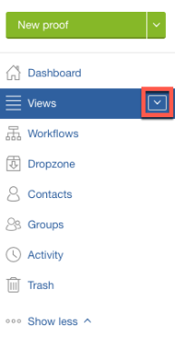

# Een proef openen in [!DNL Workfront Proof]

>[!IMPORTANT]
>
>Dit artikel verwijst naar functionaliteit in het zelfstandige product [!DNL Workfront Proof] . Voor informatie bij het proef binnen [!DNL Adobe Workfront], zie [&#x200B; het Bewijzen &#x200B;](../../../review-and-approve-work/proofing/proofing.md).

1. Klik op de pijl-omlaag naast **[!UICONTROL Views]** in de zijbalk.\
   

1. Kies **[!UICONTROL All Items]** in het menu dat wordt weergegeven.
1. Klik op het pictogram **[!UICONTROL Go to Proof]** voor de proefdruk die u wilt weergeven.\
   \
   Uw standaardtestviewer wordt gestart op een nieuw tabblad in uw browser en de focus wordt verplaatst naar dat tabblad. U kunt meerdere proefdrukken tegelijk openen, elk op een eigen tabblad.

1. Ga door met een van de volgende artikelen, afhankelijk van de proefdrukviewer die u gebruikt.

   * Om in de Kijker van het Bewijs van het Web te bewijzen, zie [&#x200B; het Reviseren van Bewijzen in de Kijker van het Bewijzen van het Web.](https://support.workfront.com/hc/en-us/sections/115000275214)
   * Aan bewijs in de Desktop het Proofing Kijker, zie [&#x200B; het Reviseren Proofs in de Kijker van het Bewijzen van de Desktop.](https://support.workfront.com/hc/en-us/search/click?data=BAh7CjoHaWRsKwjm7%2BTRUwA6CXR5cGVJIgxhcnRpY2xlBjoGRVQ6CHVybEkiVC9oYy9lbi11cy9hcnRpY2xlcy8zNjAwMDM3MjczMzQtUmV2aWV3aW5nLVByb29mcy1pbi10aGUtRGVza3RvcC1Qcm9vZmluZy1WaWV3ZXIGOwdUOg5zZWFyY2hfaWRJIik0NDIyMjdkZi0zYTA4LTQ2YjItYTdkMy1kYzM1YjhlN2U4MjUGOwdGOglyYW5raQc%3D--2056c434cf6f4f97ca87532493ebfeb67ca07b63)

   Om meer over de het proeven kijkers te leren, zie [&#x200B; Verschillen tussen de Kijker van het Web het Bewijzen van het Web en het Overzicht van de Kijker van het Proofing van de Desktop &#x200B;](../../../review-and-approve-work/proofing/proofing-overview/understand-differences-between-web-viewer.md).
