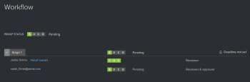

# Een workflow controleren in de conceptviewer

>[!IMPORTANT]
>
>Dit artikel verwijst naar functionaliteit in het zelfstandige product [!DNL Workfront Proof] . Voor informatie bij het proef binnen [!DNL Adobe Workfront], zie [ het Bewijzen ](../../../review-and-approve-work/proofing/proofing.md).

In het deelvenster [!UICONTROL Workflow] wordt de workflow van uw proefdruk weergegeven zoals deze wordt weergegeven op de pagina Proefgegevens en in uw e-mailmeldingen.\
Voor meer informatie over proefdrukdetails, zie [ Beheers de Details van het Bewijs in  [!DNL Workfront Proof]](../../../workfront-proof/wp-work-proofsfiles/manage-your-work/manage-proof-details.md).\
Alle toegewezen revisoren, waaronder gebruikers en gasten, kunnen het deelvenster [!UICONTROL Workflow] weergeven.

Het deelvenster [!UICONTROL Workflow] openen:

1. Als het menu met het linkerpictogram niet wordt weergegeven, klikt u op het pictogram **[!UICONTROL Menu]** in de linkerbovenhoek van de proefdrukviewer.

   

1. Klik op het pictogram **[!UICONTROL Workflow]** .

   Het deelvenster **[!UICONTROL Workflow]** wordt weergegeven.

   

   In elke sectie in het deelvenster Workflow worden de voortgang en status van de proefdruk, de proeffasen en de controleurs weergegeven.

   * Bekijk de algemene **Status van het Bewijs** zoals die door besluiten en acties wordt bepaald die op de proef door alle recensenten in elk stadium worden gemaakt.

     

   * Klik op de vervolgkeuzepijl naast de afzonderlijke stappen om de voortgang, status, deadline en revisiegegevens van het werkgebied weer te geven.

     

   * Bekijk in elke fase een lijst met revisoren en hun eigen proefrollen voor het werkgebied, alsmede de voortgang en status van elke individuele controleur.

     

     Voor meer informatie over het begrip van de vooruitgang en de status van een bewijs, zie [ de Voortgang en de Status van een Bewijs in  [!DNL Workfront Proof]](../../../workfront-proof/wp-work-proofsfiles/manage-your-work/view-progress-and-status-of-proof.md) bekijken.
