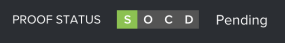

# Een workflow controleren in de conceptviewer

>[!IMPORTANT]
>
>Dit artikel verwijst naar functionaliteit in het standalone product [!DNL Workfront Proof]. Voor informatie over proefdrukken binnen [!DNL Adobe Workfront], zie [Proofing](../../../review-and-approve-work/proofing/proofing.md).

De [!UICONTROL Workflow] wordt de workflow van uw proefdruk weergegeven zoals deze wordt weergegeven op de pagina Proefgegevens en in uw e-mailmeldingen.\
Voor meer informatie over proefdrukdetails raadpleegt u [Proofinggegevens beheren in [!DNL Workfront Proof]](../../../workfront-proof/wp-work-proofsfiles/manage-your-work/manage-proof-details.md).\
Alle toegewezen revisoren, waaronder gebruikers en gasten, kunnen de [!UICONTROL Workflow] deelvenster.

Om toegang te krijgen tot [!UICONTROL Workflow] paneel:

1. Als het linkerpictogrammenu niet wordt weergegeven, klikt u op de knop **[!UICONTROL Menu]** in de linkerbovenhoek van de proefdrukviewer.

   

1. Klik op de knop **[!UICONTROL Workflow]** pictogram.

   De **[!UICONTROL Workflow]** wordt weergegeven.

   

   In elke sectie in het deelvenster Workflow worden de voortgang en status van de proefdruk, de proeffasen en de controleurs weergegeven.

   * De algemene weergave weergeven **Proefstatus** zoals bepaald door besluiten en acties die in elk stadium door alle controleurs op het bewijs worden genomen.

      

   * Klik op de vervolgkeuzepijl naast de afzonderlijke stappen om de voortgang, status, deadline en revisiegegevens van het werkgebied weer te geven.

      

   * Bekijk in elke fase een lijst met revisoren en hun eigen proefrollen voor het werkgebied, alsmede de voortgang en status van elke individuele controleur.

      

      Voor meer informatie over het begrijpen van de voortgang en status van een bewijs raadpleegt u [De voortgang en status van een proefdruk weergeven [!DNL Workfront Proof]](../../../workfront-proof/wp-work-proofsfiles/manage-your-work/view-progress-and-status-of-proof.md).
