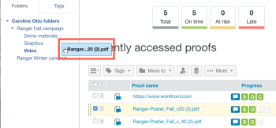

# Werken met meerdere proefdrukken in de proefdrukviewer

>[!IMPORTANT]
>
>Dit artikel verwijst naar functionaliteit in het standalone product [!DNL Workfront Proof]. Voor informatie over proefdrukken binnen [!DNL Adobe Workfront], zie [Proofing](../../../review-and-approve-work/proofing/proofing.md).

In [!DNL Workfront Proof], kunt u mappen gebruiken om proefdrukken te groeperen waaraan u wilt samenwerken of waaraan u wilt dat revisoren samenwerken. Wanneer een revisor een van de proefdrukken opent en de proefdrukviewer start, zijn alle proefdrukken in de map ook beschikbaar. U kunt de andere proefdrukken weergeven, ze sorteren en zoeken, en ze met elkaar vergelijken zonder de proefdrukviewer te verlaten.

Voor algemene informatie over mappen raadpleegt u [Mappen in [!DNL Workfront Proof]](../../../workfront-proof/wp-work-proofsfiles/organize-your-work/folders.md).

>[!NOTE]
>
>De mogelijkheid voor een revisor om een proefdruk in een map te openen, hangt af van de toegang tot de proefdruk. Voor informatie over toegang tot proefdrukken raadpleegt u [Proefdrukken genereren in [!DNL Workfront Proof]](../../../workfront-proof/wp-work-proofsfiles/create-proofs-and-files/generate-proofs.md).

## Proefdrukken in een map groeperen

1. Maak in Workfront Proof (buiten de proefdrukviewer) een map, zoals beschreven in [Mappen maken in [!DNL Workfront Proof]](../../../workfront-proof/wp-work-proofsfiles/organize-your-work/create-folders.md).
1. Groepeer in het dashboard of in de lijstweergave de proefdrukken waaraan u samen wilt werken door deze naar de map te slepen die u hebt gemaakt.

   

## Meerdere proefdrukken in een map bekijken

Als controleur kunt u met meerdere proefdrukken in een map werken zonder de proefdrukviewer te verlaten.

1. In [!DNL Workfront Proof], klikt u op de naam van de map om deze te openen en opent u een proefdruk in de map om de proefdrukviewer te starten.

   of

   Open een proef van een openbare URL of van een e-mailbericht, het programma openen aan het systeem zoals vereist.

1. Klik op het mappictogram in de linkerbovenhoek van de proefdrukviewer.

   

   Hiermee opent u de map met de huidige proefdruk en de andere proefdrukken die u eraan hebt toegevoegd.

   

1. (Optioneel) Voer een van de volgende handelingen uit met de proefdrukken in de map terwijl u de proefdrukviewer gebruikt:

   * Als u in de map naar de gewenste proefdruk wilt zoeken, klikt u op de knop **[!UICONTROL Search]** in de rechterbovenhoek boven de lijst en typ een deel van de naam van de proefdruk en klik vervolgens op de proefdruk wanneer deze wordt weergegeven.
   * Als u de proefdrukken wilt sorteren op de inhoud van een kolom, klikt u op **[!UICONTROL Name]**, **[!UICONTROL Created]**, **[!UICONTROL Status]**, of **[!UICONTROL Owner]** boven de lijst.

   * Als u twee proefdrukken in de map wilt vergelijken, opent u een proefdruk en selecteert u de andere proefdruk in de mappenlijst. Klik vervolgens op de knop [!UICONTROL Compare] knop uiterst rechts op die proef (zie [Proofs vergelijken in de proefdrukviewer](../../../workfront-proof/wp-work-proofsfiles/review-proofs-wpv/compare-proofs.md) als u meer informatie nodig hebt over het vergelijken van twee proefdrukken).

      

      Als u tijdens het vergelijken van proefdrukken wilt overschakelen naar een nieuwe proefdruk, links of rechts in de proefdrukviewer, klikt u op de knop [!UICONTROL Compare] boven de proefdruk.

      
