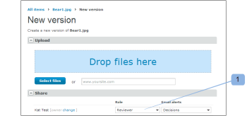

# Proefrollen beheren in [!DNL Workfront Proof]

>[!IMPORTANT]
>
>Dit artikel verwijst naar functionaliteit in het standalone product [!DNL Workfront Proof]. Voor informatie over proefdrukken binnen [!DNL Adobe Workfront], zie [Proofing](../../../review-and-approve-work/proofing/proofing.md).

De rollen van het bewijs laten u toe om toestemmingen aan gebruikers te verlenen die door het toestemmingsprofiel worden beperkt dat op hun gebruikersprofiel wordt gevormd. (Zie voor meer informatie over machtigingsprofielen [Profielen met proefmachtigingen in [!DNL Workfront Proof]](../../../workfront-proof/wp-acct-admin/account-settings/proof-perm-profiles-in-wp.md).)

Proefrollen verschillen van accountprofielen. Uw accountprofiel heeft betrekking op het algemene machtigingsniveau in uw account en heeft invloed op de rechten die u hebt op alle proefdrukken in uw account, ook op de rechten die niet expliciet met u zijn gedeeld.

Zie voor meer informatie [Profielen met proefmachtigingen in [!DNL Workfront Proof]](../../../workfront-proof/wp-acct-admin/account-settings/proof-perm-profiles-in-wp.md).

## Proefrollen

De volgende proefdrukrollen worden aan gebruikers toegekend voor een afzonderlijke proefdruk op het moment dat de gebruiker wordt verzocht de proefdruk te beoordelen:

* [Alleen-lezen](#read-only)
* [Revisor](#reviewer)
* [Fiatteur](#approver)
* [Revisor en fiatteur](#reviewer-approver)
* [Auteur](#author)
* [Moderator](#moderator)

De proefdrukrol bepaalt welke acties een recensent met betrekking tot die specifieke proef kan ondernemen.

Als u bijvoorbeeld Revisor bent, wordt u gevraagd de proefdruk te controleren door markeringen en opmerkingen toe te voegen. Als u Revisor &amp; fiatteur bent, wordt u gevraagd om de bewijsvoering te beoordelen en ook een beslissing te nemen.

Bepaalde proefdrukrollen geven een revisor bewerkingsrechten op de proefdruk (zelfs als zijn accountprofiel dat niet doet) en bieden deze een aantal extra functies, zoals het toevoegen van handelingen voor opmerkingen, het maken van nieuwe versies en het toevoegen van meer controleurs aan de proefdruk.

Raadpleeg de volgende artikelen voor meer informatie:

* [Handelingen gebruiken voor opmerkingen bij proefdrukken](../../../review-and-approve-work/proofing/reviewing-proofs-within-workfront/comment-on-a-proof/use-actions-on-comments-in-viewer.md)
* [Een proef delen in [!DNL Workfront Proof]](../../../workfront-proof/wp-work-proofsfiles/share-proofs-and-files/share-proof.md)

### Alleen-lezen

{#read-only}

 Kan een proefdruk weergeven

 Kan geen markeringen toevoegen

 Kan geen opmerkingen toevoegen

 Kan geen beslissing nemen

 Kan opmerkingen van anderen niet verwijderen

 Heeft geen bewerkingsrechten op de proefdruk

>[!NOTE]
>
>Als een map wordt gedeeld met een gebruiker van [!DNL Workfront Proof], krijgen ze automatisch alleen-lezen rechten voor alle bestaande en vervolgens toegevoegde items in de map.

Zie voor meer informatie [Mappen delen in [!DNL Workfront Proof]](../../../workfront-proof/wp-work-proofsfiles/organize-your-work/share-folders.md).

### Revisor {#reviewer}

 Kan een proefdruk weergeven

 Kan markeringen toevoegen

 Kan opmerkingen toevoegen

![[!DNL cleaner].png](assets/cleaner.png) Kan eigen opmerkingen bewerken als er geen reacties zijn

 Kan geen beslissing nemen

 Kan opmerkingen van anderen niet bewerken of verwijderen

 Heeft geen bewerkingsrechten op de proefdruk

### Fiatteur {#approver}

 Kan een proefdruk weergeven

 Kan een beslissing nemen

 Kan geen markeringen toevoegen

 Kan geen opmerkingen toevoegen

 Kan opmerkingen van anderen niet bewerken of verwijderen

 Heeft geen bewerkingsrechten op de proefdruk

### Revisor en fiatteur {#reviewer-approver}

 Kan een proefdruk weergeven

 Kan markeringen toevoegen

 Kan opmerkingen toevoegen

![[!DNL cleaner].png](assets/cleaner.png) Kan eigen opmerkingen bewerken als er geen reacties zijn

 Kan een beslissing nemen

 Kan opmerkingen van anderen niet bewerken of verwijderen

 Heeft geen bewerkingsrechten op de proefdruk

### Auteur {#author}

 Kan markeringen toevoegen

 Kan opmerkingen toevoegen

![[!DNL cleaner].png](assets/cleaner.png) Kan eigen opmerkingen bewerken als er geen reacties zijn

 Kan een beslissing nemen

 Kan nieuwe versies verzenden

 Kan een kopie van de proefdruk maken

 Kan de proefdruk delen met anderen

 Kan handelingen toepassen op opmerkingen

 Kan opmerkingen oplossen

 Kan opmerkingen van anderen niet bewerken of verwijderen

>[!NOTE]
>
>Deze rol kan alleen worden toegewezen aan gebruikers van [!DNL Workfront Proof]

### Moderator {#moderator}

 Kan markeringen toevoegen

 Kan opmerkingen toevoegen

![[!DNL cleaner].png](assets/cleaner.png) Kan eigen opmerkingen bewerken als er geen reacties zijn

 Kan een beslissing nemen

 Kan nieuwe versies verzenden

 Kan nieuwe revisoren toevoegen

 Kan handelingen toepassen op opmerkingen

 Kan opmerkingen oplossen

 Kan opmerkingen en antwoorden op de proefdruk (gemaakt door henzelf of anderen) verwijderen

* Als u de eerste opmerking in een opmerkingsthread verwijdert, wordt de hele thread verwijderd.
* Als u reacties in de commentaarthread verwijdert, wordt alleen dat antwoord verwijderd.

 Kan opmerkingen van anderen niet bewerken

Deze rol stelt de persoon in staat de bewijsopmerkingen te beheren en te matigen, zodat hij alleen relevante opmerkingen over het bewijs kan bewaren en niet-relevante opmerkingen kan verwijderen.

>[!NOTE]
>
>Deze rol kan alleen worden toegewezen aan gebruikers van [!DNL Workfront Proof].

## Proefdrukrollen toewijzen

U kunt proefdrukrollen toewijzen bij het maken van nieuwe proefdrukken, het maken van nieuwe versies van bestaande proefdrukken of op bestaande proefdrukken.

* [Nieuwe proefdrukken](#new-proofs)
* [Nieuwe versies](#new-versions)
* [Bestaande proefdrukken](#existing-proofs)

### Nieuwe proefdrukken {#new-proofs}

Proefdrukrollen kunnen worden toegewezen aan revisoren op de [!UICONTROL New proof] pagina tijdens het maken van proefdrukken (1).

### Nieuwe versies {#new-versions}

Als u een nieuwe versie van een proefdruk maakt, worden de controleurs van de vorige versie automatisch weergegeven (met dezelfde rol als de vorige versie).

U kunt de proefdrukrollen die zijn toegepast op controleurs bewerken bij het maken van de nieuwe versie (1).

### Bestaande proefdrukken {#existing-proofs}

Als u de rol van een persoon op een bestaande proefdruk wilt wijzigen, kunt u dat doen op de knop [!UICONTROL Proof details] pagina door inlinebewerking van hun rol in de werkstroomsectie (1):

## Rollen controleren in de Proefweergave

U kunt de rol van een revisor rechtstreeks vanuit de Proefweergave (1) controleren en deze (2) bewerken.

## Standaardproefdrukrollen

U kunt de standaardproefdrukrol instellen op de knop [!DNL Proofing Defaults] in uw persoonlijke instellingen. Dit betekent dat wanneer u aan een proef wordt toegevoegd, uw standaardproefdrukrol automatisch zal worden bevolkt. Deze rol kan op proefdrukniveau worden gewijzigd door een gebruiker met bewerkingsrechten op een proefdrukbewijs.

>[!NOTE]
>
>Alleen gebruikers met beheerdersprofielen of factureringsprofielen kunnen de standaardwaarden voor proefdrukken wijzigen voor andere gebruikers in hun account.

Zie voor meer informatie [Persoonlijke instellingen in [!DNL Workfront Proof]](../../../workfront-proof/wp-getstarted/personal-settings/personal-settings.md).

## Maker en eigenaar

Maker en eigenaar hebben volledige bewerkingsrechten op de proefdruk.

* [Maker](#creators)
* [Eigenaars](#owners)

### Maker {#creators}

De maker van het bewijs is de persoon die het bewijs in eerste instantie uploadt. De maker van de proefdruk wordt automatisch weergegeven in de lijst met personen voor de proefdruk (in de standaardrol).

Op de [!UICONTROL New proof] op de pagina kunt u een andere proefdrukrol toewijzen aan de maker van de proefdruk (anders dan de standaardrol).

De maker van de proefdruk kan niet worden gewijzigd of uit een proefdruk worden verwijderd.

### Eigenaars {#owners}

Standaard is de maker ook de eigenaar van het bewijs; de maker kan echter iemand anders de eigenaar van de proef maken bij het maken van de proef (op de [!UICONTROL New proof] pagina).

De eigenaar wijzigen op de pagina Nieuwe proefdruk:

1. Klik op de wijzigingskoppeling die naast de naam van de maker wordt weergegeven.
1. Selecteer de nieuwe eigenaar in het keuzemenu. (2)

Zodra het bewijs is gecreeerd, is het nog mogelijk om de eigenaar te veranderen. Iedereen met bewerkingsrechten op de proefdruk kan de proefdrukeigenaar via de [!UICONTROL Proof details] pagina (zie hieronder).

De mogelijkheid om de eigenaar van een proefdruk te wijzigen is vooral handig vanuit het oogpunt van workflowbeheer. Hierdoor kan de persoon die verantwoordelijk is voor het project de eigendom van proefdrukken overnemen, zodat hij bewerkingsrechten krijgt op proefdrukken en deze in de [!UICONTROL My proofs] weergeven.

De eigenaar van het bewijs wijzigen via de [!UICONTROL Proof details] pagina:

* Klik op het menu Handelingen naast de naam van de persoon die u wilt maken.
* Selecteren [!UICONTROL Make owner] in het keuzemenu.
* U kunt ook in de [!UICONTROL Owner] naast de proefdrukafbeelding en kies in het vervolgkeuzemenu de nieuwe eigenaar.

Zodra dit wordt gedaan, zal het woord &quot;Eigenaar&quot;naast de naam van die persoon worden getoond.

>[!NOTE]
>
>Alleen een gebruiker van dezelfde account of een partneraccount kan de eigenaar van een bewijs worden. Een gebruiker in een partnerrekening kan tot eigenaar van een bewijs slechts worden gemaakt wanneer:
>
>* Er is een bestaande partnerverhouding opstelling tussen de rekeningen. Zie voor meer informatie [Partneraccounts in [!DNL Workfront Proof]](../../../workfront-proof/wp-acct-admin/partner-accounts/partner-accounts.md).
>* Er zijn geen aangepaste velden op de [!UICONTROL New proof] pagina.
>* De proefdruk is niet toegewezen aan een map.
>* Er zijn geen codes toegepast op de proefdruk.
>

Bewijs tijdelijk delegeren binnen [!DNL Workfront Proof], zie [Aanwijzing van eigenaars van tijdelijke bewijzen in [!DNL Workfront Proof]](../../../workfront-proof/wp-getstarted/personal-settings/designate-temp-proof-owners.md).
