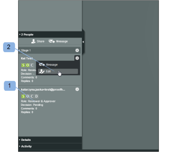
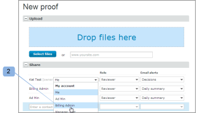

# Proefrollen beheren in [!DNL Workfront Proof]

<!-- Audited: 01/2024 -->

>[!IMPORTANT]
>
>Dit artikel verwijst naar functionaliteit in het zelfstandige product [!DNL Workfront Proof] . Voor informatie bij het proef binnen [!DNL Adobe Workfront], zie [&#x200B; het Bewijzen &#x200B;](../../../review-and-approve-work/proofing/proofing.md).

De rollen van het bewijs laten u toe om toestemmingen aan gebruikers te verlenen die door het toestemmingsprofiel worden beperkt dat op hun gebruikersprofiel wordt gevormd. (Voor meer informatie over toestemmingsprofielen, zie [&#x200B; Profielen van de Toestemmingen van de Bewijs in  [!DNL Workfront Proof]](../../../workfront-proof/wp-acct-admin/account-settings/proof-perm-profiles-in-wp.md).)

Proefrollen verschillen van accountprofielen. Uw accountprofiel heeft betrekking op het algemene machtigingsniveau in uw account en heeft invloed op de rechten die u hebt op alle proefdrukken in uw account, ook op de rechten die niet expliciet met u zijn gedeeld.

Voor meer informatie, zie [&#x200B; Profielen van de Toestemmingen van de Bewijs in  [!DNL Workfront Proof]](../../../workfront-proof/wp-acct-admin/account-settings/proof-perm-profiles-in-wp.md).

## Proefrollen

De volgende proefdrukrollen worden aan gebruikers toegekend voor een afzonderlijke proefdruk op het moment dat de gebruiker wordt verzocht de proefdruk te beoordelen:

* [Alleen-lezen](#read-only)
* [Revisor](#reviewer)
* [Fiatteur](#approver)
* [Revisor en fiatteur](#reviewer-approver)
* [Auteur](#author)
* [Moderator](#moderator)

De proefdrukrol bepaalt welke acties een recensent met betrekking tot die specifieke proef kan ondernemen.

Als u bijvoorbeeld Revisor bent, wordt u gevraagd de proefdruk te controleren door markeringen en opmerkingen toe te voegen. Als u Revisor &amp; fiatteur bent, wordt u gevraagd om de bewijsvoering te beoordelen en ook een beslissing te nemen.

Bepaalde proefdrukrollen geven een revisor bewerkingsrechten op de proefdruk (zelfs als zijn accountprofiel dat niet doet) en bieden deze een aantal extra functies, zoals het toevoegen van handelingen voor opmerkingen, het maken van nieuwe versies en het toevoegen van meer controleurs aan de proefdruk.

Zie de volgende artikelen voor meer informatie:

* [Handelingen gebruiken voor opmerkingen bij proefdrukken](../../../review-and-approve-work/proofing/reviewing-proofs-within-workfront/comment-on-a-proof/use-actions-on-comments-in-viewer.md)
* [Een proef delen in  [!DNL Workfront Proof]](../../../workfront-proof/wp-work-proofsfiles/share-proofs-and-files/share-proof.md)

### Alleen-lezen

{#read-only}

 kan een proef bekijken

 kan geen markeringen toevoegen

 kan geen commentaren toevoegen

 kan geen besluit nemen

 kan commentaren schrappen die door anderen worden gemaakt

 heeft uitgeeft geen rechten op de proef

>[!NOTE]
>
>Als een map wordt gedeeld met een gebruiker van [!DNL Workfront Proof] , krijgen deze automatisch alleen-lezen rechten voor alle bestaande en vervolgens toegevoegde items in de map.

Voor meer informatie, zie [&#x200B; Mappen van het Aandeel in  [!DNL Workfront Proof]](../../../workfront-proof/wp-work-proofsfiles/organize-your-work/share-folders.md).

### Revisor {#reviewer}

 kan een proef bekijken

 kan markeringen toevoegen

 kan commentaren toevoegen

![[!DNL cleaner] .png &#x200B;](assets/cleaner.png) Kan eigen opmerkingen bewerken als er geen reacties zijn

 kan geen besluit nemen

 kan commentaren uitgeven of schrappen die door anderen worden gemaakt

 heeft uitgeeft geen rechten op de proef

### Fiatteur {#approver}

 kan een proef bekijken

 kan een besluit nemen

 kan geen markeringen toevoegen

 kan geen commentaren toevoegen

 kan commentaren uitgeven of schrappen die door anderen worden gemaakt

 heeft uitgeeft geen rechten op de proef

### Revisor en fiatteur {#reviewer-approver}

 kan een proef bekijken

 kan markeringen toevoegen

 kan commentaren toevoegen

![[!DNL cleaner] .png &#x200B;](assets/cleaner.png) Kan eigen opmerkingen bewerken als er geen reacties zijn

 kan een besluit nemen

 kan commentaren uitgeven of schrappen die door anderen worden gemaakt

 heeft uitgeeft geen rechten op de proef

### Auteur {#author}

 kan markeringen toevoegen

 kan commentaren toevoegen

![[!DNL cleaner] .png &#x200B;](assets/cleaner.png) Kan eigen opmerkingen bewerken als er geen reacties zijn

 kan een besluit nemen

 kan nieuwe versies voorleggen

 kan tot een exemplaar van de proef leiden

 kan het bewijs met andere mensen delen

 kan acties op commentaren toepassen

 kan commentaren oplossen

 kan commentaren uitgeven of schrappen die door anderen worden gemaakt

>[!NOTE]
>
>Deze rol kan alleen worden toegewezen aan gebruikers van [!DNL Workfront Proof] .

### Moderator {#moderator}

 kan markeringen toevoegen

 kan commentaren toevoegen

![[!DNL cleaner] .png &#x200B;](assets/cleaner.png) Kan eigen opmerkingen bewerken als er geen reacties zijn

 kan een besluit nemen

 kan nieuwe versies voorleggen

 kan nieuwe recensenten toevoegen

 kan acties op commentaren toepassen

 kan commentaren oplossen

 kan commentaren en antwoorden op de proef (die door zich of anderen worden gemaakt) schrappen

* Als u de eerste opmerking in een opmerkingsthread verwijdert, wordt de hele thread verwijderd.
* Als u reacties in de commentaarthread verwijdert, wordt alleen dat antwoord verwijderd.

 kan commentaren uitgeven die door anderen worden gemaakt

Deze rol stelt de persoon in staat de bewijsopmerkingen te beheren en te matigen, zodat hij alleen relevante opmerkingen over het bewijs kan bewaren en niet-relevante opmerkingen kan verwijderen.

>[!NOTE]
>
>Deze rol kan alleen worden toegewezen aan gebruikers van [!DNL Workfront Proof] .

## Proefdrukrollen toewijzen

U kunt proefdrukrollen toewijzen bij het maken van nieuwe proefdrukken, het maken van nieuwe versies van bestaande proefdrukken of op bestaande proefdrukken.

### Nieuwe proefdrukken {#new-proofs}

Proefdrukrollen kunnen tijdens het maken van proefdrukken worden toegewezen aan revisoren op de pagina [!UICONTROL New proof] (1).

### Nieuwe versies {#new-versions}

Wanneer u een nieuwe versie van een proefdruk maakt, worden de controleurs van de vorige versie automatisch weergegeven (met dezelfde rol als de vorige versie).

U kunt de proefdrukrollen die zijn toegepast op controleurs bewerken bij het maken van de nieuwe versie (1).

### Bestaande proefdrukken {#existing-proofs}

Als u de rol van een persoon op een bestaande proefdruk wilt wijzigen, kunt u dat op de pagina [!UICONTROL Proof details] doen door de rol van die persoon inline te bewerken in de werkstroomsectie (1).

## Rollen controleren in de Proefweergave

U kunt de rol van een revisor rechtstreeks vanuit de Proefweergave (1) controleren en deze (2) bewerken.

## Standaardproefdrukrollen

U kunt uw standaardproefdrukrol op de [!DNL Proofing Defaults] pagina in uw Persoonlijke montages plaatsen. Dit betekent dat wanneer u aan een proef wordt toegevoegd, uw standaardproefdrukrol automatisch zal worden bevolkt. Deze rol kan op proefdrukniveau worden gewijzigd door een gebruiker met bewerkingsrechten op een proefdrukbewijs.

>[!NOTE]
>
>Alleen gebruikers met beheerdersprofielen of factureringsprofielen kunnen de standaardwaarden voor proefdrukken wijzigen voor andere gebruikers in hun account.

Voor meer informatie, zie [&#x200B; Persoonlijke montages in  [!DNL Workfront Proof]](../../../workfront-proof/wp-getstarted/personal-settings/personal-settings.md).

## Maker en eigenaar

Maker en eigenaar hebben volledige bewerkingsrechten op de proefdruk.

### Maker {#creators}

De maker van het bewijs is de persoon die het bewijs in eerste instantie uploadt. De maker van de proefdruk wordt automatisch weergegeven in de lijst met personen voor de proefdruk (in de standaardrol).

Op de pagina [!UICONTROL New proof] kunt u een andere proefdrukrol toewijzen aan de maker van de proefdruk (behalve de standaardrol).

De maker van de proefdruk kan niet worden gewijzigd of uit een proefdruk worden verwijderd.

### Eigenaars {#owners}

Standaard is de maker ook de eigenaar van de proefdruk. De maker kan echter iemand anders de eigenaar van de proefdruk maken bij het maken van de proefdruk (op de pagina [!UICONTROL New proof] ).

De eigenaar wijzigen op de pagina Nieuwe proefdruk:

1. Klik op de koppeling voor de wijziging die naast de naam van de maker wordt weergegeven.
1. Selecteer de nieuwe eigenaar in het keuzemenu. (2)

Zodra het bewijs is gecreeerd, is het nog mogelijk om de eigenaar te veranderen. Iedereen met bewerkingsrechten op de proefdruk kan via de pagina [!UICONTROL Proof details] de proefdrukeigenaar wijzigen in een andere gebruiker (zie hieronder).

De mogelijkheid om de eigenaar van een proefdruk te wijzigen is vooral handig vanuit het oogpunt van workflowbeheer. Hierdoor kan de persoon die verantwoordelijk is voor het project de eigendom van proefdrukken overnemen, zodat hij of zij rechten op proefdrukken kan bewerken en deze in de weergave [!UICONTROL My proofs] kan bekijken.

De eigenaar van de proefdruk wijzigen via de pagina [!UICONTROL Proof details] :

* Klik op het menu Handelingen naast de naam van de persoon die u de eigenaar wilt maken.
* Selecteer [!UICONTROL **maken eigenaar**] van het drop-down menu.
* Alternatief, kunt u in het [!UICONTROL **gebied van de Eigenaar**] naast het proefdrukbeeld klikken en de nieuwe Eigenaar van de getoonde drop-down kiezen.

Zodra dit wordt gedaan, zal het woord &quot;Eigenaar&quot;naast de naam van die persoon worden getoond.

>[!NOTE]
>
>Alleen een gebruiker van dezelfde account of een partneraccount kan de eigenaar van een bewijs worden. Een gebruiker in een partnerrekening kan tot eigenaar van een bewijs slechts worden gemaakt wanneer:
>
>* Er is een bestaande partnerverhouding opstelling tussen de rekeningen. Voor meer informatie, zie [&#x200B; de rekeningen van de Partner in  [!DNL Workfront Proof]](../../../workfront-proof/wp-acct-admin/partner-accounts/partner-accounts.md).
>* De pagina [!UICONTROL New proof] bevat geen aangepaste velden.
>* De proefdruk is niet toegewezen aan een map.
>* Er zijn geen codes toegepast op de proefdruk.

Om bewijsbezit binnen [!DNL Workfront Proof] tijdelijk te delegeren, zie [&#x200B; Aanwijzend Tijdelijke Eigenaars van het Bewijs in  [!DNL Workfront Proof]](../../../workfront-proof/wp-getstarted/personal-settings/designate-temp-proof-owners.md).
